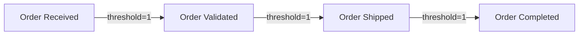
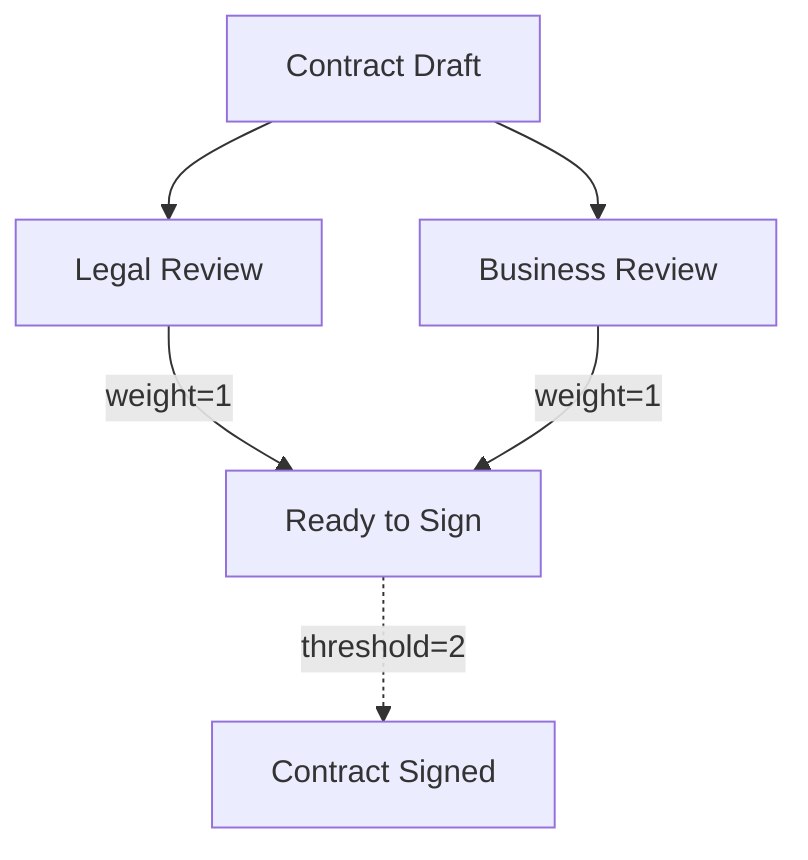
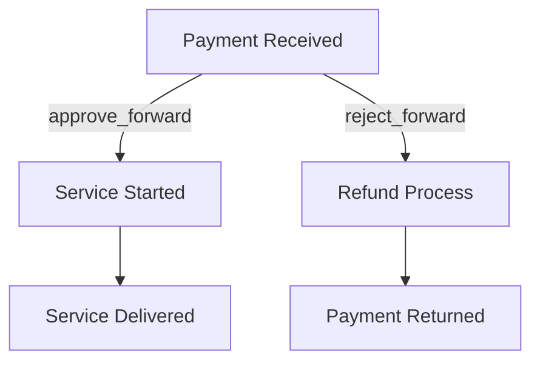
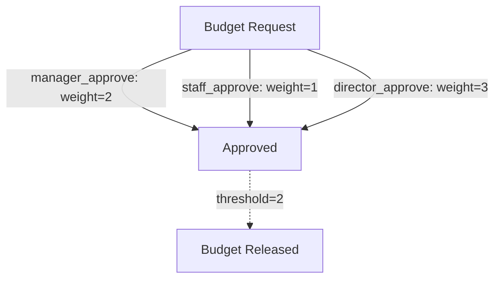

# Machine Object: Your Workflow Blueprint Designer

> "Create reusable workflow templates that define how complex processes flow from start to finish, with automatic execution through Progress instances"

**MCP Tool**: [`wowok_machine_mcp_server`](https://www.npmjs.com/package/wowok_machine_mcp_server)

## How to Use This Documentation

### Document Structure

**Part 1: Machine Template Design (Sections 1-4)**

- **[Overview](#overview)**: Machine concepts and Progress relationship
- **[Basic Configuration](#basic-configuration)**: Account, Object, and Control Parameters
- **[Node Architecture](#node-architecture)**: Complete node structure and operation design
- **[Advanced Features](#advanced-features)**: Repository integration, cloning, and complex scenarios

**Part 2: Progress Operations (Sections 5-6)**

- **[Progress Operations](#progress-operations)**: Complete Progress technical reference
- **[Execution Management](#execution-management)**: Hold/Resume, Context, Parent-Child relationships

**Part 3: Implementation & Integration (Sections 7-9)**

- **[Integration Patterns](#integration-patterns)**: How Machine coordinates with other objects
- **[Complete Examples](#complete-examples)**: End-to-end implementation scenarios
- **[Data Types & Technical Reference](#data-types--technical-reference)**: Technical specifications

**Part 4: Reference Materials (Section 10-12)**

- **[Common Issues & Troubleshooting](#common-issues--troubleshooting)**: Problem resolution
- **[Configuration Reference](#configuration-reference)**: Witness parameters and advanced settings
- **[Query Capabilities](#query-capabilities)**: What you can query and how to access Machine data

### Navigation by Need

| I need to...                              | Go to section                                                              |
| ----------------------------------------- | -------------------------------------------------------------------------- |
| Understand Machine vs Progress difference | [Overview](#overview)                                                      |
| Create basic workflow template            | [Node Architecture → Node Structure](#node-structure-definition)           |
| See simplest working example              | [Complete Examples → Minimal Working Machine](#minimal-working-machine)    |
| Add advanced workflow rules               | [Node Architecture → Forward Operations](#forward-operation-configuration) |
| Execute workflow instances                | [Progress Operations](#progress-operations)                                |
| Connect with other objects                | [Integration Patterns](#integration-patterns)                              |
| Fix broken workflows                      | [Common Issues & Troubleshooting](#common-issues--troubleshooting)         |
| Query machine data                         | [Query Capabilities](#query-capabilities)                                 |

---

## Part 1: Machine Template Design

## 1. Overview

### Definition

Machine object defines node structures and transition rules for workflow execution, specifying workflow stages, operation permissions, and threshold requirements.

Machine defines workflow parameters, while Progress instances execute workflows with bound operators and task data.

### Core Capabilities

- **Node Structure Management**: Create, modify, and organize workflow stages with dependency rules
- **Forward Operation Configuration**: Define approval buttons that move workflow forward. Set who can click each button, what role they play, and how many approval points each click contributes.
- **Message Delivery System**: Forwards can store messages and data for Progress instances to retrieve during execution
- **Flexible Operator Assignment**: Each Progress instance can assign different or same qualified operators to the same workflow roles for flexible management
- **Multi-Service Reusability**: Same Machine template can be referenced by multiple Service objects with different operator configurations
- **Cross-Object Integration**: Reference Service objects, Guard verification, and Repository data within operations. Parent-child Progress relationships enable supply chain management.

### Workflow Implementation Process

The typical workflow implementation follows these steps:

1. **Configure**: Define Machine node structures, operation permissions, and Guard verification rules
2. **Publish**: Set `bPublished: true` to enable Progress creation

**⚠️ Critical Warning**: Publishing (`bPublished: true`) is permanent and irreversible. Machine configuration becomes immutable after publishing.
3. **Test**: Create Progress instances to verify all workflow branches work as expected
4. **Production**: Bind Machine to Service objects or deploy to production environment after successful testing
   **Notes**:

- **Immutability**: Published Machines cannot modify.
- **Modification Path**: Use clone operation to create a new modified versions of existing Machines
- **Issue Response**: Set `bPaused: true` on Machine or Progress to halt execution and prevent further issues

---

## 2. Basic Configuration

### Account & Object Identification

**Note**: All Machine operations require `account` parameter to specify transaction signer. If omitted, current active account is used.

#### Top-Level Structure

```json
{
  "account": "workflow_manager", // Leave blank to use the default account
  "data": {
    // Workflow structure and execution rules - see Node Architecture section
  }
}
```

`account` specifies the transaction signer address for Machine operations.

`data` contains Machine workflow configuration - node structures, operation permissions, and execution rules.

#### Machine Object Reference

**Operating on Existing Machine**:

```json
{
  "data": {
    "object": "existing_machine_name_or_address" // Reference by name or blockchain address
  }
}
```

**Creating New Machine**:

```json
{
  "data": {
    "object": {
      "name": "workflow_machine", // Local identifier for easy reference
      "onChain": true, // Make metadata publicly visible on blockchain
      "permission": "permission_object", // Permission object address (auto-created if omitted)
      "tags": ["workflow", "automation"], // Categorization labels
      "useAddressIfNameExist": false // Name conflict resolution: false = rename original, true = use address
    }
  }
}
```

**Object Creation Parameters**:

| Parameter               | Type          | Required                  | Description                                                                             |
| ----------------------- | ------------- | ------------------------- | --------------------------------------------------------------------------------------- |
| `name`                  | string        | Optional                  | Local identifier that makes referencing easier in future operations                     |
| `onChain`               | boolean       | Optional (default: false) | Whether name and tags are publicly visible on blockchain                                |
| `permission`            | string/object | Optional                  | Permission object managing workflow access control - creates default if omitted         |
| `tags`                  | string[]      | Optional                  | Labels for organizing and categorizing workflow templates                               |
| `useAddressIfNameExist` | boolean       | Optional (default: false) | Conflict resolution: false = keep new name, rename original; true = use address instead |

### Machine Control Parameters

```json
{
  "data": {
    "description": "Order processing workflow with multi-stage approval",
    "bPublished": false,
    "bPaused": false,
    "endpoint": "https://api.example.com/workflow-callbacks"
  },
  "session": {
    "network": "sui testnet",
    "retentive": "always"
  }
}
```

| Parameter           | Type    | Default  | Description                                                                       |
| ------------------- | ------- | -------- | --------------------------------------------------------------------------------- |
| `description`       | string  | Optional | Human-readable explanation of workflow purpose                                    |
| `bPublished`        | boolean | `false`  | Set `true` to enable Progress creation (immutable after publish)                  |
| `bPaused`           | boolean | `false`  | Set `true` to halt new Progress instances (emergency brake)                       |
| `endpoint`          | string  | Optional | HTTPS URL for Progress status updates with auto-appended parameters               |
| `session.network`   | string  | Required | Target blockchain: `sui mainnet`, `sui testnet`, `wowok mainnet`, `wowok testnet` |
| `session.retentive` | string  | `always` | Persistence scope: `always` = device-wide, `session` = current program only       |

---

## 3. Node Architecture

### Node Management

Build your workflow by creating workflow stages (nodes) and connecting them with operations. Each node represents a workflow stage with specific requirements that must be met before advancing to the next stage.

**Common Node Operations**:

```json
{
  "data": {
    "nodes": {
      "op": "add",
      "bReplace": false, // false: add nodes to existing structure, true: completely replace all existing nodes
      "data": [
        // Node definitions - see Node Structure section below
      ]
    }
  }
}
```

| Operation        | Purpose                       | Parameters                                   | Use Case                                                     |
| ---------------- | ----------------------------- | -------------------------------------------- | ------------------------------------------------------------ |
| `add`            | Create new workflow stages    | `data` array with node definitions           | Building initial workflow or adding new approval stages      |
| `remove`         | Delete workflow stages        | `names` array with node names                | Removing obsolete stages from workflow                       |
| `rename node`    | Change stage names            | `data` array with old/new name pairs         | Updating stage names for clarity                             |
| `remove pair`    | Delete stage connections      | `pairs` array with connection specifications | Breaking workflow paths between stages                       |
| `add forward`    | Add operations to connections | `data` array with forward definitions        | Adding new approval operations to existing stage connections |
| `remove forward` | Delete specific operations    | `data` array with forward specifications     | Removing outdated operations from workflow                   |

### Individual Node Configuration

Define a single workflow node with its connections, threshold requirements, and available operations:

```json
{
  "name": "approval_stage",
  "pairs": [
    {
      "prior_node": "order_received", // Previous stage name (use "" for initial node)
      "threshold": 2, // Minimum approval points needed to advance
      "forwards": [
        // Available operations from this stage - see Forward Operations
      ]
    }
  ]
}
```

**Node Structure Parameters**:

| Parameter    | Type      | Required     | Description                                                                                           |
| ------------ | --------- | ------------ | ----------------------------------------------------------------------------------------------------- |
| `name`       | string    | **Required** | Unique stage identifier that Progress instances use to track current position                         |
| `prior_node` | string    | **Required** | Previous stage name creating workflow sequence - use `""` for initial starting node                   |
| `threshold`  | number ≥2 | **Required** | Minimum weight points required for advancement - see [Threshold Logic](#7-threshold-and-weight-logic) |
| `forwards`   | array     | **Required** | Available operations that can be executed from this stage connection                                  |

**Node Connection Logic**: Each `pairs` entry creates a connection from `prior_node` to this node. Multiple pairs allow a single node to be reached from different previous stages, enabling branching and merging workflow paths.

### Forward Operation Configuration

Forward operations define executable actions that advance workflow between nodes. Each forward specifies required permissions, weight contribution toward threshold, and optional Guard verification.

```json
{
  "name": "approve_order", // Operation identifier for Progress execution
  "permission": 1001, // Custom permission index ≥1000 - if Guard is also set inside permission, must satisfy both Guards in permission and forward.
  "namedOperator": "order_processor", // Role template name for operator binding - users with permission OR bound operators can execute (union)
  "weight": 2, // Points contributed toward threshold advancement
  "guard": {
    "guard": "business_hours_guard", // Guard object for additional verification
    "order_ids": [1, 2] // Supplier Orders Commitment verification IDs
  },
  "suppliers": [
    // Optional Service coordination requirements
    {
      "service": "inventory_check_service", // Service object address or name
      "bRequired": true // true = must provide order, false = optional choice
    }
  ]
}
```

**Forward Operation Parameters**:

| Parameter       | Type           | Required     | Description                                                                                                       |
| --------------- | -------------- | ------------ | ----------------------------------------------------------------------------------------------------------------- |
| `name`          | string         | **Required** | Operation identifier that Progress instances reference during execution                                           |
| `permission`    | number ≥1000   | Optional     | Custom permission index from Permission object - determines who can execute                                       |
| `namedOperator` | string         | Optional     | Role template name for operator binding - Progress instances map actual addresses to this role                    |
| `weight`        | number ≥1      | **Required** | Points contributed toward threshold when operation executes successfully. Default set as 1.                       |
| `guard`         | string/object  | Optional     | Guard object address (string) or Guard configuration object with supplier orders verification                     |
| `suppliers`     | array          | Optional     | Service objects for multi-vendor coordination - see Service Suppliers Configuration                               |

**Guard Configuration Formats**:

- **Simple Guard**: `"guard": "guard_object_address"` - Basic Guard verification without supplier orders
- **Supplier Orders Guard**: 
  ```json
  "guard": {
    "guard": "supplier_commitment_guard",
    "order_ids": [1, 2, 3]
  }
  ```

**Access Control Requirements**: At least one of `guard`, `permission`, or `namedOperator` must be specified for each forward operation.

### Service Suppliers Configuration

Service suppliers coordinate workflow operations with external Service objects during forward execution, providing comprehensive supply chain management with Guard verification.

```json
{
  "suppliers": [
    {
      "service": "inventory_check_service", // Service object address or name
      "bRequired": true  // Must provide order for operation to proceed
    },
    {
      "service": "express_shipping", // Optional shipping choice A
      "bRequired": false
    },
    {
      "service": "standard_shipping", // Optional shipping choice B  
      "bRequired": false
    }
  ]
}
```

**Supplier Configuration Parameters**:

| Parameter   | Type    | Required     | Description                                                                   |
| ----------- | ------- | ------------ | ----------------------------------------------------------------------------- |
| `service`   | string  | **Required** | Service object address or name that provides the required supplier service   |
| `bRequired` | boolean | **Required** | true = must provide order, false = optional choice for flexible selection    |

**Supplier Execution Logic**:

- **Required suppliers** (`bRequired: true`): All must provide orders before operation can execute
- **Optional suppliers** (`bRequired: false`): Selection rules depend on context:
  - If required suppliers exist: Optional suppliers can be selected or skipped entirely
  - If only optional suppliers exist: At least one must be selected from the optional group
- **Examples**:
  - 1 required + 2 optional = minimum 1 order (required only) or up to 3 orders total
  - 0 required + 3 optional = minimum 1 order (choose any) up to 3 orders total
- **Use Cases**: Multi-vendor coordination, service dependency management, flexible service combinations within workflows

### Supplier Orders Commitment & Guard Verification

When suppliers are configured in forward operations, the system implements Supplier Orders Commitment verification to ensure supply chain reliability.

```json
{
  "name": "supplier_verification",
  "guard": {
    "guard": "supplier_commitment_guard", // Guard object for verification
    "order_ids": [1, 2, 3] // Guard table IDs for supplier order verification
  },
  "suppliers": [
    {
      "service": "material_supplier_service",
      "bRequired": true
    }
  ],
  "namedOperator": "procurement_team",
  "weight": 1
}
```

**Guard Integration Parameters**:

| Parameter   | Type     | Required | Description                                                                      |
| ----------- | -------- | -------- | -------------------------------------------------------------------------------- |
| `guard`     | string   | Required | Guard object address/name for supplier commitment verification                   |
| `order_ids` | number[] | Required | Array of Guard table identifiers (1-255) specifying which orders to verify     |

**Verification Process**:

The Guard object can implement any verification logic based on its configuration and available query functions. Supported verification capabilities include:

**Order & Service Verification**:
- Order status and completion checking
- Service object validation and configuration
- Payment amount and transaction verification
- Delivery timeline and scheduling compliance

**Repository Data Queries**:
- Address-based data retrieval and validation
- Policy compliance and data type verification
- Custom field validation and business rules
- Time-based data and historical records

**Permission & Access Control**:
- Permission object validation and role checking
- Administrator and entity verification
- Custom permission and access validation

**Financial & Treasury Operations**:
- Balance and transaction amount verification
- Treasury operation and payment validation
- Arbitration fee and compensation checking

**Progress & Machine Workflow**:
- Progress status and session validation
- Machine configuration and node verification
- Task completion and deliverable checking

**Context-Based Verification**:
- Transaction signer address validation
- Current blockchain time verification
- Guard object self-reference validation

The specific verification logic depends entirely on how the Guard object is configured and which query functions it implements. See [Guard Object Documentation](Guard.md) for complete query function reference and implementation details.

**Witness Data Requirements**: When executing forward operations with supplier requirements, users must provide the actual order addresses/IDs as witness data since these are generated dynamically during workflow execution:

```json
{
  "witness": {
    "guards": ["supplier_commitment_guard"], // System-generated
    "witness": [
      {
        "guard": "supplier_commitment_guard", // System-generated
        "identifier": 1, // System-generated (matches order_ids array)
        "type": 101, // System-generated (Address type)
        "witness": "0xactual_order_address_from_supplier_purchase", // USER PROVIDES THIS
        "cmd": [{"cmd": 34, "witness": 34}], // System-generated
        "cited": 1, // System-generated
        "witnessTypes": [34] // System-generated
      }
    ]
  }
}
```

**User Responsibility**: Users only need to provide the `witness` field value - the actual order address generated when they purchased from the supplier service. All other fields are automatically populated by the system.

### Supplier Integration Examples

#### Manufacturing Supply Chain
```json
{
  "name": "production_start",
  "guard": {
    "guard": "manufacturing_suppliers_guard",
    "order_ids": [10, 11, 12] // Raw materials, components, packaging
  },
  "suppliers": [
    {
      "service": "raw_material_supplier",
      "bRequired": true
    },
    {
      "service": "component_supplier", 
      "bRequired": true
    },
    {
      "service": "packaging_supplier",
      "bRequired": false // Optional premium packaging
    }
  ],
  "namedOperator": "production_manager",
  "weight": 2
}
```

#### Restaurant Food Service
```json
{
  "name": "meal_preparation",
  "guard": {
    "guard": "fresh_ingredients_guard",
    "order_ids": [20, 21] // Fresh produce, dairy verification
  },
  "suppliers": [
    {
      "service": "fresh_produce_supplier",
      "bRequired": true
    },
    {
      "service": "dairy_supplier",
      "bRequired": true  
    },
    {
      "service": "specialty_ingredients",
      "bRequired": false // Optional for premium dishes
    }
  ],
  "namedOperator": "head_chef",
  "weight": 1
}

### Threshold and Weight Logic

Weight accumulation controls workflow advancement between nodes. Forward operations contribute weight points toward the target node's threshold requirement.

```json
{
  "threshold": 2, // Minimum points needed to advance
  "forwards": [
    { "name": "manager_approve", "weight": 1 }, // Contributes 1 point
    { "name": "legal_approve", "weight": 1 } // Contributes 1 point
  ]
}
```

**Accumulation Examples**:

- **Single Approval**: `threshold: 1`, any forward with `weight: 1` can advance workflow immediately
- **Dual Approval**: `threshold: 2`, need two forwards with `weight: 1` each, or one forward with `weight: 2`
- **Weighted Vote**: One person has 2 weight, two others have 1 weight each, threshold = 3 → decision requires the 2-weight person plus at least one other
- **Flexible Authority**: Two people have 1 weight each, one manager has 2 weight, threshold = 2 → enables both collaboration (1+1) and executive override (manager alone)
- **Partial Progress**: Operations with insufficient weight remain pending at current node until threshold satisfied

#### Message Delivery System

Forwards can store messages and data for Progress instances to retrieve during execution.

```json
{
  "deliverable": {
    "msg": "Operation completed with details",
    "orders": ["service_order_1", "service_order_2"]
  }
}
```

| Field    | Purpose                                          | Content Examples                              | Notes |
| -------- | ------------------------------------------------ | --------------------------------------------- | ------------ |
| `msg`    | Store any data for communication in the progress | Links, text, parameters, status information   | Size limited by transaction limits and Gas costs |
| `orders` | Reference supplier services                      | Order objects from required/optional services |

### Additional Node Operations

**Remove Nodes**:

```json
{
  "nodes": {
    "op": "remove",
    "names": ["node_name_1", "node_name_2"]
  }
}
```

**Rename Nodes**:

```json
{
  "nodes": {
    "op": "rename node",
    "data": [
      {
        "old": "current_name",
        "new": "updated_name"
      }
    ]
  }
}
```

**Remove Node Connections**:

```json
{
  "nodes": {
    "op": "remove pair",
    "pairs": [
      {
        "prior_node_name": "source_node",
        "node_name": "target_node"
      }
    ]
  }
}
```

**Add Forward Operations**:

```json
{
  "nodes": {
    "op": "add forward",
    "data": [
      {
        "prior_node_name": "order_confirmed",
        "node_name": "order_shipped",
        "threshold": 1,
        "forward": {
          "name": "ship_order",
          "permission": 1004,
          "namedOperator": "shipping_coordinator",
          "weight": 1,
          "guard": "warehouse_hours_guard"
        }
      }
    ]
  }
}
```

**Remove Forward Operations**:

```json
{
  "nodes": {
    "op": "remove forward",
    "data": [
      {
        "prior_node_name": "order_confirmed",
        "node_name": "order_shipped",
        "forward_name": "ship_order"
      }
    ]
  }
}
```

---

## 4. Advanced Features

Advanced features for complex workflow scenarios: link shared data repositories across all Progress instances, create workflow template variations, and manage multi-service coordination requirements.

### Repository Integration

```json
{
  "data": {
    "consensus_repository": {
      "op": "add",
      "objects": ["shared_data_repo", "standards_repo"]
    }
  }
}
```

**Repository Function**: Shared data accessible across all Progress instances executing this Machine template.

`consensus_repository` operations: `add`, `remove`, `set`, `removeall` for managing shared Repository objects.

For detailed Repository functionality, see [Repository Object Documentation](Repository.md).

### Machine Cloning

```json
{
  "data": {
    "clone_new": {
      "namedNew": {
        "name": "cloned_machine",
        "onChain": true,
        "tags": ["cloned", "variant"],
        "useAddressIfNameExist": false
      }
    }
  }
}
```

**Use Case**: Create variations of existing workflows (express vs standard processing). `clone_new` creates Machine copy then modify configuration.

---

## Part 2: Progress Operations

## 5. Progress Operations

**Note**: Progress is not a standalone object but an execution instance of Machine workflows. All Progress operations are performed through the Machine MCP tool.

Progress operations execute workflows defined by Machine templates. For Machine-Progress relationship concepts, see [Overview](#overview).

**Key Concepts**:

- **Instance Independence**: Each Progress tracks separate workflow execution
- **Operator Binding**: Template roles (namedOperator) bound to actual operator addresses
- **Execution State**: Current node, completed operations, pending approvals
- **Task Association**: Optional link to Order, custom object, or business entity (cannot be unbound once set)

### Progress Instance Creation

Creates new Progress instances for workflow execution. Each Progress instance starts at the Machine's initial node with clean execution state, ready for operator binding and workflow execution.

```json
{
  "data": {
    "progress_new": {
      "namedNew": {
        "name": "order_12345_progress", // Unique identifier for this workflow execution
        "onChain": true, // Make execution history publicly visible
        "tags": ["urgent", "customer_vip"], // Labels for tracking and filtering
        "useAddressIfNameExist": false // Name conflict resolution behavior
      },
      "task_address": "order_abc123" // Optional link to business object being processed
    }
  }
}
```

**Task Association**: `task_address` creates a bidirectional link between Progress execution and your business object (like an Order, Contract, or Project). This enables automatic task tracking and provides workflow context for external systems monitoring progress.

### Operator Binding Configuration

Operator binding assigns specific entity to Machine template roles for individual Progress execution. Each Progress instance can have same or different operators while following the same workflow rules.

```json
{
  "data": {
    "progress_namedOperator": {
      "progress": "order_abc123_progress", // Target Progress instance
      "data": [
        {
          "name": "order_approver", // Must match namedOperator from Machine forwards
          "operators": [
            {
              "name_or_address": "alice_manager", // Actual address or local name
              "local_mark_first": true // Search local names before blockchain addresses
            }
          ]
        },
        {
          "name": "quality_checker", // Another role from Machine template
          "operators": [
            {
              "name_or_address": "bob_qa_lead",
              "local_mark_first": true
            },
            {
              "name_or_address": "carol_qa_specialist", // Multiple operators for same role
              "local_mark_first": true
            }
          ]
        }
      ]
    }
  }
}
```

**Operator Assignment Rules**:

- **Role Names**: `name` must match the `namedOperator` value defined in Machine forwards (like "delivery_driver", "customer_service")
- **Multiple People**: You can assign multiple people to the same role - any of them can execute the operations
- **Different Tasks, Different People**: Each Progress can have completely different teams while using the same workflow rules
- **Permission Integration**: Users with `permission` OR bound `namedOperator` can execute operations (union logic)
- **Dynamic Assignment**: Operators can be updated during Progress execution to accommodate team changes

**namedOperator vs Permission Logic**:

```json
// Forward operation defining access control
{
  "name": "approve_order",
  "permission": 1001,           // Machine Permission object users
  "namedOperator": "approvers", // Progress-specific operators
  "weight": 1
}

// Progress operator binding
{
  "progress_namedOperator": {
    "data": [
      {
        "name": "approvers",      // Must match forward's namedOperator
        "operators": [
          {"name_or_address": "alice_manager", "local_mark_first": true}
        ]
      }
    ]
  }
}
```

**Access Control Resolution**:
- If user has permission 1001 in Machine's Permission object → can execute
- If user is assigned to "approvers" namedOperator for this Progress → can execute
- If user has both → can execute (no conflict)
- If user has neither → cannot execute

> 💡 **AI Prompt Tip**: "Today my customer is ABC Corp, delivery driver is John Smith, and manager is Alice Johnson. Please assign operators for my progress_order_12345."

### Workflow Execution Operations

```json
{
  "data": {
    "progress_next": {
      "progress": "order_abc123_progress", // Target Progress instance
      "operation": {
        "next_node_name": "order_validated", // Target stage from Machine definition
        "forward": "manager_approve" // Forward operation name from Machine
      },
      "deliverable": {
        "msg": "Order approved - inventory confirmed, payment verified, customer credit check passed", // Description of completed work
        "orders": ["inventory_check_order", "credit_verification_order"] // Service orders from suppliers
      }
    }
  }
}
```

**Execution Parameters**:

| Parameter        | Type   | Required     | Description                                                                                                                                                     |
| ---------------- | ------ | ------------ | --------------------------------------------------------------------------------------------------------------------------------------------------------------- |
| `next_node_name` | string | **Required** | Target node name from Machine definition                                                                                                                        |
| `forward`        | string | **Required** | Forward operation name that must match Machine forward configuration                                                                                            |
| `msg`            | string | Optional     | Attach any message while forwarding progress like link, text or specific parameter defined in repository for dynamic requirement. It stores in Progress Object. |
| `orders`         | array  | Optional     | Order objects from supplier services required by this forward operation                                                                                         |

**Branch Selection**: Same node can lead to different next nodes through different forward operations. Each forward has independent conditions and leads to specific target nodes. Since operations are atomic, Progress can only advance to one target node per execution.When a node has multiple forward operations, you must specify exactly which forward to execute.

**Example**: From "ticket_purchased" node → either "normal_service" (through "start_service" forward) OR "refund_process" (through "request_refund" forward). Each forward has different permission/Guard requirements.

## 6. Execution Management

### Progress Context Management

Link Repository objects to Progress instances for execution-specific data storage. Each Progress instance can bind to only one Repository object at a time as its context data source.

**Note**: Progress instances can also indirectly access multiple Repository objects through their Machine's `consensus_repository` list, which provides shared data sources for the entire workflow.

```json
{
  "data": {
    "progress_context_repository": {
      "progress": "order_abc123_progress", // Target Progress instance
      "repository": "order_abc123_documents" // Repository for this execution's data, or null to remove
    }
  }
}
```

### Parent-Child Workflow Relationships

Set parent Progress as management label for organizational purposes. Parent Progress serves as administrative tag without functional workflow impact.

```json
{
  "data": {
    "progress_parent": {
      "progress": "contract_review_subprocess", // Child Progress instance
      "parent": {
        "parent_id": "main_contract_progress", // Parent Progress instance
        "parent_session_id": 0, // Parent session identifier
        "operation": {
          "next_node_name": "contract_approved", // Target node in parent workflow
          "forward": "complete_legal_review" // Forward operation to execute in parent
        }
      }
    }
  }
}
```

Set `"parent": null` to remove existing parent relationship.

### Progress Hold/Resume Controls

Temporarily prevent specific operations from executing. Admin override can force resume regardless of hold state.

```json
{
  "data": {
    "progress_hold": {
      "progress": "order_abc123_progress", // Target Progress instance
      "operation": {
        "next_node_name": "order_shipped", // Target stage for the held operation
        "forward": "ship_product" // Specific forward operation to hold/resume
      },
      "bHold": true, // true = prevent execution, false = allow execution
      "adminUnhold": false // true = admin override to force resume regardless of bHold
    }
  }
}
```

**Hold Control Parameters**:

| Parameter     | Type    | Description                                                                 |
| ------------- | ------- | --------------------------------------------------------------------------- |
| `bHold`       | boolean | true: prevents operation execution, false: resumes normal operation         |
| `adminUnhold` | boolean | true: admin override to force operation resumption regardless of hold state |

**Hold Authority**: When someone holds a Progress operation (to prevent task grabbing), only the original holder can release the hold state, or administrators or users with relevant permissions can override using `adminUnhold: true`.

### Task Assignment Updates

Set business object binding for manually created Progress instances. Once bound, task association cannot be changed or removed.

```json
{
  "data": {
    "progress_task": {
      "progress": "order_abc123_progress", // Target Progress instance
      "task_address": "order_abc456" // Business object to bind - cannot be unbound once set
    }
  }
}
```

**Task Binding Rules**:

- **Manual Progress**: Created from Machine template - can manually bind task using `progress_task`
- **Service Progress**: Created from Service purchase - automatically binds to Order object
- **Binding Permanence**: Once task is bound, it cannot be changed or removed

---

## 8. Data Types & Technical Reference

### Address Format Options

All address fields follow consistent format:

- **External Address**: `"name_or_address": "0x1234..."`
- **Named Address**: `"name_or_address": "alice_manager"`
- **Resolution Priority**: `"local_mark_first": true/false`

### Permission Requirements

For Machine-related permission indexes (600-607) and Progress permissions (650-655), see [Permission Object Documentation](Permission.md).

- **Machine Management**: Requires Permission object with Machine management permissions (index ≥600)
- **Forward Operations**: Named operators must have assigned permissions for their workflow steps (custom permissions ≥1000)
- **Publishing**: Only Permission admins can publish Machines

### Data Type Enumerations

| Data Type              | Values                                                                 | Description                          |
| ---------------------- | ---------------------------------------------------------------------- | ------------------------------------ |
| **Boolean**            | `true`, `false`                                                        | Logical values (bPublished, bPaused) |
| **Network**            | `"sui mainnet"`, `"sui testnet"`, `"wowok mainnet"`, `"wowok testnet"` | Blockchain network selection         |
| **Session Retention**  | `"always"`, `"session"`                                                | Network configuration persistence    |
| **Address Resolution** | `true`, `false`                                                        | Local mark vs account name priority  |
| **Visibility**         | `true`, `false`                                                        | On-chain metadata visibility         |

### Machine Parameter Constraints

| Parameter         | Min Value | Max Value | Special Rules                              |
| ----------------- | --------- | --------- | ------------------------------------------ | --- |
| `threshold`       | `1`       | No limit  | Must be ≥ 1 for node activation            |
| `weight`          | `1`       | No limit  | Must be ≥ 0 for forward operations         |     |
| `permissionIndex` | `0`       | No limit  | 0=no permission, ≥1000=business permission |
| `guardId`         | `1`       | `255`     | Guard identifier within Guard object       |
| `message_length`  | `0`       | No limit  | Forward message content length             |

### Default Values Summary

| Parameter Category | Common Defaults                                          |
| ------------------ | -------------------------------------------------------- |
| **Boolean Flags**  | `false` (onChain, bPublished, bPaused, local_mark_first) |
| **Arrays**         | `[]` (tags, forwards, serviceSuppliers)                  |
| **Strings**        | `""` (name), `null` (machine)                            |
| **Numbers**        | `1` (threshold), `0` (weight, permissionIndex)           |
| **Objects**        | `null` (machine reference)                               |

### Visual Workflow Patterns

#### Linear Pattern

**Use Case**: Document review, sequential approval processes, step-by-step validation



_Each node requires exactly one operation to proceed to the next step_

---

#### Parallel Pattern

**Use Case**: Dual-signature requirements, concurrent approvals, multi-department validation



_Both parallel paths must complete before proceeding (threshold=2)_

---

#### Branching Pattern

**Use Case**: Approval vs rejection paths, conditional workflows, decision-based routing



_Different forwards lead to completely different workflow paths_

---

#### Weighted Pattern

**Use Case**: Hierarchical approval systems, role-based decision making, flexible consensus



_Different roles have different decision weights, flexible threshold achievement_

---

## Part 4: Reference Materials

## 9. Real Implementation Examples

### Flower Delivery Machine: Complete Workflow

**Business Case**: Jake's flower delivery service with automatic payment protection and refund mechanisms.

**Machine Structure**: 8-node workflow handling order confirmation, product verification, delivery completion, and exception handling with price upgrade loops.

```json
// Actual deployed Machine configuration - tested and functional
{
  "account": "delivery_provider",
  "data": {
    "object": {
      "name": "flower_delivery_machine_v4_simplified",
      "permission": "errand_delivery_permission",
      "onChain": true,
      "tags": ["flower", "delivery", "errand"]
    },
    "description": "Flower delivery workflow with 8 core nodes and price upgrade mechanism",
    "nodes": {
      "op": "add",
      "data": [
        {
          "name": "order_confirmation",
          "pairs": [
            {
              "prior_node": "",
              "threshold": 1,
              "forwards": [
                {
                  "name": "confirm_order_details",
                  "namedOperator": "delivery_person",
                  "weight": 1
                }
              ]
            }
          ]
        },
        {
          "name": "product_confirmation",
          "pairs": [
            {
              "prior_node": "order_confirmation",
              "threshold": 2,
              "forwards": [
                {
                  "name": "upload_product_photo",
                  "namedOperator": "delivery_person",
                  "weight": 1
                },
                {
                  "name": "buyer_confirm_purchase",
                  "namedOperator": "buyer",
                  "weight": 1
                }
              ]
            },
            {
              "prior_node": "price_upgrade",
              "threshold": 2,
              "forwards": [
                {
                  "name": "upload_product_photo",
                  "namedOperator": "delivery_person",
                  "weight": 1
                },
                {
                  "name": "buyer_confirm_purchase",
                  "namedOperator": "buyer",
                  "weight": 1
                }
              ]
            }
          ]
        },
        {
          "name": "price_upgrade",
          "pairs": [
            {
              "prior_node": "order_confirmation",
              "threshold": 1,
              "forwards": [
                {
                  "name": "buyer_agree_upgrade",
                  "namedOperator": "buyer",
                  "weight": 1,
                  "suppliers": [
                    {
                      "service": "flower_delivery_extra_fee_service",
                      "bRequired": false
                    }
                  ]
                }
              ]
            }
          ]
        }
      ]
    }
  }
}
```

**Key Implementation Features**:

- **Dual Approval**: `threshold: 2` requires both delivery person and buyer confirmation
- **Price Upgrade Loop**: Enables cost adjustments with buyer approval and supplier service integration
- **Role-Based Access**: Different `namedOperator` roles for different participants
- **Service Integration**: Uses `suppliers` mechanism for extra fee handling

**Deployed Address**: `0x49415465ca622f1cb42e3867f7211a844e57993af8cf5143326023a1eed8b301`

### LA28 Olympic Volunteer Machine: Multi-Stage Verification

**Business Case**: Olympic volunteer lifecycle management with triple verification and nested service architecture.

**Machine Structure**: 7-node workflow with triple Guard verification, supplier mechanism for task assignment, and hierarchical approval system.

```json
// Actual LA28 Machine configuration - managing 100,000 volunteer applications
{
  "account": "la28_organizer",
  "data": {
    "object": {
      "name": "LA28 Main Machine Final Correct Configuration",
      "permission": "LA28_Owner",
      "onChain": true,
      "tags": ["LA28", "volunteer", "olympic"]
    },
    "description": "LA28 volunteer lifecycle management with triple verification and supplier mechanism",
    "nodes": {
      "op": "add",
      "data": [
        {
          "name": "Application",
          "pairs": [
            {
              "prior_node": "",
              "threshold": 3,
              "forwards": [
                {
                  "name": "Basic Qualification Verification",
                  "permission": 1001,
                  "namedOperator": "system_verifier",
                  "weight": 1,
                  "guard": "LA28_Basic_Qualification_Guard"
                },
                {
                  "name": "Professional Skill Verification",
                  "permission": 1001,
                  "namedOperator": "system_verifier",
                  "weight": 1,
                  "guard": "LA28_Professional_Skill_Guard"
                },
                {
                  "name": "Position Matching Verification",
                  "permission": 1001,
                  "namedOperator": "system_verifier",
                  "weight": 1,
                  "guard": "LA28_Position_Matching_Guard"
                }
              ]
            }
          ]
        },
        {
          "name": "Task Assignment",
          "pairs": [
            {
              "prior_node": "Application Approved",
              "threshold": 1,
              "forwards": [
                {
                  "name": "Assign Specific Task",
                  "permission": 1003,
                  "namedOperator": "team_lead",
                  "weight": 1,
                  "suppliers": [
                    {
                      "service": "LA28_Subservice_Language_Assistance",
                      "bRequired": false
                    }
                  ]
                }
              ]
            }
          ]
        }
      ]
    }
  }
}
```

**Key Implementation Features**:

- **Triple Verification**: `threshold: 3` requires all three Guard verifications to pass
- **Guard Integration**: Each forward uses different Guard for qualification, skill, and position matching
- **Supplier Mechanism**: Task assignment requires selecting from available sub-services
- **Hierarchical Roles**: Different permission levels (1001, 1003) for different approval stages

**Deployed Address**: `0xfdce0ac5cba309d3bd3d36de352e5946f1022d22a263048f57f577dbac578449`

### Guard Verification in Practice

**Real Witness Usage**: LA28 basic qualification verification

```json
// Actual witness data for LA28 qualification check
{
  "witness": {
    "guards": [
      "0x3af6b8079bac66f164de2fa327aa89a16014c243342241b703bc297bdc287c68"
    ],
    "witness": [
      {
        "guard": "0x3af6b8079bac66f164de2fa327aa89a16014c243342241b703bc297bdc287c68",
        "identifier": 1,
        "type": 101,
        "witness": "0xvolunteer_address_here", // Volunteer's address for qualification lookup
        "cmd": [],
        "cited": 1,
        "witnessTypes": []
      }
    ]
  }
}
```

**Guard Logic**: Checks Repository data to verify `qualification_status == "approved"` for the provided volunteer address.

**Repository Query**: Uses query function 113 to retrieve string data from address + field combination.

For complete Guard implementation details, see [Guard Object Documentation](Guard.md#complete-examples).

For detailed Guard and Witness functionality, see [Guard Object Documentation](Guard.md).

---

## 10. Configuration Reference

### Witness System Configuration

For complete witness system understanding, see [Guard Object Documentation - Witness System](Guard.md#witness-system-configuration). This section focuses on Machine-specific witness usage in supplier verification.

When Guard verification requires witness data, the system automatically generates the witness structure and users only need to provide the actual witness values:

```json
{
  "witness": {
    "guards": ["guard_object_address"], // System-generated: Guards requiring verification
    "witness": [
      {
        "guard": "guard_object_address", // System-generated: Specific Guard object
        "identifier": 1, // System-generated: Guard table ID (1-255)
        "type": 101, // System-generated: Wowok data type code
        "witness": "user_provided_value", // USER FILLS THIS: The actual witness value
        "cmd": [], // System-generated: Query commands for verification
        "cited": 1, // System-generated: Reference count
        "witnessTypes": [] // System-generated: Type information
      }
    ]
  }
}
```

**Witness Configuration Parameters**:

| Parameter      | Type     | User Action     | Description                                                                    |
| -------------- | -------- | --------------- | ------------------------------------------------------------------------------ |
| `guards`       | string[] | **System-Generated** | List of Guard objects requiring verification - automatically populated        |
| `guard`        | string   | **System-Generated** | Specific Guard object address - matches guards array                          |
| `identifier`   | number   | **System-Generated** | Reference ID in Guard's verification table (1-255)                            |
| `type`         | number   | **System-Generated** | Wowok data type code - see [Data Types](#wowok-data-types)                    |
| `witness`      | any      | **USER PROVIDES** | The actual witness value (e.g., order address from supplier purchase)        |
| `cmd`          | array    | **System-Generated** | Query commands for witness type resolution                                     |
| `cited`        | number   | **System-Generated** | Reference count for witness usage                                              |
| `witnessTypes` | number[] | **System-Generated** | Type information for witness resolution                                        |

**Key Point**: Users only fill in the `witness` field with the actual data (like order addresses generated from supplier purchases). All other fields are automatically populated by the system when Guard verification is required.

### Machine-Specific Witness Types

Machine operations may require specific witness types for supplier verification and workflow validation:

| Code | Relationship        | Usage in Machine                                        |
| ---- | ------------------- | ------------------------------------------------------- |
| **30** | Order → Progress    | Verify Progress execution for Order-related workflows  |
| **31** | Order → Machine     | Verify Machine configuration for Order processing      |
| **32** | Order → Service     | Verify Service association for Order workflows         |
| **33** | Progress → Machine  | Verify Machine context for Progress operations         |
| **34** | Arb → Order         | Verify Order address for arbitration-related workflows |
| **35** | Arb → Arbitration   | Verify Arbitration service for dispute workflows       |
| **36** | Arb → Progress      | Verify Progress for arbitration-integrated workflows   |
| **37** | Arb → Machine       | Verify Machine for arbitration workflow integration    |
| **38** | Arb → Service       | Verify Service for arbitration-enabled workflows       |

### Wowok Data Types

For complete data types reference (100-122), see [Guard Object Documentation - Data Types](Guard.md#wowok-data-types). Below are the Machine-relevant data types:

| Code | Type              | Example Values                                    |
| ---- | ----------------- | ------------------------------------------------- |
| 100  | Bool              | `true`, `false`                                   |
| 101  | Address           | `"0x1234..."`                                     |
| 102  | U8                | `255`                                             |
| 103  | U64               | `"1000000"`                                       |
| 104  | Vec<U8>           | `[1, 2, 3, 255]`                                  |
| 105  | U128              | `"999999999999999"`                               |
| 106  | Vec<Address>      | `["0x1234...", "0x5678..."]`                     |
| 107  | Vec<Bool>         | `[true, false, true]`                             |
| 108  | Vec<Vec<U8>>      | `[[1, 2], [3, 4], [5, 6]]`                        |
| 109  | Vec<U64>          | `["1000", "2000", "3000"]`                        |
| 110  | Vec<U128>         | `["999999999", "888888888"]`                      |
| 111  | Option<Address>   | `"0x1234..."` or `null`                           |
| 112  | Option<Bool>      | `true`, `false`, or `null`                         |
| 113  | Option<U8>        | `255` or `null`                                    |
| 114  | Option<U64>       | `"1000"` or `null`                                 |
| 115  | Option<U128>      | `"999999999"` or `null`                            |
| 116  | Option<U256>      | `"999999999999999999"` or `null`                  |
| 117  | Option<String>    | `"text_value"` or `null`                           |
| 118  | Option<Vec<U8>>   | `[1, 2, 3]` or `null`                              |
| 119  | Vec<U256>         | `["999999999999", "888888888888"]`                |
| 120  | String            | `"text_value"`                                     |
| 121  | Vec<String>       | `["value1", "value2", "value3"]`                   |
| 122  | U256              | `"999999999999999999999999"`                      |

### Complete Witness Example

Real-world example from supplier orders verification workflow:

```json
{
  "witness": {
    "guards": ["material_supplier_guard"], // System-generated
    "witness": [
      {
        "guard": "material_supplier_guard", // System-generated
        "identifier": 1, // System-generated: First supplier order verification
        "type": 101, // System-generated: Address type
        "witness": "0x1234567890abcdef...", // USER PROVIDES: Actual order address from material supplier purchase
        "cmd": [{"cmd": 34, "witness": 34}], // System-generated: ORDER address query
        "cited": 1, // System-generated
        "witnessTypes": [34] // System-generated
      },
      {
        "guard": "material_supplier_guard", // System-generated
        "identifier": 2, // System-generated: Second supplier order verification
        "type": 103, // System-generated: U64 type
        "witness": "1000", // USER PROVIDES: Actual quantity delivered
        "cmd": [{"cmd": 15}], // System-generated: Quantity verification query
        "cited": 1, // System-generated
        "witnessTypes": [] // System-generated
      }
    ]
  }
}
```

**Workflow**: 
1. User executes forward operation that requires supplier verification
2. System detects Guard needs witness data and generates witness structure  
3. **User only fills in `witness` field values** with actual data from their supplier purchases
4. System uses this witness data to verify Guard conditions
5. If verification passes, forward operation completes successfully

**Why Witness Data?**: The supplier order addresses and quantities are unknown when the Guard object is created. They only become available when users actually purchase from supplier services during workflow execution, making them perfect examples of "witness" data.

### Advanced Configuration Patterns

#### Multiple Supplier Verification
```json
{
  "name": "multi_supplier_check",
  "guard": {
    "guard": "supply_chain_guard",
    "order_ids": [1, 2, 3, 4] // Multiple supplier orders
  },
  "suppliers": [
    {"service": "material_supplier", "bRequired": true},
    {"service": "packaging_supplier", "bRequired": true},
    {"service": "quality_service", "bRequired": false},
    {"service": "logistics_service", "bRequired": false}
  ],
  "namedOperator": "supply_chain_manager",
  "permission": 1005,
  "weight": 3
}
```

#### Permission and Guard Integration
```json
{
  "name": "secure_approval",
  "permission": 1001, // Must have Machine permission
  "namedOperator": "authorized_approvers", // AND be assigned operator
  "guard": {
    "guard": "business_hours_guard", // AND pass Guard verification
    "order_ids": [5, 6] // AND verify supplier orders
  },
  "weight": 2
}
```

**Verification Sequence**: All conditions must be satisfied in sequence - permission check → namedOperator check → Guard verification → supplier orders verification.

---

## Query Capabilities

Machine objects provide comprehensive workflow analysis and Progress tracking capabilities for understanding process design, monitoring execution, and auditing workflow performance.

**What You Can Query:**
- **Complete workflow architecture** - including all node definitions, operation sequences, and transition conditions
- **Individual workflow nodes** - with their operation paths, threshold requirements, and permission settings
- **Progress instance tracking** - all Progress objects created from this Machine template with execution status
- **Node relationship analysis** - transition conditions and workflow flow patterns

**Quick Query Examples:**
- "Show me the complete workflow structure for machine_name including all nodes and operations"
- "List all Progress instances created from this Machine to see execution activity"
- "Get the details of node 'payment_confirmation' in machine_addr to understand its requirements"
- "Check if this Machine is published and ready for creating new Progress instances"

**Detailed Query Reference:** See the complete [Machine Object Query Capabilities](./Query_Reference.md#machine-object-query-capabilities) in the Wowok Query Technical Reference for field specifications, query operations, and advanced usage patterns.

---
