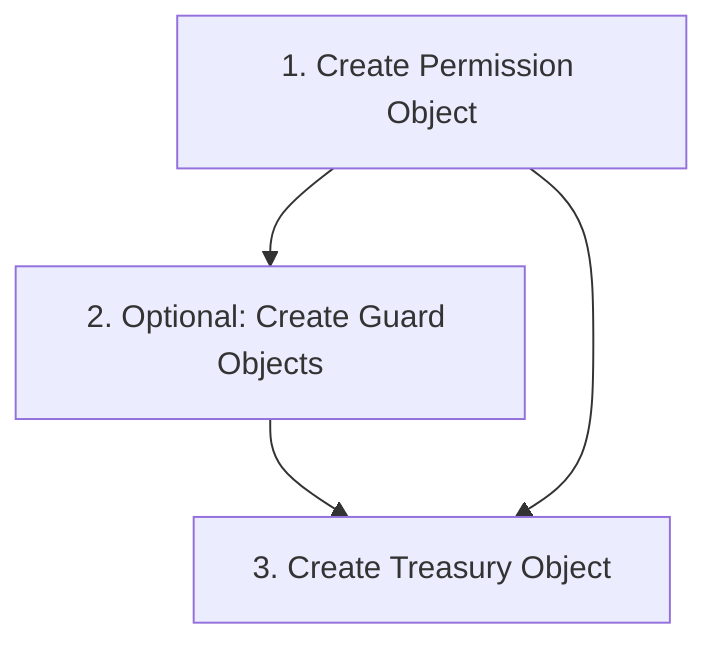

# Treasury Object: Your Team's Smart Wallet

> "Shared fund management with custom rules - like a team bank account that enforces your agreements automatically"

**MCP Tool**: [`wowok_treasury_mcp_server`](https://www.npmjs.com/package/wowok_treasury_mcp_server)

## How to Use This Documentation

### Document Structure
- **[Prerequisites & Setup](#prerequisites--setup)**: Required objects and creation dependencies
- **[Overview](#overview)**: Treasury capabilities and technical workflows
- **[Core Parameters](#core-parameters)**: All configuration options organized by operation type
- **[Data Types & Formats](#data-types--formats)**: Technical reference for addresses and types
- **[Integration Patterns](#integration-patterns)**: How Treasury works with other objects
- **[Complete Examples](#complete-examples)**: Working configurations with expected results
- **[Query Capabilities](#query-capabilities)**: What you can query and how to access Treasury data

### Navigation by Need
| I need to... | Go to section |
|--------------|---------------|
| Create Treasury object | [Prerequisites & Setup](#prerequisites--setup) |
| Add/withdraw funds | [Core Parameters → Fund Operations](#3-fund-operations) |
| Set spending limits | [Core Parameters → Access Control](#4-access-control) |
| Control team access | [Core Parameters → Access Control](#4-access-control) |
| Connect with Guards/Machines | [Integration Patterns](#integration-patterns) |
| Reference tables | [Data Types & Formats](#data-types--formats) |
| Query treasury data | [Query Capabilities](#query-capabilities) |

---

## Prerequisites & Setup

### Critical Dependency Chain
Treasury **cannot work alone**. You must create these objects in exact order:



#### Step 1: Permission Object (Required)
> "Create a Permission object for my coffee shop Treasury management, with deposit and withdrawal permissions for my finance manager."

**Permission Options**:
- **Inherit existing**: If you specify an existing Permission object, Treasury will use those established access rules
- **Create automatically**: If you omit the permission field, system creates a dedicated Permission object with admin access rights for your Treasury

#### Step 2: Guard Objects (Optional for Mode 0/2, required before setting Mode 1)
> "Create a Guard that limits daily spending to 100 SUI for our cafe operations, allowing small purchases without additional approval."

**When you need Guards**: For spending limits, time-based access, or conditional approvals (like "only during business hours" or "only with manager present").

#### Step 3: Treasury Creation
Now you can create your Treasury object. Detailed Treasury configuration and operations are covered in the following sections.

---

## Overview

### Definition
Treasury creates shared fund pools for teams with programmable spending rules and automated access control. Unlike personal wallets, Treasury enables multiple authorized entity ( AI/ Human/ Agent ) to deposit and withdraw funds according to predefined rules and approval processes.

### Core Capabilities
- **Multi-Entity Fund Management**: Single or multiple entities deposit funds into shared pools, withdraw based on assigned permissions. AI agents, humans, or smart contracts can all participate as fund managers.
- **Granular Access Control**: Different entities get different withdrawal limits based on amount thresholds, time windows, or conditions. For example: Some can only deposit, others withdraw small amounts, administrators control large transfers.
- **Conditional Operations**: Object Guards verify requirements before fund movements - such as spending limits, time constraints, multi-signature approvals. Operations execute when conditions are met, block when they fail.
- **Layered Security**: Use Permission objects to assign roles and Guard objects for dynamic condition checks, enabling multiple verification steps to meet complex operational requirements.

### Important Notes
- Treasury manages one specific token type per pool (like SUI, USDT or custom tokens)
- Token type format: `"0x2::sui::SUI"` (different from Demand's `"0x2::coin::Coin<0x2::sui::SUI>"`)
- Mode 1 (External) setting is **permanent and irreversible** - cannot switch back to Permission-based access
- All operations require account specification for transaction signing
- **Critical**: All numeric values must be strings - `"1000000000"` not `1000000000` to avoid precision loss

### Core Workflow
1. **Prerequisite**: Create a [Permission object](#prerequisites--setup) (the system can also auto-create one), and optionally create Guard objects
2. **Create**: Initialize Treasury with [token type and permissions](#1-account--object-identification)
3. **Configure**: Set [access modes and withdrawal guards](#4-access-control) for security
4. **Fund**: Add money through [deposit operations](#3-fund-operations) from team member accounts
5. **Operate**: Execute [withdrawals to team members](#3-fund-operations) or external recipients
6. **Secure**: Manage [Guard-based approvals](#4-access-control) for different spending tiers
7. **Receive**: Accept [incoming payment objects](#3-fund-operations) automatically

**Example Usage**:
1. **Coffee Shop Operations**: Owner deposits monthly budget, barista manager has daily withdrawal rights with automatic approval for small expenses (<50 SUI) and owner approval for large purchases (>200 SUI)
2. **Service Integration**: Customer payments from Service objects automatically flow into Treasury, enabling centralized fund management and automatic team profit sharing
3. **Workflow Automation**: Machine objects trigger Treasury withdrawals based on project milestones, automating supplier payments and team compensation according to progress
4. **Conditional Access**: Guards verify business hours, manager presence, or emergency status before allowing fund movements, ensuring secure operations

*Related Implementation*: → Integration with Service and Machine objects for automated business workflows

---

## Core Parameters

### 1. Account & Object Identification

**Note**: All Treasury operations require `account` parameter to specify transaction signer. If omitted, system uses current active account.

#### Object Reference (Existing Treasury)
```json
{
  "object": "sunny_cafe_fund"
}
```
**Use this when**: You want to modify an existing Treasury (deposit, withdraw, configure settings)

#### Object Creation (New Treasury)
```json
{
  "object": {
    "type_parameter": "0x2::sui::SUI",
    "permission": "existing_permission_object_name_or_address",
    "name": "treasury_identifier",
    // name: "sunny_cafe_fund" 
    "onChain": true,
    "tags": ["business", "cafe", "operations"],
    // tags: ["coffee-shop", "daily-ops", "team-fund"]
    "useAddressIfNameExist": false
  }
}
```

| Parameter | Type | Required | Description |
|-----------|------|----------|-------------|
| `type_parameter` | string | Required | Token type: `"0x2::sui::SUI"` (not Coin format) |
| `permission` | string/object | Optional | Permission object reference or inline creation |
| `name` | string | Optional | Treasury identifier for easy reference |
| `onChain` | boolean | Optional | Whether metadata visible on blockchain |
| `tags` | string[] | Optional | Organizational labels |
| `useAddressIfNameExist` | boolean | Optional | Name conflict resolution |

**Technical Note**: 
- **Reference existing**: Use `"permission": "existing_permission_address"` to inherit established access rules and team structure
- **Create inline**: Use `"permission": {...}` object to create new Permission with specified settings  
- **Required field**: Permission cannot be omitted - Treasury needs either existing reference or inline creation

💡 **AI Prompt Tip**: "Create Treasury for [business type] managing [token type] with [permission setup] for [team description]."

---

### 2. Basic Configuration

```json
{
  "description": "Shared fund purpose and operational scope",
  // description: "Sunny Side Cafe's main operating fund - covers daily supplies, staff wages, equipment maintenance, and emergency expenses. Managed by owner and finance manager with different approval levels for various expense categories."
  "deposit_guard": "contributor_verification_guard"
  // deposit_guard: "cafe_staff_verification" - only verified cafe employees can contribute
}
```

| Parameter | Type | Description | When to Use |
|-----------|------|-------------|-------------|
| `description` | string | Human-readable purpose and scope | Always recommended for team clarity |
| `deposit_guard` | string/null | Guard verification for incoming deposits | Restrict who can add funds |
---

### 3. Fund Operations

#### Deposit Funds
Add tokens from your account to Treasury pool.

```json
{
  "deposit": {
    "balance": "500000000000",
    // 500 SUI monthly budget
    "param": {
      "remark": "Monthly cafe operating budget - December 2024",
      "index": "202412001",
      // index: Business reference for accounting system integration
      "for_object": "cafe_operations_project",
      // for_object: Links deposit to specific business operations or project
      "for_guard": "budget_approval_guard"
      // for_guard: References Guard object that approved this budget allocation
    }
  }
}
```

#### Withdraw Funds  
Send tokens from Treasury to one or more recipients.

```json
{
  "withdraw": {
    "receiver": [
      {
        "address": {
          "name_or_address": "sarah_barista_manager",
          "local_mark_first": true
        },
        "amount": "150000000000"
        // amount: "150000000000" = 150 SUI monthly salary for barista manager
      },
      {
        "address": {
          "name_or_address": "mike_part_time", 
          "local_mark_first": true
        },
        "amount": "80000000000"
        // amount: "80000000000" = 80 SUI part-time weekend wages
      }
    ],
    "remark": "December staff payments - thanks for making our cafe the neighborhood favorite!",
    "withdraw_guard": "payroll_approval_guard",
    "index": "202412002",
    "for_object": "staff_compensation_program",
    "for_guard": "employment_verification_guard"
  }
}
```

#### Receive Payment Objects
Accept incoming payment objects into Treasury automatically.

```json
{
  "receive": "recently"
}
```

**Explanation**: `"recently"` automatically processes the last 50 received payment objects into the Treasury. This operation can be run multiple times safely - it only processes new, unhandled payment objects and won't duplicate existing deposits.

```json
{
  "receive": {
    "received_objects": ["0xabc123...", "0xdef456..."]
  }
}
```

### Fund Operations Parameters

| Parameter | Type | Required | Description | Example |
|-----------|------|----------|-------------|---------|
| `balance` | string | Required | Amount in base units: `"1000000000"` = 1 SUI | `"500000000000"` (500 SUI) |
| `receiver` | array | Required | List of recipients with addresses and amounts | See withdraw example |
| `amount` | string | Required | Payment per recipient in base units | `"150000000000"` (150 SUI) |
| `remark` | string | Required | Transaction description for records | `"Monthly team salaries"` |
| `index` | string | Optional | Business reference number for tracking | `"202412001"` |
| `for_object` | string | Optional | Related project/object address for context | `"operations_project"` |
| `for_guard` | string | Optional | Verification guard reference for compliance | `"approval_guard"` |
| `withdraw_guard` | string | Optional | Specific guard for this withdrawal operation | `"executive_guard"` |

**Address Resolution**:
- `local_mark_first: true` - Search your saved nickname first, then account name
- `local_mark_first: false` - Search account name first, then nickname

#### Combined Operations
Treasury supports multiple operations in single transaction for efficiency:

```json
{
  "deposit": {
    "balance": "1000000000000",
    // 1000 SUI monthly revenue
    "param": {"remark": "Monthly revenue from cafe sales"}
  },
  "withdraw": {
    "receiver": [{
      "address": {"name_or_address": "supplier_account", "local_mark_first": true},
      "amount": "300000000000"
      // 300 SUI to supplier
    }],
    "remark": "Monthly supplier payment"
  },
  "description": "Monthly cafe operations - revenue collection and supplier payment"
}
```

**When to use combined operations**: Monthly operations, budget rebalancing, automated workflow executions.

💡 **AI Prompt Tip**: "Help me withdraw funds from [treasury_name]: pay [person1] [amount] and [person2] [amount] for [purpose] with appropriate remarks."

---

### 4. Access Control

#### Withdrawal Guard Management
Set spending limits and approval requirements for different withdrawal amounts.

```json
{
  "withdraw_guard": {
    "op": "add",
    "data": [
      {
        "guard": "daily_operations_limit",
        "max_withdrawal_amount": "50000000000"// 50 SUI
      },
      {
        "guard": "owner_approval_required",
        "max_withdrawal_amount": "200000000000"//200 SUI
      },
      {
        "guard": "emergency_fund_access",
        "max_withdrawal_amount": "1000000000000"
        //1000 SUI emergency fund access
      }
    ]
  }
}
```

**How it works**: Each guard can authorize withdrawals up to its limit. Multiple guards create different spending tiers with appropriate approval requirements.

#### Withdrawal Mode Configuration
Control the overall access system for your Treasury.

```json
{
  "withdraw_mode": 2
}
```

**Mode Requirements & Implications**:
- **Mode 0 (Internal)**: No special requirements, flexible for small teams
- **Mode 1 (External)**: **Requires at least one Guard object configured first**, permanent decision
- **Mode 2 (Hybrid)**: Works with or without Guards, recommended for most teams

> ⚠️ **Mode 1 Warning**: External mode setting is permanent and irreversible. The Treasury object remains changeable, but you cannot switch the access mode back to Permission-based control once set. Use for high-security scenarios only.

#### Deposit Guard Configuration
```json
{
  "deposit_guard": "cafe_employee_verification"
}
```

```json
{
  "deposit_guard": null
}
```

### Access Control Parameters

| Parameter | Options | Description | Changeable |
|-----------|---------|-------------|------------|
| `op` | `add`, `set`, `remove`, `removeall` | Guard management operation | ✅ |
| `max_withdrawal_amount` | string | Spending limit in base units (per guard) | ✅ |
| `withdraw_mode` | 0, 1, 2 | Overall access control system | Mode 1: ❌ Permanent |
| `deposit_guard` | string/null | Guard required for deposits | ✅ |

**Operation Types**: `add` (append), `set` (replace all), `remove` (delete specific), `removeall` (clear all)

💡 **AI Prompt Tip**: "Set up Treasury security for [business type]: [small/medium/large] daily expenses need [approval type], [amount] threshold needs [approval level]."

---

### 5. Advanced Features

#### Network Configuration
```json
{
  "session": {
    "network": "sui testnet",
    "retentive": "always"
  }
}
```

#### Real-time Verification (Witness)

For complete witness system and Guard verification, see [Guard Object Documentation - Witness System](Guard.md#witness-system-configuration).

```json
{
  "witness": {
    "guards": ["dynamic_verification_guard"],
    "witness": [
      {
        "guard": "dynamic_verification_guard", 
        "identifier": 1,
        "type": 101,
        "witness": "cafe_emergency_confirmed"
      }
    ]
  }
}
```

| Parameter | Options | Description |
|-----------|---------|-------------|
| `network` | `sui mainnet`, `sui testnet`, `wowok mainnet`, `wowok testnet` | Target blockchain |
| `retentive` | `always`, `session` | Whether to keep connection active |
| `identifier` | 1-255 | Reference position in Guard's verification table |
| `type` | 100: Bool, 101: Address, 102: U8, 103: U64, 104: Vec<U8>, 105: U128, 106-122: Other types | Wowok data type code for witness value |
| `witness` | any | **User-provided proof value (only field you modify)** |

---

## Data Types & Formats

### Address Format Options

For complete address format options, see [Service Object Documentation - Address Formats](Service.md#address-formats).

#### Treasury-Specific Address Examples
```json
{
  "address": {
    "name_or_address": "sarah_barista_manager",
    "local_mark_first": true
  }
}
```

**Treasury Context**: Treasury address resolution focuses on team member management and payment recipients. Use descriptive names for team members to simplify fund distribution operations.

### Token Type Formats

| Token Category | Format Example | Common Use |
|---------------|----------------|------------|
| **SUI Native** | `"0x2::sui::SUI"` | common native blockchain token for SUI |
| **Custom Token** | `"0xabc123::cafe::LOYALTY"` | Business tokens, loyalty points |

### Number Format Guidelines

> ⚠️ **Critical Requirement**: All numeric values in Treasury operations must be strings to avoid precision issues. This is mandatory for all amount fields.

```json
// ✅ Correct format - always use strings
{
  "balance": "500000000000",
  "amount": "150000000000", 
  "max_withdrawal_amount": "50000000000"
}

// ❌ Wrong format - will cause errors or precision loss
{
  "balance": 500000000000,    // ❌ Number format not supported
  "amount": 150000000000      // ❌ Risk of precision loss
}
```

**Why strings are required**: Large numbers in JavaScript can lose precision. Treasury handles significant token amounts that require exact precision for financial operations.


💡 **Quick Math**: 1 SUI = `"1000000000"` base units (9 zeros)

---

## Integration Patterns

### Treasury + Service Integration
**Service Payment Processing**: Service objects can automatically deposit customer payments into Treasury, while Treasury handles automatic staff payment distribution and supplier cost management.

**Order-to-Treasury Flow**: When customers purchase from Service objects, payments flow through Treasury for centralized fund management, enabling automatic expense allocation and team profit sharing.

### Treasury + Machine Integration  
**Workflow-Driven Payments**: Machine objects can trigger Treasury withdrawals based on workflow completion milestones, automating team payments and supplier disbursements according to project progress.

**Multi-Stage Fund Release**: Treasury integrates with Machine progress tracking to release funds at different workflow stages - partial payments for milestones, final payments for completion, bonus releases for quality achievements.

### Treasury + Guard Integration
**Conditional Access Control**: Guards can verify complex business conditions before Treasury operations - time-based access windows, multi-party approval requirements, external verification proof, or dynamic business logic.

**Real-time Verification**: Guards enable Treasury to verify real-time conditions that aren't stored on blockchain - current business hours, owner presence confirmation, emergency status verification, or seasonal operation modes.

### Treasury + Repository Integration
**Financial Record Management**: Repository objects can store detailed transaction metadata, business receipts, and approval records that Treasury references for audit trails and compliance reporting.

**Team Data Integration**: Treasury can query Repository for team member information, payment preferences, tax details, and performance metrics to automate personalized compensation and benefit distribution.


💡 **AI Prompt Template for Treasury Integration**:
```
"I need Treasury integration for [business type] that connects with [other objects]. We have [team structure] and need [payment automation]. Design Treasury configuration with appropriate guards, permissions, and integration patterns. Show me how Treasury works with [specific object types] for [business workflow]."
```

---

## Complete Examples

### Complete Cafe Treasury Setup
**Step 1**: Create Permission Object with `mcp_wowok_permission_operations`
```json
{
  "account": "cafe_owner",
  "data": {
    "object": {
      "description": "Sunny Side Cafe treasury management permissions",
      "name": "cafe_permission"
    },
    "admin": {"op": "add", "addresses": [{"name_or_address": "cafe_owner"}]},
    "permission": {
      "op": "add entity", 
      "entities": [
        {
          "address": {"name_or_address": "sarah_manager"},
          "permissions": [
            {"index": 702}, {"index": 703}, {"index": 704}
          ]
        }
      ]
    }
  }
}

```
Result should look like:


**Step 2**: Create Treasury with `mcp_wowok_treasury_operations`
```json 
{
  "account": "cafe_owner",
  "data": {
    "object": {
      "type_parameter": "0x2::sui::SUI",
      "permission": "cafe_permission",
      "name": "sunny_cafe_fund",
      "tags": ["cafe", "operations", "team-fund"]
    },
    "description": "Sunny Side Cafe shared operating fund - daily supplies, staff wages, equipment maintenance, emergency expenses. Owner and manager access with different approval levels."
  }
}

```
Result should look like:


**Step 3**: Configure Security with `mcp_wowok_treasury_operations`
```json
{
  "account": "cafe_owner",
  "data": {
    "object": "sunny_cafe_fund",
    "withdraw_mode": 2,
    "withdraw_guard": {
      "op": "add",
      "data": [
        {
          "guard": "daily_operations_limit",
          "max_withdrawal_amount": "50000000000"
        },
        {
          "guard": "owner_approval_required", 
          "max_withdrawal_amount": "200000000000"
        }
      ]
    },
    "deposit_guard": "cafe_staff_verification"
  }
}
```

### Monthly Staff Payment Distribution
```json
{
  "account": "sarah_manager",
  "data": {
    "object": "sunny_cafe_fund",
    "withdraw": {
      "receiver": [
        {
          "address": {
            "name_or_address": "sarah_manager",
            "local_mark_first": true
          },
          "amount": "180000000000"
        },
        {
          "address": {
            "name_or_address": "mike_weekend_barista",
            "local_mark_first": true
          },
          "amount": "120000000000"
        },
        {
          "address": {
            "name_or_address": "emma_morning_shift",
            "local_mark_first": true
          },
          "amount": "140000000000"
        }
      ],
      "remark": "December 2024 staff compensation - amazing month everyone! Holiday bonuses included for exceptional customer service during busy season."
    }
  }
}
```
Result should look like：

Payment：


### Emergency Equipment Purchase
```json
{
  "account": "cafe_owner",
  "data": {
    "object": "sunny_cafe_fund",
    "withdraw": {
      "receiver": [
        {
          "address": {
            "name_or_address": "coffee_equipment_supplier",
            "local_mark_first": true
          },
          "amount": "800000000000"
        }
      ],
      "remark": "Emergency espresso machine replacement - old machine died during morning rush, needed immediate replacement to keep cafe operational",
      "withdraw_guard": "emergency_fund_access",
      "for_object": "equipment_maintenance_program"
    }
  },
  "witness": {
    "guards": ["emergency_fund_access"],
    "witness": [
      {
        "guard": "emergency_fund_access",
        "identifier": 1,
        "type": 101,
        "witness": "equipment_emergency_confirmed"
      }
    ]
  }
}
```
Result should look like：


**Expected Results**:
- Treasury created with 2-tier spending approval system
- Daily operations: up to 50 SUI (manager can approve for supplies, minor maintenance)
- Major expenses: up to 200 SUI (owner approval required for equipment, large orders)
- Emergency fund: up to 1000 SUI (emergency verification + owner approval)
- Only verified cafe staff can deposit funds for security

---

## AI Assistant Troubleshooting

Instead of manually debugging Treasury issues, use these AI prompts for instant, personalized assistance:

### 🤖 **Treasury Creation Problems**

**Prompt**: "I'm trying to create a Treasury object but getting error '[ERROR_MESSAGE]'. I'm using account [ACCOUNT] with Permission object [PERMISSION_NAME] and token type [TOKEN_TYPE]. Can you help me fix this?"

**The AI will check**:
- Permission object existence and accessibility  
- Token type parameter format (must be `"0x2::sui::SUI"` not Coin format)
- Account authorization and admin rights in Permission object
- Network consistency between components

### 🤖 **Fund Operation Issues**

**Prompt**: "I'm getting '[ERROR_MESSAGE]' when trying to [DEPOSIT/WITHDRAW] [AMOUNT] tokens [TO/FROM] Treasury [TREASURY_NAME]. My account is [ACCOUNT]. What's wrong with my operation?"

**The AI will verify**:
- Treasury balance and token availability
- Account permissions (702: Deposit, 703: Withdraw)  
- Treasury mode compatibility with operation type
- Guard configuration and verification requirements

### 🤖 **Access Control & Mode Problems**

**Prompt**: "I can't change my Treasury [NAME] to mode [MODE_NUMBER] and getting '[ERROR_MESSAGE]'. Current configuration: [CONFIG_DETAILS]. What should I do?"

**The AI will analyze**:
- Current Treasury mode and transition rules
- Guard object configuration requirements for Mode 1
- Mode permanence implications (Mode 1 cannot be changed back)
- Alternative solutions if mode change is blocked

### 🤖 **Guard Integration Issues**

**Prompt**: "My Treasury guard verification is failing with error '[ERROR_MESSAGE]'. I'm trying to withdraw [AMOUNT] using Guard [GUARD_NAME]. Here's my witness data: [WITNESS_JSON]. Can you help me fix the guard verification?"

**The AI will help**:
- Review Guard logic and verification requirements
- Check witness data format and required fields
- Verify withdrawal amount against guard limits
- Suggest correct witness values for verification

### 🤖 **Address Resolution Problems**

**Prompt**: "I'm getting 'Address not found' or 'Invalid address' when trying to send Treasury funds to [RECIPIENT_ADDRESS]. I'm using local_mark_first: [true/false]. How can I fix the address resolution?"

**The AI will check**:
- local_mark_first setting compatibility with address format
- Local mark existence and naming consistency  
- Address format validation (blockchain address vs local names)
- Alternative addressing methods

### 🎯 **General Treasury Troubleshooting**

**Comprehensive Issue Resolution**: "I'm having trouble with Treasury [NAME]. Here's what I'm trying to do: [DESCRIBE_GOAL]. Here's the error: [ERROR_MESSAGE]. Current Treasury configuration: [CONFIG_JSON]. Can you walk me through diagnosing and fixing this step by step?"

💡 **Development Tip**: Always test Treasury configurations on testnet first, especially mode changes and Guard integrations. Use small amounts initially to verify everything works correctly before handling real business funds.

---

## Query Capabilities

Treasury objects provide comprehensive financial tracking and transaction history access for auditing, monitoring, and financial analysis.

**What You Can Query:**
- **Complete treasury configuration** - including token type, withdrawal modes, guard settings, and balance information
- **Financial transaction history** - detailed operation records with pagination support for comprehensive auditing
- **Specific transaction details** - by sequential index numbers for precise transaction tracking
- **Pending ReceivedObject instances** - payments waiting to be processed into the treasury

**Quick Query Examples:**
- "Show me the complete treasury configuration including withdrawal modes and guard settings"
- "List all transaction records in treasury_addr to see the complete financial history"
- "Get the details of transaction index 5 in treasury_addr to see what happened"
- "Check what payments are waiting to be deposited into this treasury"

**Detailed Query Reference:** See the complete [Treasury Object Query Capabilities](./Query_Reference.md#treasury-object-query-capabilities) in the Wowok Query Technical Reference for field specifications, query operations, and advanced usage patterns.

---
