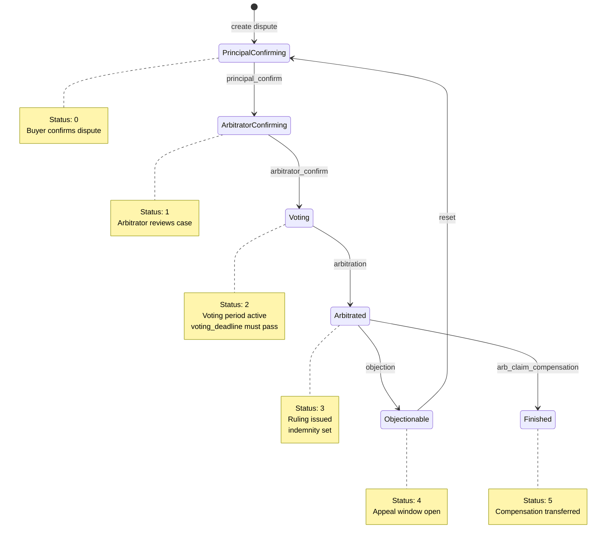
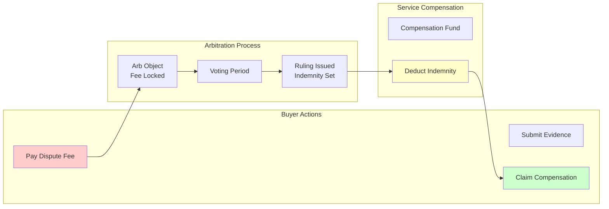

# Arbitration Component (⚖️ Dispute Resolution)

---

## Component Overview

The Arbitration component is WoWok protocol's on-chain dispute resolution module, providing a transparent arbitration system for resolving order conflicts. Arbitration objects can be created with configurable voting rules, receive dispute submissions, confirm materials, vote on propositions, and provide final arbitration results.

---

## Function List

| Function Name | Purpose | Usage Scenario | Significance |
|---------------|---------|----------------|-------------|
| **Create Arbitration** | Set up dispute resolution system | Establish order governance | Provides framework for fair conflict resolution |
| **Initiate Dispute** | File conflict case | Report order issues, service failures | Formalizes dispute submission |
| **Confirm Materials** | Validate evidence submission | Review dispute documents | Ensures arbitration based on verified data |
| **Vote on Propositions** | Participate in decision-making | Jury voting, governance | Enables democratic dispute resolution |
| **Issue Ruling** | Deliver final arbitration result | Resolve conflicts, decide compensation | Concludes dispute with binding outcome |

---

## Complete Tool Call Structure

Arbitration operations use the following top-level structure:

```json
{
  "operation_type": "arbitration",
  "data": { ... },    // Arbitration data definition
  "env": { ... },      // Execution environment (optional)
  "submission": { ... } // Guard verification submission (optional)
}
```

---

## Schema Tree

```
arbitration (Arbitration Object)
├── operation_type: "arbitration" (fixed value)
├── data (Arbitration data definition)
│   ├── object (TypedPermissionObject, required) - Arbitration object reference or creation
│   │   ├── Option 1: Reference existing object (string) - object name or ID
│   │   └── Option 2: Create new object (object)
│   │       ├── name (string, optional) - local mark name, max 64 characters
│   │       ├── tags (array of string, optional) - tags array
│   │       ├── onChain (boolean, optional) - whether to sync name to blockchain
│   │       ├── replaceExistName (boolean, optional) - force claim existing name
│   │       ├── type_parameter (string, optional) - token type, default: 0x2::wow::WOW
│   │       └── permission (string | object, optional) - Permission object ID/name or new permission object
│   │           ├── Option 1: Existing permission ID/name (string)
│   │           └── Option 2: New permission object (object)
│   │               ├── name (string, optional) - permission name
│   │               ├── tags (array of string, optional) - tags array
│   │               ├── onChain (boolean, optional) - whether to sync name to blockchain
│   │               └── replaceExistName (boolean, optional) - force claim existing name
│   ├── description (string, optional) - arbitration description, max 65535 characters
│   ├── location (string, optional) - arbitration location, max 256 characters
│   ├── fee (number, optional) - arbitration fee in smallest units
│   ├── pause (boolean, optional) - whether to pause arbitration
│   ├── dispute (Dispute object, optional) - create dispute for order
│   │   ├── order (string, required) - order object ID or name
│   │   ├── description (string, optional) - dispute description, max 65535 characters
│   │   ├── proposition (array of string, required) - list of dispute propositions, each max 256 characters
│   │   ├── fee (CoinParam, required) - dispute processing fee
│   │   │   ├── Option 1: Balance object (object)
│   │   │   │   └── balance (number) - balance amount
│   │   │   └── Option 2: Coin object ID (string)
│   │   └── namedArb (NamedObject, optional) - name for the newly created Arb object
│   │       ├── name (string, optional) - arb object name
│   │       ├── tags (array of string, optional) - tags array
│   │       ├── onChain (boolean, optional) - whether to sync name to blockchain
│   │       └── replaceExistName (boolean, optional) - force claim existing name
│   ├── confirm (Confirm object, optional) - confirm arbitration materials
│   │   ├── arb (string, required) - Arb object ID or name
│   │   └── voting_deadline (number | null, required) - voting deadline in milliseconds
│   ├── voting_deadline_change (VotingDeadlineChange object, optional) - change voting deadline
│   │   ├── arb (string, required) - Arb object ID or name
│   │   └── voting_deadline (number | null, required) - new voting deadline in milliseconds
│   ├── vote (Vote object, optional) - vote on propositions
│   │   ├── arb (string, required) - Arb object ID or name
│   │   ├── votes (array of number, required) - vote list, each value 0-255
│   │   └── voting_guard (string, optional) - voting Guard object ID/name
│   ├── feedback (Feedback object, optional) - provide arbitration feedback
│   │   ├── arb (string, required) - Arb object ID or name
│   │   └── feedback (string, required) - arbitration feedback, max 65535 characters
│   ├── arbitration (ArbitrationAction object, optional) - provide final arbitration result
│   │   ├── arb (string, required) - Arb object ID or name
│   │   ├── feedback (string, required) - arbitration feedback, max 65535 characters
│   │   └── indemnity (number, required) - compensation amount in smallest units
│   ├── reset (Reset object, optional) - apply to restart arbitration
│   │   ├── arb (string, required) - Arb object ID or name
│   │   └── feedback (string, required) - arbitration feedback, max 65535 characters
│   ├── arb_withdraw (ArbWithdraw object, optional) - withdraw arbitration fees
│   │   └── arb (string, required) - Arb object ID or name
│   ├── fees_transfer (FeesTransfer object, optional) - distribute arbitration fees
│   │   ├── to (FeesTransferTo object, required) - receiving object
│   │   │   ├── Option 1: Allocation reference (object)
│   │   │   │   └── allocation (string) - Allocation object ID/name
│   │   │   └── Option 2: Treasury reference (object)
│   │   │       └── treasury (string) - Treasury object ID/name
│   │   ├── payment_remark (string, required) - payment remark, max 64 characters
│   │   ├── payment_index (number, required) - payment index
│   │   └── newPayment (NamedObject, optional) - name for new Payment object
│   │       ├── name (string, optional) - payment name
│   │       ├── tags (array of string, optional) - tags array
│   │       ├── onChain (boolean, optional) - whether to sync name to blockchain
│   │       └── replaceExistName (boolean, optional) - force claim existing name
│   ├── usage_guard (string | null, optional) - Guard for user verification, null to unbind
│   ├── voting_guard (VotingGuardAction object, optional) - manage voting Guards
│   │   ├── op (string, required) - operation type: "add", "set", "remove", "clear"
│   │   └── guards (array, required for add/set/remove) - list of VotingGuard objects or Guard names
│   │       └── VotingGuard object (for add/set)
│   │           ├── guard (string) - Guard object ID or name
│   │           └── vote_weight (object) - vote weight
│   │               ├── Option 1: FixedValue (object)
│   │               │   └── FixedValue (number) - fixed weight value 0-65535
│   │               └── Option 2: GuardIdentifier (object)
│   │                   └── GuardIdentifier (number) - Guard table identifier 0-255
│   ├── owner_receive (ReceivedObjectsOrRecently, optional) - receive objects to owner
│   │   ├── Option 1: "recently" (string) - receive all recent objects
│   │   ├── Option 2: ReceivedBalance object (object)
│   │   │   ├── balance (number or string) - balance amount
│   │   │   ├── token_type (string) - token type
│   │   │   └── received (array of ReceivedItem) - received items list
│   │   │       └── ReceivedItem object
│   │   │           ├── id (string) - object ID
│   │   │           └── type (string) - object type
│   │   └── Option 3: Array of received objects
│   │       └── [{ id: "object_id", type: "object_type" }]
│   └── um (string | null, optional) - Contact object ID/name, null to unbind
├── env (CallEnv, optional) - execution environment
│   ├── account (string, optional) - account name or address, empty string for default
│   ├── network (string, optional) - "testnet" or "mainnet"
│   ├── permission_guard (array of string, optional) - list of permission guard IDs
│   ├── no_cache (boolean, optional) - disable caching
│   └── referrer (string, optional) - referrer ID
└── submission (SubmissionCall, optional) - submission data
    ├── type (string) - fixed value "submission"
    ├── guard (array of GuardInfo) - list of guards to verify
    │   └── GuardInfo object
    │       ├── object (string) - guard object ID
    │       └── impack (boolean) - impact flag
    └── submission (array of GuardSubmission) - submission data for guards
        └── GuardSubmission object
            ├── guard (string) - guard object ID
            └── submission (array of GuardSubmissionItem) - submission items
                └── GuardSubmissionItem object
                    ├── identifier (number, 0-255) - Guard table item identifier
                    ├── b_submission (boolean) - whether this item requires submission
                    ├── value_type (number | string) - value type (e.g., 6 or "U64" for U64 type)
                    ├── value (any) - submitted value
                    └── name (string, optional) - item name
```

---

### ⚠️ Important Note About Submission

If the execution returns a `submission` field in the response, it indicates that additional Guard verification data is required. You must:

1. Complete all required submission data within the `submission` structure
2. Resubmit the operation with the completed submission data
3. **Do not modify any other parts of the structure** - only fill in the required submission values

The submission structure will specify which Guard objects need verification and what data needs to be provided for each Guard table item.

**Query Value Types**: Use the `wowok_buildin_info` tool with `{ "info": "value types" }` to query all supported value types with their numeric and string representations. This helps you understand what `value_type` values are valid for submission data.

---

## Sub-feature 1: Create New Arbitration

### Feature Description

Create a new Arbitration object for resolving order disputes. Newly created arbitrations can be configured with descriptions, locations, fees, and voting guards.

### Parameter Description

| Parameter Path | Type | Required | Description | Constraints |
|----------|------|------|------|------|
| `operation_type` | string | Yes | Operation type | Fixed value "arbitration" |
| `data.object` | object | Yes | Create new Arbitration | TypedPermissionObject structure |
| `data.object.name` | string | No | Local mark name | Max 64 characters |
| `data.object.tags` | array | No | Tags array | String array |
| `data.object.onChain` | boolean | No | Whether to mark on-chain | |
| `data.object.replaceExistName` | boolean | No | Replace existing name | |
| `data.object.permission` | string/object | No | Permission object | Can be existing permission ID/name, or new permission object |
| `data.object.type_parameter` | string | No | Token type | Default: 0x2::wow::WOW |
| `data.description` | string | No | Arbitration description | Max 65535 characters |
| `data.location` | string | No | Arbitration location | Max 256 characters |
| `data.fee` | number | No | Arbitration fee in smallest units | No decimals or negatives |

---

### Examples

#### Example 1.1: Create Simple Arbitration

**Prompt**: Create a new arbitration named "doc_test_arbitration" with: 1) Permission "arb_test_permission", 2) Description "Arbitration for documentation testing", 3) Location "Online arbitration system", 4) Fee at 1000000000 (1 WOW).

```json
{
  "operation_type": "arbitration",
  "data": {
    "object": {
      "name": "doc_test_arbitration",
      "permission": "arb_test_permission",
      "type_parameter": "0x2::wow::WOW",
      "tags": ["arbitration", "test", "doc"],
      "onChain": false
    },
    "description": "Arbitration for documentation testing",
    "location": "Online arbitration system",
    "fee": 1000000000
  },
  "env": {
    "account": "arbitration_test_account",
    "network": "testnet",
    "no_cache": true
  }
}
```

**Execution Result**:
```json
{
  "status": "success",
  "object": "0xebc9dc62a87d05e87f6bad1f9fd600bb61734ab00a8bd7435818115a1709d6ec",
  "type": "Arbitration",
  "version": "1413284",
  "change": "created"
}
```

#### Example 1.2: Create Arbitration with New Permission and Guards

**Prompt**: Create arbitration "product_arbitration" with: 1) New permission named "arb_permission", 2) Description "Product quality arbitration", 3) Usage guard "eligibility_guard", 4) Voting guards: "senior_judge" with FixedValue 100, "junior_judge" with GuardIdentifier 5.

```json
{
  "operation_type": "arbitration",
  "data": {
    "object": {
      "name": "product_arbitration",
      "permission": {
        "name": "arb_permission"
      }
    },
    "description": "Product quality arbitration",
    "usage_guard": "eligibility_guard",
    "voting_guard": {
      "op": "add",
      "guards": [
        {
          "guard": "senior_judge",
          "vote_weight": {
            "FixedValue": 100
          }
        },
        {
          "guard": "junior_judge",
          "vote_weight": {
            "GuardIdentifier": 5
          }
        }
      ]
    }
  }
}
```

---

## Sub-feature 2: Create Dispute (dispute)

### Feature Description

Create a new Arb object for an order to initiate dispute arbitration.

### Parameter Description

| Parameter Path | Type | Required | Description | Constraints |
|----------|------|------|------|------|
| `operation_type` | string | Yes | Operation type | Fixed value "arbitration" |
| `data.object` | string | Yes | Reference existing Arbitration | Arbitration name or ID |
| `data.dispute.order` | string | Yes | Order object ID or name | |
| `data.dispute.description` | string | No | Dispute description | Max 65535 characters |
| `data.dispute.proposition` | array | Yes | List of dispute propositions | String array |
| `data.dispute.fee` | object/string | Yes | Dispute processing fee | CoinParam structure |
| `data.dispute.namedArb.name` | string | No | Name for the newly created arbitration object | Max 64 characters |

---

### Example

#### Example 2.1: Create Dispute

**Prompt**: Create a dispute for "doc_test_arbitration" with: 1) Order "arb_test_order", 2) Description "Product quality does not match description", 3) Propositions ["Full refund", "Partial refund 50%", "No refund"], 4) Fee 1000000000 (1 WOW), 5) Name new dispute "test_dispute_2026".

```json
{
  "operation_type": "arbitration",
  "data": {
    "object": "doc_test_arbitration",
    "dispute": {
      "order": "arb_test_order",
      "description": "Product quality does not match description",
      "proposition": ["Full refund", "Partial refund 50%", "No refund"],
      "fee": {
        "balance": 1000000000
      },
      "namedArb": {
        "name": "test_dispute_2026",
        "onChain": false
      }
    }
  },
  "env": {
    "account": "arbitration_test_account",
    "network": "testnet",
    "no_cache": true
  }
}
```

**Execution Result**:
```json
{
  "status": "success",
  "results": [
    {
      "object": "0x2b1439093329363d108a9eef44414c3ae916762c030b63457ebfb351af7b5cc0",
      "type": "Order",
      "version": "1415870",
      "change": "mutated"
    },
    {
      "object": "0xebc9dc62a87d05e87f6bad1f9fd600bb61734ab00a8bd7435818115a1709d6ec",
      "type": "Arbitration",
      "version": "1415870",
      "change": "mutated"
    },
    {
      "object": "0xe8e2b96b03472a731a070cd244c3bd7fe25135ee99c05d61ac265cc62e50f9b2",
      "type": "Arb",
      "version": "1415870",
      "change": "created"
    }
  ]
}
```

---

## Sub-feature 3: Confirm Materials (confirm)

### Feature Description

Confirm the arbitration materials submitted by the user.

### Parameter Description

| Parameter Path | Type | Required | Description | Constraints |
|----------|------|------|------|------|
| `operation_type` | string | Yes | Operation type | Fixed value "arbitration" |
| `data.object` | string | Yes | Reference existing Arbitration | Arbitration name or ID |
| `data.confirm.arb` | string | Yes | Arb object ID or name | |
| `data.confirm.voting_deadline` | number or null | Yes | Voting deadline (milliseconds) | No decimals or negatives, or null |

---

### Example

#### Example 3.1: Confirm Materials with Voting Deadline

**Prompt**: For "doc_test_arbitration", confirm materials for "test_dispute_2026" with voting deadline at 1777830400000.

```json
{
  "operation_type": "arbitration",
  "data": {
    "object": "doc_test_arbitration",
    "confirm": {
      "arb": "test_dispute_2026",
      "voting_deadline": 1777830400000
    }
  },
  "env": {
    "account": "arbitration_test_account",
    "network": "testnet",
    "no_cache": true
  }
}
```

**Execution Result**:
```json
{
  "status": "success",
  "object": "0xe8e2b96b03472a731a070cd244c3bd7fe25135ee99c05d61ac265cc62e50f9b2",
  "type": "Arb",
  "version": "1415871",
  "change": "mutated"
}
```

---

## Sub-feature 4: Change Voting Deadline (voting_deadline_change)

### Feature Description

Change the voting deadline for arbitration.

### Parameter Description

| Parameter Path | Type | Required | Description | Constraints |
|----------|------|------|------|------|
| `operation_type` | string | Yes | Operation type | Fixed value "arbitration" |
| `data.object` | string | Yes | Reference existing Arbitration | Arbitration name or ID |
| `data.voting_deadline_change.arb` | string | Yes | Arb object ID or name | |
| `data.voting_deadline_change.voting_deadline` | number or null | Yes | New voting deadline (milliseconds) | No decimals or negatives, or null |

---

### Example

#### Example 4.1: Remove Voting Deadline

**Prompt**: For "service_arbitration", remove voting deadline for "order_123_dispute" (set to null).

```json
{
  "operation_type": "arbitration",
  "data": {
    "object": "service_arbitration",
    "voting_deadline_change": {
      "arb": "order_123_dispute",
      "voting_deadline": null
    }
  }
}
```

---

## Sub-feature 5: Vote (vote)

### Feature Description

Vote on user propositions.

### Parameter Description

| Parameter Path | Type | Required | Description | Constraints |
|----------|------|------|------|------|
| `operation_type` | string | Yes | Operation type | Fixed value "arbitration" |
| `data.object` | string | Yes | Reference existing Arbitration | Arbitration name or ID |
| `data.vote.arb` | string | Yes | Arb object ID or name | |
| `data.vote.votes` | array | Yes | Vote list | Each value 0-255 |
| `data.vote.voting_guard` | string | No | Voting Guard object ID/name | |

---

### Example

#### Example 5.1: Vote on Propositions

**Prompt**: For "service_arbitration", vote on "order_123_dispute" with votes [200, 100, 50] using "senior_judge" guard.

```json
{
  "operation_type": "arbitration",
  "data": {
    "object": "service_arbitration",
    "vote": {
      "arb": "order_123_dispute",
      "votes": [200, 100, 50],
      "voting_guard": "senior_judge"
    }
  }
}
```

---

## Sub-feature 6: Provide Feedback (feedback)

### Feature Description

Provide arbitration feedback for an Arb object.

### Parameter Description

| Parameter Path | Type | Required | Description | Constraints |
|----------|------|------|------|------|
| `operation_type` | string | Yes | Operation type | Fixed value "arbitration" |
| `data.object` | string | Yes | Reference existing Arbitration | Arbitration name or ID |
| `data.feedback.arb` | string | Yes | Arb object ID or name | |
| `data.feedback.feedback` | string | Yes | Arbitration feedback | Max 65535 characters |

---

### Example

#### Example 6.1: Provide Feedback

**Prompt**: For "doc_test_arbitration", provide feedback on "test_dispute_2026" that "All evidence has been reviewed. The buyer provided sufficient proof of product quality issues."

```json
{
  "operation_type": "arbitration",
  "data": {
    "object": "doc_test_arbitration",
    "feedback": {
      "arb": "test_dispute_2026",
      "feedback": "All evidence has been reviewed. The buyer provided sufficient proof of product quality issues."
    }
  },
  "env": {
    "account": "arbitration_test_account",
    "network": "testnet",
    "no_cache": true
  }
}
```

**Execution Result**:
```json
{
  "status": "success",
  "object": "0xe8e2b96b03472a731a070cd244c3bd7fe25135ee99c05d61ac265cc62e50f9b2",
  "type": "Arb",
  "version": "1415872",
  "change": "mutated"
}
```

---

## Sub-feature 7: Give Arbitration Result (arbitration)

### Feature Description

Provide the final arbitration result.

### Parameter Description

| Parameter Path | Type | Required | Description | Constraints |
|----------|------|------|------|------|
| `operation_type` | string | Yes | Operation type | Fixed value "arbitration" |
| `data.object` | string | Yes | Reference existing Arbitration | Arbitration name or ID |
| `data.arbitration.arb` | string | Yes | Arb object ID or name | |
| `data.arbitration.feedback` | string | Yes | Arbitration feedback | Max 65535 characters |
| `data.arbitration.indemnity` | number | Yes | Compensation amount in smallest units | No decimals or negatives |

---

### Example

#### Example 7.1: Give Arbitration Result

**Prompt**: For "service_arbitration", give final result on "order_123_dispute": 1) Feedback "Based on all evidence, buyer wins the case", 2) Indemnity 5000000000 (5 WOW).

```json
{
  "operation_type": "arbitration",
  "data": {
    "object": "service_arbitration",
    "arbitration": {
      "arb": "order_123_dispute",
      "feedback": "Based on all evidence, buyer wins the case",
      "indemnity": 5000000000
    }
  }
}
```

---

## Sub-feature 8: Reset Arbitration (reset)

### Feature Description

User applies to resubmit materials and restart arbitration.

### Parameter Description

| Parameter Path | Type | Required | Description | Constraints |
|----------|------|------|------|------|
| `operation_type` | string | Yes | Operation type | Fixed value "arbitration" |
| `data.object` | string | Yes | Reference existing Arbitration | Arbitration name or ID |
| `data.reset.arb` | string | Yes | Arb object ID or name | |
| `data.reset.feedback` | string | Yes | Arbitration feedback | Max 65535 characters |

---

### Example

#### Example 8.1: Reset Arbitration

**Prompt**: For "service_arbitration", apply to reset "order_123_dispute" with feedback "New evidence discovered, request to resubmit materials".

```json
{
  "operation_type": "arbitration",
  "data": {
    "object": "service_arbitration",
    "reset": {
      "arb": "order_123_dispute",
      "feedback": "New evidence discovered, request to resubmit materials"
    }
  }
}
```

---

## Sub-feature 9: Withdraw Arbitration Fee (arb_withdraw)

### Feature Description

Withdraw arbitration fees from the Arb object.

### Parameter Description

| Parameter Path | Type | Required | Description | Constraints |
|----------|------|------|------|------|
| `operation_type` | string | Yes | Operation type | Fixed value "arbitration" |
| `data.object` | string | Yes | Reference existing Arbitration | Arbitration name or ID |
| `data.arb_withdraw.arb` | string | Yes | Arb object ID or name | |

---

### Example

#### Example 9.1: Withdraw Arbitration Fee

**Prompt**: For "service_arbitration", withdraw fee from "order_123_dispute".

```json
{
  "operation_type": "arbitration",
  "data": {
    "object": "service_arbitration",
    "arb_withdraw": {
      "arb": "order_123_dispute"
    }
  }
}
```

---

## Sub-feature 10: Distribute Arbitration Fees (fees_transfer)

### Feature Description

Distribute withdrawn arbitration fees.

### Parameter Description

| Parameter Path | Type | Required | Description | Constraints |
|----------|------|------|------|------|
| `operation_type` | string | Yes | Operation type | Fixed value "arbitration" |
| `data.object` | string | Yes | Reference existing Arbitration | Arbitration name or ID |
| `data.fees_transfer.to` | object | Yes | Receiving object | Must have either "allocation" or "treasury" |
| `data.fees_transfer.to.allocation` | string | No | Allocation object ID/name | |
| `data.fees_transfer.to.treasury` | string | No | Treasury object ID/name | |
| `data.fees_transfer.payment_remark` | string | Yes | Payment remark | Max 64 characters |
| `data.fees_transfer.payment_index` | number | Yes | Payment index | No decimals or negatives |
| `data.fees_transfer.newPayment.name` | string | No | Name for the newly created Payment object | Max 64 characters |

---

### Examples

#### Example 10.1: Distribute to Allocation

**Prompt**: For "service_arbitration", distribute fees to "fee_allocation" with: 1) Remark "Arbitration fee distribution", 2) Index 0, 3) Name new payment "fee_payment".

```json
{
  "operation_type": "arbitration",
  "data": {
    "object": "service_arbitration",
    "fees_transfer": {
      "to": {
        "allocation": "fee_allocation"
      },
      "payment_remark": "Arbitration fee distribution",
      "payment_index": 0,
      "newPayment": {
        "name": "fee_payment"
      }
    }
  }
}
```

#### Example 10.2: Distribute to Treasury

**Prompt**: For "service_arbitration", distribute fees to "platform_treasury" with: 1) Remark "Arbitration fees to platform", 2) Index 0.

```json
{
  "operation_type": "arbitration",
  "data": {
    "object": "service_arbitration",
    "fees_transfer": {
      "to": {
        "treasury": "platform_treasury"
      },
      "payment_remark": "Arbitration fees to platform",
      "payment_index": 0
    }
  }
}
```

---

## Sub-feature 11: Set Usage Guard (usage_guard)

### Feature Description

Set the verification Guard for users applying for arbitration.

### Parameter Description

| Parameter Path | Type | Required | Description | Constraints |
|----------|------|------|------|------|
| `operation_type` | string | Yes | Operation type | Fixed value "arbitration" |
| `data.object` | string | Yes | Reference existing Arbitration | Arbitration name or ID |
| `data.usage_guard` | string or null | Yes | Guard object ID/name, or null to unbind | |

---

### Examples

#### Example 11.1: Set Usage Guard

**Prompt**: For "service_arbitration", set usage guard to "eligibility_check".

```json
{
  "operation_type": "arbitration",
  "data": {
    "object": "service_arbitration",
    "usage_guard": "eligibility_check"
  }
}
```

#### Example 11.2: Unbind Usage Guard

**Prompt**: For "service_arbitration", unbind usage guard (set to null).

```json
{
  "operation_type": "arbitration",
  "data": {
    "object": "service_arbitration",
    "usage_guard": null
  }
}
```

---

## Sub-feature 12: Manage Voting Guards (voting_guard)

### Feature Description

Manage the verification Guards for arbitration voting.

### Parameter Description

| Parameter Path | Type | Required | Description | Constraints |
|----------|------|------|------|------|
| `operation_type` | string | Yes | Operation type | Fixed value "arbitration" |
| `data.object` | string | Yes | Reference existing Arbitration | Arbitration name or ID |
| `data.voting_guard.op` | string | Yes | Operation type | "add", "set", "remove", or "clear" |
| `data.voting_guard.guards` | array | Required for add/set/remove | List of VotingGuard objects or Guard names |

### Operation Type Description

| Operation Type | Description |
|----------------|-------------|
| `add` | Add new Guard to existing list |
| `set` | Replace entire Guard list |
| `remove` | Remove specified Guard (use ID or name) |
| `clear` | Clear all Guards |

---

### Examples

#### Example 12.1: Add Voting Guard

**Prompt**: For "service_arbitration", add voting guard "expert_judge" with FixedValue 50.

```json
{
  "operation_type": "arbitration",
  "data": {
    "object": "service_arbitration",
    "voting_guard": {
      "op": "add",
      "guards": [
        {
          "guard": "expert_judge",
          "vote_weight": {
            "FixedValue": 50
          }
        }
      ]
    }
  }
}
```

#### Example 12.2: Set Voting Guard List

**Prompt**: For "service_arbitration", set voting guards to only "chief_judge" with GuardIdentifier 10.

```json
{
  "operation_type": "arbitration",
  "data": {
    "object": "service_arbitration",
    "voting_guard": {
      "op": "set",
      "guards": [
        {
          "guard": "chief_judge",
          "vote_weight": {
            "GuardIdentifier": 10
          }
        }
      ]
    }
  }
}
```

#### Example 12.3: Remove Voting Guard

**Prompt**: For "service_arbitration", remove voting guard "old_judge".

```json
{
  "operation_type": "arbitration",
  "data": {
    "object": "service_arbitration",
    "voting_guard": {
      "op": "remove",
      "guards": ["old_judge"]
    }
  }
}
```

#### Example 12.4: Clear All Voting Guards

**Prompt**: For "service_arbitration", clear all voting guards.

```json
{
  "operation_type": "arbitration",
  "data": {
    "object": "service_arbitration",
    "voting_guard": {
      "op": "clear"
    }
  }
}
```

---

## Sub-feature 13: Pause/Resume (pause)

### Feature Description

Pause or resume arbitration.

### Parameter Description

| Parameter Path | Type | Required | Description | Constraints |
|----------|------|------|------|------|
| `operation_type` | string | Yes | Operation type | Fixed value "arbitration" |
| `data.object` | string | Yes | Reference existing Arbitration | Arbitration name or ID |
| `data.pause` | boolean | Yes | Whether to pause | |

---

### Examples

#### Example 13.1: Pause Arbitration

**Prompt**: For "service_arbitration", pause arbitration operations.

```json
{
  "operation_type": "arbitration",
  "data": {
    "object": "service_arbitration",
    "pause": true
  }
}
```

#### Example 13.2: Resume Arbitration

**Prompt**: For "service_arbitration", resume arbitration operations.

```json
{
  "operation_type": "arbitration",
  "data": {
    "object": "service_arbitration",
    "pause": false
  }
}
```

---

## Sub-feature 14: Bind Contact (um)

### Feature Description

Bind a Contact object to Arbitration.

### Parameter Description

| Parameter Path | Type | Required | Description | Constraints |
|----------|------|------|------|------|
| `operation_type` | string | Yes | Operation type | Fixed value "arbitration" |
| `data.object` | string | Yes | Reference existing Arbitration | Arbitration name or ID |
| `data.um` | string or null | Yes | Contact object ID/name, or null to unbind | |

---

### Examples

#### Example 14.1: Bind Contact

**Prompt**: For "service_arbitration", bind contact "arb_support".

```json
{
  "operation_type": "arbitration",
  "data": {
    "object": "service_arbitration",
    "um": "arb_support"
  }
}
```

#### Example 14.2: Unbind Contact

**Prompt**: For "service_arbitration", unbind contact (set to null).

```json
{
  "operation_type": "arbitration",
  "data": {
    "object": "service_arbitration",
    "um": null
  }
}
```

---

## Sub-feature 15: Receive Objects (owner_receive)

### Feature Description

Receive objects sent to this Arbitration object and unpack them to send to the permission owner.

### Parameter Description

| Parameter Path | Type | Required | Description | Constraints |
|----------|------|------|------|------|
| `operation_type` | string | Yes | Operation type | Fixed value "arbitration" |
| `data.object` | string | Yes | Reference existing Arbitration | Arbitration name or ID |
| `data.owner_receive` | string/object/array | No | Receive objects configuration | "recently" or ReceivedBalance object or array |

---

### Examples

#### Example 15.1: Receive Recent Objects

**Prompt**: For "service_arbitration", receive all recent objects.

```json
{
  "operation_type": "arbitration",
  "data": {
    "object": "service_arbitration",
    "owner_receive": "recently"
  }
}
```

---

## Sub-feature 16: Combined Operations

### Feature Description

Execute multiple operations in a single call.

---

### Example

#### Example 16.1: Complete Arbitration Setup

**Prompt**: Create "complete_arbitration" with: 1) Permission "arbitration_permission", 2) Description "Full-featured arbitration", 3) Location "Online", 4) Fee 1000000000 (1 WOW), 5) Usage guard "eligibility_guard", 6) Add voting guard "head_judge" with FixedValue 100, 7) Bind contact "arb_support".

```json
{
  "operation_type": "arbitration",
  "data": {
    "object": {
      "name": "complete_arbitration",
      "permission": "arbitration_permission",
      "type_parameter": "0x2::wow::WOW"
    },
    "description": "Full-featured arbitration",
    "location": "Online",
    "fee": 1000000000,
    "usage_guard": "eligibility_guard",
    "voting_guard": {
      "op": "add",
      "guards": [
        {
          "guard": "head_judge",
          "vote_weight": {
            "FixedValue": 100
          }
        }
      ]
    },
    "um": "arb_support"
  }
}
```

---

## Complete Arbitration Workflow Example

This example demonstrates a complete arbitration workflow using existing Service and Order objects.

### Prerequisites

Before starting the arbitration process, ensure you have:
1. A **Permission** object for the Arbitration
2. A **Service** with arbitration support and published
3. An **Order** created from the Service
4. Sufficient WOW tokens for dispute fees

### Step 1: Create Arbitration Object

Create an Arbitration object that will handle disputes:

```json
{
  "operation_type": "arbitration",
  "data": {
    "object": {
      "name": "doc_test_arbitration",
      "permission": "arb_test_permission",
      "type_parameter": "0x2::wow::WOW",
      "tags": ["arbitration", "test", "doc"],
      "onChain": false
    },
    "description": "Arbitration for documentation testing",
    "location": "Online arbitration system",
    "fee": 1000000000
  },
  "env": {
    "account": "arbitration_test_account",
    "network": "testnet",
    "no_cache": true
  }
}
```

**Returns**:
```json
{
  "status": "success",
  "object": "0xebc9dc62a87d05e87f6bad1f9fd600bb61734ab00a8bd7435818115a1709d6ec",
  "type": "Arbitration",
  "version": "1413284",
  "change": "created"
}
```

### Step 2: Create Service with Arbitration Support

Create a Service that includes the Arbitration object:

```json
{
  "operation_type": "service",
  "data": {
    "object": {
      "name": "arb_test_service",
      "permission": "arb_test_permission",
      "type_parameter": "0x2::wow::WOW",
      "tags": ["service", "arbitration", "test"],
      "onChain": false
    },
    "description": "Service for arbitration testing",
    "sales": {
      "op": "add",
      "sales": [{
        "name": "test_product",
        "price": 1000000000,
        "stock": 100,
        "suspension": false,
        "wip": "https://example.com/wip",
        "wip_hash": ""
      }]
    },
    "arbitrations": {
      "op": "add",
      "objects": ["doc_test_arbitration"]
    },
    "order_allocators": {
      "description": "Order fund allocators",
      "threshold": 100000000,
      "allocators": [{
        "guard": "test_guard_arb",
        "sharing": [{
          "who": {"Signer": "signer"},
          "sharing": 10000,
          "mode": "Rate"
        }]
      }]
    },
    "publish": true
  },
  "env": {
    "account": "arbitration_test_account",
    "network": "testnet",
    "no_cache": true
  }
}
```

**Returns**:
```json
{
  "status": "success",
  "object": "0x50ca67dfb163b8bbab3d3ed59052d28a8859de167ea101b19e012bc4a258f708",
  "type": "Service",
  "version": "1415003",
  "change": "created"
}
```

### Step 3: Create Order

Create an Order from the Service:

```json
{
  "operation_type": "service",
  "data": {
    "object": "arb_test_service",
    "order_new": {
      "buy": {
        "items": [{
          "name": "test_product",
          "stock": 1,
          "wip_hash": ""
        }],
        "total_pay": {"balance": 1000000000}
      },
      "order_required_info": "test_contact_2026",
      "namedNewOrder": {
        "name": "arb_test_order",
        "onChain": false
      }
    }
  },
  "env": {
    "account": "arbitration_test_account",
    "network": "testnet",
    "no_cache": true
  }
}
```

**Returns**:
```json
{
  "status": "success",
  "results": [
    {
      "object": "0x2b1439093329363d108a9eef44414c3ae916762c030b63457ebfb351af7b5cc0",
      "type": "Order",
      "version": "1415346",
      "change": "created"
    },
    {
      "object": "0x4488b2f85a3869b5c480d194c35270b1a449518f2bdd8a3641872cbc47d45dc2",
      "type": "Allocation",
      "version": "1415346",
      "change": "created"
    }
  ]
}
```

### Step 4: Resume Arbitration (if paused)

Ensure the Arbitration is active:

```json
{
  "operation_type": "arbitration",
  "data": {
    "object": "doc_test_arbitration",
    "pause": false
  },
  "env": {
    "account": "arbitration_test_account",
    "network": "testnet",
    "no_cache": true
  }
}
```

**Returns**:
```json
{
  "status": "success",
  "object": "0xebc9dc62a87d05e87f6bad1f9fd600bb61734ab00a8bd7435818115a1709d6ec",
  "type": "Arbitration",
  "version": "1415347",
  "change": "mutated"
}
```

### Step 5: Initiate Dispute

Create a dispute for the Order:

```json
{
  "operation_type": "arbitration",
  "data": {
    "object": "doc_test_arbitration",
    "dispute": {
      "order": "arb_test_order",
      "description": "Product quality does not match description",
      "proposition": ["Full refund", "Partial refund 50%", "No refund"],
      "fee": {"balance": 1000000000},
      "namedArb": {
        "name": "test_dispute_2026",
        "onChain": false
      }
    }
  },
  "env": {
    "account": "arbitration_test_account",
    "network": "testnet",
    "no_cache": true
  }
}
```

**Returns**:
```json
{
  "status": "success",
  "results": [
    {
      "object": "0xe8e2b96b03472a731a070cd244c3bd7fe25135ee99c05d61ac265cc62e50f9b2",
      "type": "Arb",
      "version": "1415870",
      "change": "created"
    }
  ]
}
```

### Step 6: Confirm Materials

Confirm the dispute materials and set voting deadline:

```json
{
  "operation_type": "arbitration",
  "data": {
    "object": "doc_test_arbitration",
    "confirm": {
      "arb": "test_dispute_2026",
      "voting_deadline": 1777830400000
    }
  },
  "env": {
    "account": "arbitration_test_account",
    "network": "testnet",
    "no_cache": true
  }
}
```

### Step 7: Provide Feedback

Add arbitration feedback:

```json
{
  "operation_type": "arbitration",
  "data": {
    "object": "doc_test_arbitration",
    "feedback": {
      "arb": "test_dispute_2026",
      "feedback": "All evidence has been reviewed. The buyer provided sufficient proof of product quality issues."
    }
  },
  "env": {
    "account": "arbitration_test_account",
    "network": "testnet",
    "no_cache": true
  }
}
```

### Step 8: Issue Final Ruling

Provide the final arbitration result with compensation:

```json
{
  "operation_type": "arbitration",
  "data": {
    "object": "doc_test_arbitration",
    "arbitration": {
      "arb": "test_dispute_2026",
      "feedback": "Based on all evidence provided, the buyer's claim is valid. The product quality does not match the description.",
      "indemnity": 500000000
    }
  },
  "env": {
    "account": "arbitration_test_account",
    "network": "testnet",
    "no_cache": true
  }
}
```

**Note**: The `indemnity` amount requires sufficient compensation fund in the Service. If insufficient funds exist, the transaction will fail with error code 4.

### Step 9: Claim Compensation (by Order Owner)

After arbitration is finalized, the order owner can claim compensation:

```json
{
  "operation_type": "order",
  "data": {
    "object": "arb_test_order",
    "arb_claim_compensation": {
      "arb": "test_dispute_2026"
    }
  },
  "env": {
    "account": "arbitration_test_account",
    "network": "testnet",
    "no_cache": true
  }
}
```

---

## Complete Arbitration Workflow Example (Real On-Chain Data)

This example demonstrates the **complete arbitration process** from dispute creation to compensation claim using **real on-chain objects and transaction data**. This showcases the transparent, auditable nature of on-chain arbitration.

### 📊 Real Objects on Testnet

| Object | ID | Type | Description |
|--------|-----|------|-------------|
| **Service** | `0x50ca67dfb163b8bbab3d3ed59052d28a8859de167ea101b19e012bc4a258f708` | Service | Published service with 7.999 WOW compensation fund |
| **Arbitration** | `0xebc9dc62a87d05e87f6bad1f9fd600bb61734ab00a8bd7435818115a1709d6ec` | Arbitration | Active arbitration with 1 WOW fee |
| **Order** | `0x934bf2d62b472082d91b5ba7425228bcb158c33d281ad01ed7fdd20bf5f00ff6` | Order | Completed order with 1 WOW payment |
| **Arb (Dispute)** | `0x5e22bd716933ce89d620dd7976627110a0ed26672244516f31b83fd7f6903db0` | Arb | **Status: Finished (5)** - Compensation claimed |

### 🔍 Real Transaction History

| Step | Transaction | Block | Description |
|------|-------------|-------|-------------|
| Order Created | `8Rq9...` | 1651574 | Buyer created order for test_product |
| Dispute Created | `HKkg...` | 1652451 | Buyer initiated dispute with 1 WOW fee |
| Materials Confirmed | `2trT...` | 1654581 | Arbitrator confirmed, set 10s voting deadline |
| Ruling Issued | `AZcM...` | 1660200 | Arbitrator ruled: 0.001 WOW compensation |
| **Compensation Claimed** | `AZcM...` | 1660200 | **Buyer received 0.001 WOW** |

### 📋 Arb Object Final State

```json
{
  "object": "0x5e22bd716933ce89d620dd7976627110a0ed26672244516f31b83fd7f6903db0",
  "type": "Arb",
  "type_raw": "0x2::arb::Arb<0x2::wow::WOW>",
  "description": "Product quality does not match description, requesting refund",
  "order": "0x934bf2d62b472082d91b5ba7425228bcb158c33d281ad01ed7fdd20bf5f00ff6",
  "arbitration": "0xebc9dc62a87d05e87f6bad1f9fd600bb61734ab00a8bd7435818115a1709d6ec",
  "proposition": [
    {"name": "Full refund", "votes": "0"},
    {"name": "Partial refund 50%", "votes": "0"},
    {"name": "No refund - keep product", "votes": "0"}
  ],
  "fee": "1000000000",
  "feedback": "After review, support buyer claim, full refund granted",
  "indemnity": {"amount": "1000000", "time": "1776834479869"},
  "voting_deadline": "1776834427793",
  "status": 5,
  "compensation_time": "1776834773322",
  "time": "1776834368972"
}
```

### 🎯 Scenario: Product Quality Dispute

**Background**: A buyer purchased "test_product" (1 WOW) from `arb_test_service` but received an item with quality issues that didn't match the description.

**Timeline**:
- **T+0**: Order created and paid
- **T+1min**: Buyer discovers quality issue
- **T+5min**: Buyer initiates dispute with 3 propositions
- **T+6min**: Arbitrator confirms materials, sets 10-second voting deadline
- **T+16s**: Voting deadline passes
- **T+20s**: Arbitrator issues ruling: 0.001 WOW compensation
- **T+25s**: Buyer claims compensation

---

## 🔄 Complete Arbitration State Machine

### State Diagram



### State Transitions with Time/Amount Conditions

| From | To | Trigger | Time/Amount Condition |
|------|-----|---------|----------------------|
| 0 → 1 | Principal_confirming → Arbitrator_confirming | `principal_confirm` | None |
| 1 → 2 | Arbitrator_confirming → Voting | `arbitrator_confirm` | voting_deadline set (optional) |
| 2 → 3 | Voting → Arbitrated | `arbitration` | **Must pass voting_deadline** if set |
| 3 → 5 | Arbitrated → Finished | `arb_claim_compensation` | None |
| 3 → 4 | Arbitrated → Objectionable | `objection` | Within objection period |
| 4 → 0 | Objectionable → Principal_confirming | `reset` | None |

### 💰 Financial Flow



**Fee Distribution**:
- Dispute fee: 1 WOW (paid by buyer to Arb)
- Compensation: 0.001 WOW (from Service fund to buyer)
- Net buyer cost: 0.999 WOW (fee - compensation)

### Permission Matrix

| Operation | Status Required | Actor | Additional Requirements |
|-----------|-----------------|-------|------------------------|
| `dispute` | - | Buyer | Order owner, arbitration unpaused |
| `principal_confirm` | 0 | Buyer | Must be dispute initiator |
| `arbitrator_confirm` | 1 | Arbitrator | Must be designated arbitrator |
| `arbitration` | 2 | Arbitrator | `voting_deadline` must pass |
| `arb_claim_compensation` | 3 | Buyer | Order owner, indemnity > 0 |
| `objection` | 3 | Buyer | Within appeal window |
| `reset` | 4 | System | Automatic on objection |

---

## Transparent Arbitration Process

The WoWok arbitration system is designed with complete transparency - all actions, evidence, and decisions are recorded on-chain and can be verified by anyone. This section details how the transparent arbitration process works and how parties can submit evidence.

### Public Transparency Features

| Aspect | Transparency Mechanism | Verification Method |
|--------|------------------------|---------------------|
| **Dispute Creation** | Arb object created on-chain with all parameters public | Query Arb object by ID |
| **Evidence Submission** | Evidence hashes recorded in `feedback` field | Cross-reference with Messenger or IPFS |
| **Voting Records** | All votes recorded with voter Guard verification | Query Arb object voting history |
| **Arbitration Ruling** | Final decision and indemnity amount permanently stored | Query Arb object status and fields |
| **Fund Movements** | All compensation transfers traceable on-chain | Query transaction effects |

### Evidence Submission via Messenger

The WoWok Messenger provides an encrypted, verifiable channel for submitting sensitive evidence during arbitration. This ensures privacy while maintaining transparency through cryptographic proofs.

## Step-by-Step Real Execution

### Step 1: Buyer Creates Dispute (Status: 0 → 1)

The buyer creates a dispute for the order, paying the 1 WOW arbitration fee:

**Request**:
```json
{
  "operation_type": "arbitration",
  "data": {
    "object": "0xebc9dc62a87d05e87f6bad1f9fd600bb61734ab00a8bd7435818115a1709d6ec",
    "dispute": {
      "order": "0x934bf2d62b472082d91b5ba7425228bcb158c33d281ad01ed7fdd20bf5f00ff6",
      "description": "Product quality does not match description, requesting refund",
      "proposition": ["Full refund", "Partial refund 50%", "No refund - keep product"],
      "fee": {"balance": 1000000000},
      "namedArb": {"name": "real_dispute_2026", "onChain": false}
    }
  },
  "env": {"account": "buyer_account", "network": "testnet", "no_cache": true}
}
```

**Real Response**:
```json
{
  "status": "success",
  "results": [
    {"object": "0x934bf2d62b472082d91b5ba7425228bcb158c33d281ad01ed7fdd20bf5f00ff6", "type": "Order", "version": "1652451", "change": "mutated"},
    {"object": "0xebc9dc62a87d05e87f6bad1f9fd600bb61734ab00a8bd7435818115a1709d6ec", "type": "Arbitration", "version": "1652451", "change": "mutated"},
    {"object": "0x5e22bd716933ce89d620dd7976627110a0ed26672244516f31b83fd7f6903db0", "type": "Arb", "version": "1652451", "change": "created"}
  ]
}
```

**On-Chain Evidence**: 
- Arb created at: Block 1652451
- Status: Status_Arbitrator_confirming (1)
- Fee locked: 1 WOW

---

### Step 2: Arbitrator Confirms Materials (Status: 1 → 2)

The arbitrator reviews the dispute and confirms materials, setting a short voting deadline:

**Request**:
```json
{
  "operation_type": "arbitration",
  "data": {
    "object": "0xebc9dc62a87d05e87f6bad1f9fd600bb61734ab00a8bd7435818115a1709d6ec",
    "confirm": {
      "arb": "0x5e22bd716933ce89d620dd7976627110a0ed26672244516f31b83fd7f6903db0",
      "voting_deadline": 1776834427793
    }
  },
  "env": {"account": "arbitration_admin", "network": "testnet", "no_cache": true}
}
```

**Real Response**:
```json
{
  "status": "success",
  "object": "0x5e22bd716933ce89d620dd7976627110a0ed26672244516f31b83fd7f6903db0",
  "type": "Arb",
  "version": "1654581",
  "change": "mutated"
}
```

**State Change**:
- Status: Status_Voting (2)
- Voting deadline: 1776834427793 (Unix timestamp ms)
- Time window: ~10 seconds for this demo

---

### Step 3: Voting Period (Optional)

During the voting period (if configured), authorized voters can cast votes on propositions. **Proposition indices are 0-based**:

- Index 0: "Full refund"
- Index 1: "Partial refund 50%"
- Index 2: "No refund - keep product"

**Note**: In this real example, no voting guards were configured, so voting was skipped.

---

### Step 4: Arbitrator Issues Final Ruling (Status: 2 → 3)

**⚠️ Critical**: Can only execute after `voting_deadline` has passed!

The arbitrator provides the final decision with compensation amount:

**Request**:
```json
{
  "operation_type": "arbitration",
  "data": {
    "object": "0xebc9dc62a87d05e87f6bad1f9fd600bb61734ab00a8bd7435818115a1709d6ec",
    "arbitration": {
      "arb": "0x5e22bd716933ce89d620dd7976627110a0ed26672244516f31b83fd7f6903db0",
      "feedback": "After review, support buyer claim, full refund granted",
      "indemnity": 1000000
    }
  },
  "env": {"account": "arbitration_admin", "network": "testnet", "no_cache": true}
}
```

**Real Response**:
```json
{
  "status": "success",
  "object": "0x5e22bd716933ce89d620dd7976627110a0ed26672244516f31b83fd7f6903db0",
  "type": "Arb",
  "version": "1654581",
  "change": "mutated"
}
```

**State Change**:
- Status: Status_Arbitrated (3)
- Indemnity set: 0.001 WOW (1000000)
- Feedback recorded on-chain
- Service compensation fund: 7.999 → 7.998 WOW

---

### Step 5: Buyer Claims Compensation (Status: 3 → 5)

After arbitration is finalized, the **order owner (buyer)** claims the awarded compensation via the Order component:

**Request**:
```json
{
  "operation_type": "order",
  "data": {
    "object": "0x934bf2d62b472082d91b5ba7425228bcb158c33d281ad01ed7fdd20bf5f00ff6",
    "arb_claim_compensation": {
      "arb": "0x5e22bd716933ce89d620dd7976627110a0ed26672244516f31b83fd7f6903db0"
    }
  },
  "env": {"account": "buyer_account", "network": "testnet", "no_cache": true}
}
```

**Real Response**:
```json
{
  "status": "success",
  "results": [
    {"object": "0x50ca67dfb163b8bbab3d3ed59052d28a8859de167ea101b19e012bc4a258f708", "type": "Service", "version": "1660200", "change": "mutated"},
    {"object": "0x5e22bd716933ce89d620dd7976627110a0ed26672244516f31b83fd7f6903db0", "type": "Arb", "version": "1660200", "change": "mutated"},
    {"object": "0x934bf2d62b472082d91b5ba7425228bcb158c33d281ad01ed7fdd20bf5f00ff6", "type": "Order", "version": "1660200", "change": "mutated"}
  ]
}
```

**Final State**:
- Status: Status_Finished (5)
- Compensation time: 1776834773322 (claimed timestamp)
- Buyer received: 0.001 WOW
- Service fund: 7.998 WOW

---

## 📊 Complete Workflow Summary

| Step | Actor | Status | Operation | Amount | Time |
|------|-------|--------|-----------|--------|------|
| 1 | Buyer | 0→1 | `dispute` | -1 WOW (fee) | Block 1652451 |
| 2 | Arbitrator | 1→2 | `confirm` | 0 | Block 1654581 |
| 3 | - | 2 | Voting period | 0 | 10 seconds |
| 4 | Arbitrator | 2→3 | `arbitration` | Set 0.001 WOW | Block 1654581 |
| 5 | Buyer | 3→5 | `arb_claim_compensation` | +0.001 WOW | Block 1660200 |

**Net Result**: Buyer paid 0.999 WOW (1.0 fee - 0.001 compensation) for the arbitration process.

---

## 🔗 Related Documentation

| Component | Link | Description |
|-----------|------|-------------|
| **Service Setup** | [Service - Compensation Fund](service.md#sub-feature-11-add-compensation-fund) | Configure service with arbitration support |
| **Order Creation** | [Service - Create Order](service.md#sub-feature-12-create-order) | How orders are created from services |
| **Claim Compensation** | [Order - Claim Compensation](order.md#sub-feature-6-claim-compensation) | Detailed guide for buyers to claim |
| **Objection Process** | [Order - Object to Arbitration](order.md#sub-feature-5-object-to-arbitration) | How to appeal arbitration decisions |
| **Messenger Evidence** | [Messenger](messenger.md) | Submit encrypted evidence via WoWok Messenger |

---

## Important Notes

⚠️ **Dispute fees are required to initiate arbitration.**

⚠️ **Voting weights must be either FixedValue (0-65535) or GuardIdentifier (0-255).**

⚠️ **Compensation fund must be sufficient in the Service to cover the indemnity amount.**

⚠️ **Arbitration must be unpaused (pause: false) to accept disputes.**

---

## Related Components

| Component | Description |
|-----------|-------------|
| **[Service](service.md)** | WYSIWYG product trading - creates orders that may need arbitration |
| **[Order](order.md)** | Order management - subject of arbitration disputes |
| **[Treasury](treasury.md)** | Team fund management - can receive arbitration fees |
| **[Allocation](allocation.md)** | Automatic fund distribution - can receive arbitration fees |
| **[Permission](permission.md)** | Permission management - controls arbitration operations |
| **[Guard](guard.md)** | Trust verification engine - used for eligibility and voting |
| **[Contact](contact.md)** | Public contact information - provides support channels |

