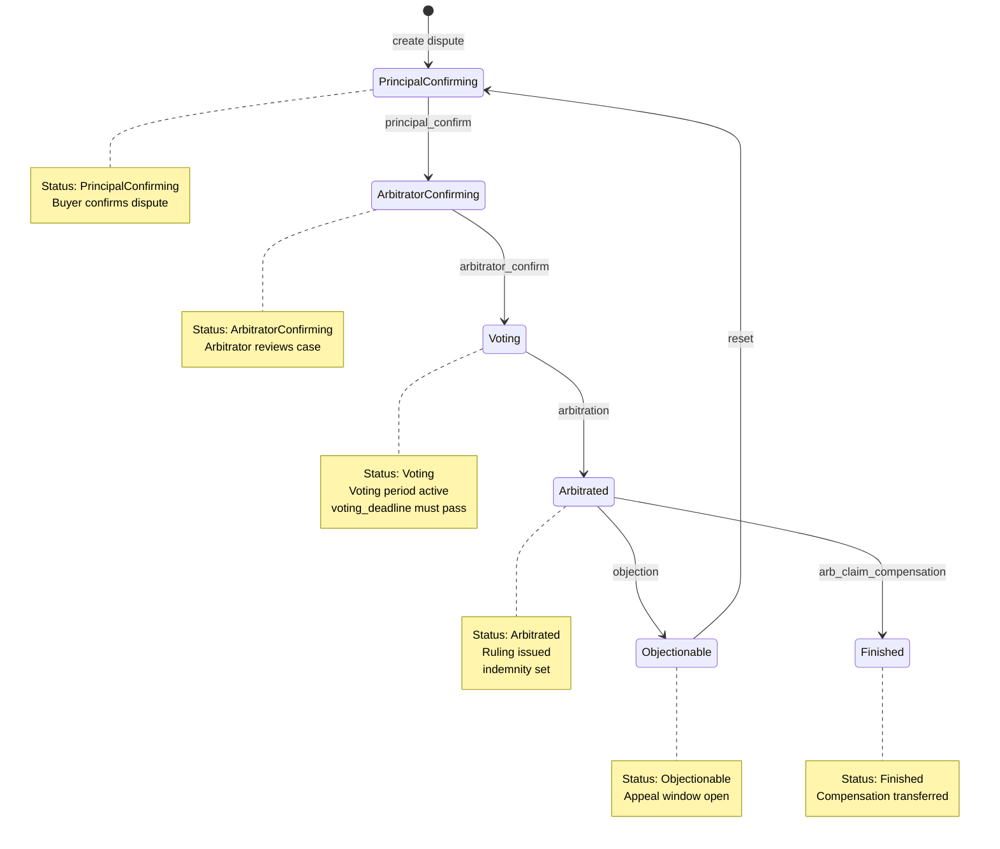
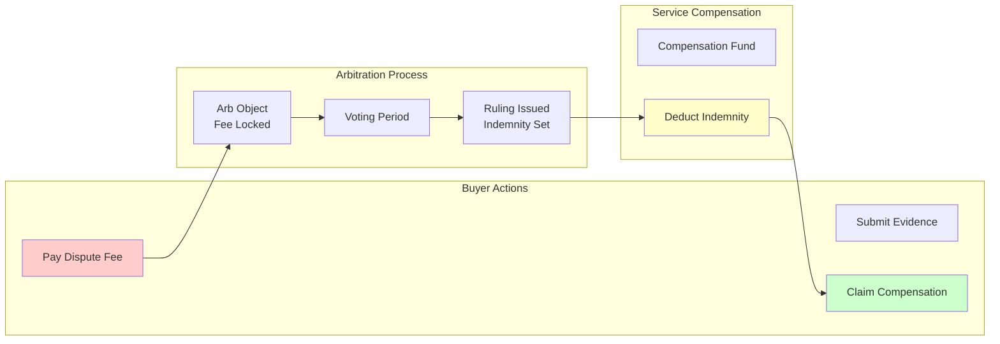
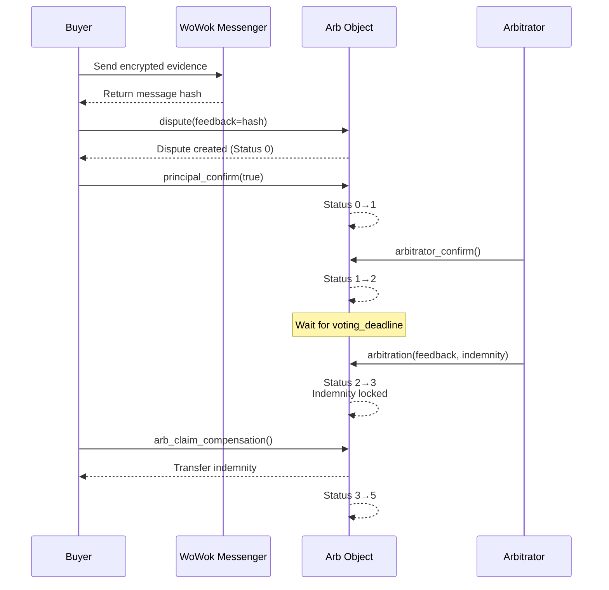
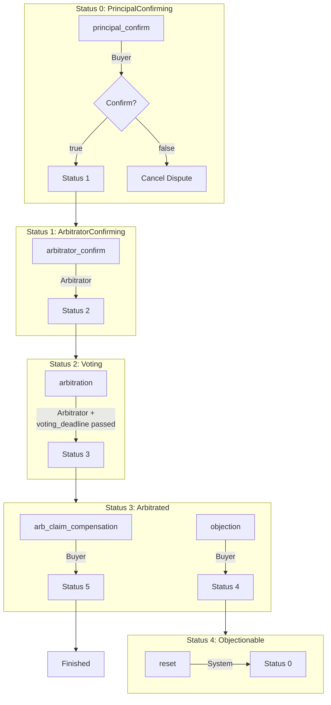

## Arbitration State Machine

The arbitration process follows a strict state machine with defined transitions, time constraints, and financial flows.

### State Diagram

### State Descriptions

| Status | Description | Entry Condition | Exit Actions |
|--------|-------------|-----------------|--------------|
| PrincipalConfirming | Buyer confirms dispute | Dispute created by buyer | Confirm or reject dispute |
| ArbitratorConfirming | Arbitrator reviews case | Buyer confirmed dispute | Arbitrator accepts case |
| Voting | Voting period active | Arbitrator accepted case | Wait for voting_deadline |
| Arbitrated | Ruling issued | voting_deadline passed | Compensation set, can claim |
| Objectionable | Appeal window open | Objection filed | Reset to review or finalize |
| Finished | Process completed | Compensation claimed | Final state |

### State Transition Rules

1. **PrincipalConfirming**
   - Entry: Buyer calls `dispute` to create arbitration
   - Exit: Buyer calls `principal_confirm` to proceed or cancel

2. **ArbitratorConfirming**
   - Entry: Buyer confirmed dispute
   - Exit: Arbitrator calls `arbitrator_confirm` to accept case

3. **Voting**
   - Entry: Arbitrator accepted case
   - Constraint: Must wait until `voting_deadline` timestamp passes
   - Exit: Arbitrator calls `arbitration` after deadline

4. **Arbitrated**
   - Entry: Arbitrator issued ruling with `indemnity` amount
   - Exit: Buyer calls `arb_claim_compensation` to receive payment, or `objection` to appeal

5. **Objectionable**
   - Entry: Buyer filed objection within appeal window
   - Exit: System resets to PrincipalConfirming for re-review

6. **Finished**
   - Entry: Compensation successfully transferred to buyer
   - Final state - no further transitions

---

## Financial Flow Diagram

### Financial Flow Steps

1. **Buyer Pays Dispute Fee**
   - Amount: Specified in arbitration `fee` parameter
   - Destination: Locked in Arb object
   - Purpose: Prevents spam disputes, compensates arbitrators

2. **Evidence Submission**
   - Buyer and service provider submit evidence
   - Can use WoWok Messenger for encrypted communication
   - Evidence referenced via `feedback` parameter

3. **Voting Period**
   - Time window for voting on propositions
   - Duration controlled by `voting_deadline` parameter
   - No financial transactions during this phase

4. **Ruling Issued**
   - Arbitrator determines `indemnity` amount
   - Amount deducted from Service compensation fund
   - Ruling recorded on-chain with timestamp

5. **Compensation Claimed**
   - Buyer receives `indemnity` amount
   - Transaction completes arbitration process
   - Arb object status changes to Finished (5)

---

## Evidence Submission Sequence

### Evidence Submission Methods

| Method | Description | Use Case |
|--------|-------------|----------|
| **Plain Text** | Direct string in `feedback` parameter | Simple disputes, public resolution |
| **IPFS Hash** | Content-addressed storage reference | Large files, documents, images |
| **WoWok Messenger** | Encrypted on-chain messaging | Sensitive information, private disputes |
| **External Link** | URL with verification hash | Third-party evidence, timestamps |

---

## Time Constraints

```mermaid
gantt
    title Arbitration Timeline Example
    dateFormat X
    axisFormat %s

    section Dispute
    Create Dispute           :a1, 0, 1s
    Principal Confirm        :a2, after a1, 1s
    Arbitrator Confirm       :a3, after a2, 1s

    section Voting
    Voting Period            :crit, a4, after a3, 10s

    section Ruling
    Issue Arbitration        :a5, after a4, 1s
    Claim Compensation       :a6, after a5, 5s

    section Complete
    Finished                 :milestone, after a6, 0s
```

### Time Parameter Guidelines

| Parameter | Typical Value | Minimum | Purpose |
|-----------|---------------|---------|---------|
| `voting_deadline` | 7 days | 10 seconds | Allow time for evidence review |
| Appeal window | 3 days | 1 hour | Time to file objections |
| Evidence submission | Before voting_deadline | - | Ensure evidence is available |

---

## Permission Requirements by State

### Permission Matrix

| Operation | Status Required | Actor | Additional Requirements |
|-----------|-----------------|-------|------------------------|
| `dispute` | - | Buyer | Order owner, arbitration unpaused |
| `principal_confirm` | 0 | Buyer | Must be dispute initiator |
| `arbitrator_confirm` | 1 | Arbitrator | Must be designated arbitrator |
| `arbitration` | 2 | Arbitrator | `voting_deadline` must pass |
| `arb_claim_compensation` | 3 | Buyer | Order owner, indemnity > 0 |
| `objection` | 3 | Buyer | Within appeal window |
| `reset` | 4 | System | Automatic on objection |
