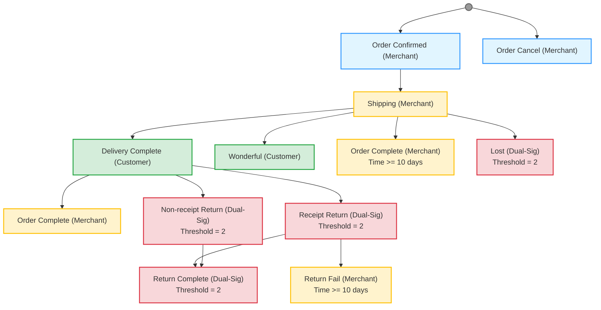

# MyShop Advanced E-Commerce Example

An advanced e-commerce example demonstrating escrow with multiple order fund allocation modes, multi-party allocation, arbitration with voting guards, and WIP-based product verification.

> **View Actual Execution Results**: 
> - **Merchant System Setup**: See [MyShop\_Advanced\_MerchantSystem\_TestResults.md](MyShop_Advanced_MerchantSystem_TestResults.md) for service construction test results
> - **Customer Order Flow**: See [MyShop\_Advanced\_OrderFlow\_TestResults.md](MyShop_Advanced_OrderFlow_TestResults.md) for order testing results

***

## Core Requirements & Features

| Requirement                    | Description                                                               | Implementation                                                                        |
| ------------------------------ | ------------------------------------------------------------------------- | ------------------------------------------------------------------------------------- |
| **WIP-Verified Product**       | Single product with WIP file hash verification                            | `three_body.wip` integrated into Service sales                                        |
| **Milestone-Based Workflow**   | Order progress tracked through Machine workflow nodes                     | Multi-path workflow with delivery confirmation, wonderful rating, and return handling |
| **Simplified Fund Allocation** | Clear fund distribution model with reward incentives                      | 100% to merchant on completion/wonderful, 100% to customer on lost/return             |
| **Reward System**              | Incentive mechanism for excellent service and lost compensation           | Reward pool with guard-based verification                                             |
| **Messenger-Based Logistics**  | Privacy-preserving shipping info exchange via Messenger + Merkle Root     | Tracking numbers shared privately; only Merkle Root submitted on-chain                |
| **Multi-Path Returns**         | Support for non-receipt return, receipt return, and lost package handling | Different return paths based on delivery status                                       |

### Key Design Decisions

1. **Single Product Model**: Only one WIP-verified product to simplify the example while demonstrating full capabilities
2. **Privacy-Preserving Logistics**: Merchant handles logistics independently using any logistics provider. Tracking numbers are shared privately via Messenger (not on-chain), with only Merkle Root submitted on-chain as proof of communication
3. **Reward Incentive Model**: Additional reward pool for excellent service (Wonderful reward) and compensation for lost packages
4. **Multi-Path Workflow**: Order can complete through normal delivery, wonderful rating, or various return paths
5. **Dual-Signature Returns**: Return processes require both customer and merchant confirmation (threshold=2)

### Important Design Principle: "Who Completes the Key Action, Who Submits the Proof"

To ensure accountability and prevent disputes, the party who completes the critical action must submit the on-chain proof:

- **Merchant Shipping**: Merchant receives customer's shipping address via Messenger and sends back tracking number → **Merchant submits Merkle Root** proving communication completed
- **Customer Return**: Customer sends return tracking number to merchant via Messenger → **Customer submits Merkle Root** proving communication completed
- **Lost Confirmation**: Both parties confirm lost package through dual-signature mechanism

This principle ensures that the party responsible for the action bears the responsibility of recording it on-chain, creating a clear audit trail for potential arbitration.

***

## Overview

This advanced example demonstrates an enterprise-grade e-commerce system with:

- **Single WIP-Verified Product**: One product listing ("The Three-Body Problem + Author Signature") with WIP file verification
- **Multi-Path Workflow**: Order progress with delivery confirmation, wonderful rating, lost handling, and multiple return paths
- **Dual-Signature Returns**: Return processes require confirmation from both customer and merchant
- **Reward Incentive System**: Reward pool for excellent service and compensation for lost packages
- **Time-Based Auto-Completion**: Orders auto-complete after time thresholds

***

## Architecture

### System Components

```
┌─────────────────────────────────────────────────────────────────────────────┐
│                     MyShop Advanced E-Commerce System                       │
├─────────────────────────────────────────────────────────────────────────────┤
│                                                                             │
│  ┌─────────────────────────┐    ┌─────────────────────────┐                │
│  │    Merchant System      │    │    Customer System      │                │
│  ├─────────────────────────┤    ├─────────────────────────┤                │
│  │ • Permission            │    │ • Place Order           │                │
│  │ • Machine (Milestone)   │    │ • Track Progress        │                │
│  │ • Service (WIP Catalog) │◄──►│ • Confirm Delivery      │                │
│  │ • Allocation (Escrow)   │    │ • Rate Wonderful        │                │
│  │ • Guards (Verification) │    │ • Request Return        │                │
│  │ • Reward Pool           │    │ • Submit Arbitration    │                │
│  └─────────────────────────┘    └─────────────────────────┘                │
│                                                                             │
│  Fund Flow: Merchant + Reward Pool (Incentives)                            │
│                                                                             │
└─────────────────────────────────────────────────────────────────────────────┘
```

### Order Workflow (Multi-Path Milestone-Based)



#### Fund Allocation

- **Merchant 100%**: Order Complete | Wonderful | Return Fail
- **Customer 100%**: Lost | Return Complete

#### Reward Compensation

- **Wonderful Node**: 10000 reward
- **Lost Node**: 20000 compensation
- **Shipping Timeout (>2 days)**: 20000 compensation

***

## Part 1: Build Order and Rationale

Understanding the correct order for creating WoWok objects is crucial for a successful deployment. This section explains the dependency chain and why objects must be created in a specific sequence.

### Object Dependency Graph

```
┌─────────────────────────────────────────────────────────────────────────────┐
│                         Object Creation Dependencies                        │
├─────────────────────────────────────────────────────────────────────────────┤
│                                                                             │
│  Phase 1: Foundation                                                        │
│  ═══════════════════════════                                                │
│                                                                             │
│  ┌─────────────────┐    ┌─────────────────┐                                │
│  │   Permission    │    │   Accounts      │                                │
│  │ (myshop_perm_   │    │ (myshop_merchant│                                │
│  │     v2)         │    │  myshop_customer)│                               │
│  └────────┬────────┘    └─────────────────┘                                │
│           │                                                                 │
│           ▼                                                                 │
│  ┌─────────────────┐                                                       │
│  │     Service     │◄─── Requires: Permission                              │
│  │(three_body_sig  │     Publish: FALSE (get address first)                │
│  │ _service_v2)    │                                                        │
│  └────────┬────────┘                                                        │
│           │                                                                 │
│           ▼                                                                 │
│  Phase 2: Guard Creation                                                    │
│  ═══════════════════════                                                    │
│                                                                             │
│  ┌─────────────────┐    ┌─────────────────┐    ┌─────────────────┐         │
│  │ guard_merkle_   │    │ guard_service_  │    │ guard_delivery_ │         │
│  │   root_v2       │    │ signature_v2    │    │ complete_v2     │         │
│  └─────────────────┘    └────────┬────────┘    └─────────────────┘         │
│                                  │                                          │
│                                  ▼                                          │
│  ┌─────────────────┐    ┌─────────────────┐    ┌─────────────────┐         │
│  │ guard_merchant_ │    │ guard_customer_ │    │ guard_time_10d  │         │
│  │   win_v2        │    │   win_v2        │    │     _v2         │         │
│  └─────────────────┘    └─────────────────┘    └────────┬────────┘         │
│                                                         │                   │
│                                                         ▼                   │
│                                               ┌─────────────────┐          │
│                                               │ guard_time_2d   │          │
│                                               │     _v2         │          │
│                                               └─────────────────┘          │
│                                                                             │
│  Phase 3: Machine Creation                                                  │
│  ═══════════════════════════════                                            │
│                                                                             │
│  ┌─────────────────┐                                                       │
│  │     Machine     │◄─── Requires: Permission + Guards                     │
│  │(myshop_advanced │     All nodes with guards for verification           │
│  │  _machine_v2)   │                                                        │
│  └────────┬────────┘                                                        │
│           │                                                                 │
│           ▼                                                                 │
│  Phase 4: Machine Binding                                                   │
│  ═══════════════════════════════                                            │
│                                                                             │
│  ┌─────────────────┐                                                       │
│  │ Bind Machine    │◄─── Requires: Service + Machine                       │
│  │   to Service    │     Must be done before publishing Service            │
│  └────────┬────────┘                                                        │
│           │                                                                 │
│           ▼                                                                 │
│  Phase 5: Arbitration Creation                                              │
│  ═══════════════════════════════                                            │
│                                                                             │
│  ┌─────────────────┐                                                       │
│  │   Arbitration   │◄─── Independent, but needs Service binding            │
│  │myshop_arbitration│                                                        │
│  │      _v2        │                                                        │
│  └────────┬────────┘                                                        │
│           │                                                                 │
│           ▼                                                                 │
│  Phase 6: Service Configuration                                             │
│  ════════════════════════════════                                           │
│                                                                             │
│  ┌─────────────────┐                                                       │
│  │ Update Service  │◄─── Add: order_allocators, sales, arbitrations        │
│  │  and Publish    │     Requires: All Guards, Arbitration                 │
│  └─────────────────┘                                                        │
│                                                                             │
│  Phase 7: Reward Pool                                                       │
│  ═════════════════════                                                      │
│                                                                             │
│  ┌─────────────────┐                                                       │
│  │     Reward      │◄─── Requires: Service (for guard verification)        │
│  │myshop_reward_v2 │     Add: reward_guards for Wonderful/Lost/Timeout     │
│  └─────────────────┘                                                        │
│                                                                             │
└─────────────────────────────────────────────────────────────────────────────┘
```

### Why This Order Matters

| Phase | Object               | Dependencies         | Reason                                                                                                        |
| ----- | -------------------- | -------------------- | ------------------------------------------------------------------------------------------------------------- |
| 1     | **Permission**       | None                 | Permission is the foundation. Machine and Service both reference a permission object for access control.      |
| 2     | **Service (Empty)**  | Permission           | Create Service without publishing first to obtain its address. This address is needed for Guard verification. |
| 3     | **Guards**           | Service Address      | Guards must verify that orders belong to the correct Service. They query Service address and Progress state.  |
| 4     | **Machine**          | Permission, Guards   | Machine requires guards for node verification. Guards need Service address which is now available.            |
| 5     | **Machine Binding**  | Service, Machine     | Bind Machine to Service before publishing. Once published, Machine cannot be bound.                           |
| 6     | **Arbitration**      | None                 | Arbitration is independent but needs to be bound to Service. Create before Service update.                    |
| 7     | **Service (Update)** | Guards, Arb, Machine | Update Service with order\_allocators, arbitrations, machine binding. Then publish.                            |
| 8     | **Reward**           | Service, Guards      | Reward pool needs Service address in guards for claim verification. Create after Service is available.        |

### Key Design Decisions

1. **Permission First**: Every major object (Machine, Service) requires a permission object. Create this first.
2. **Service Before Guards**: Create Service without publishing to get its address. Guards need Service address to verify orders belong to the correct service.
3. **Guards Before Machine**: Machine nodes reference guards for verification. Create all guards first, then create Machine with guard references.
4. **Machine Binding Before Publish**: Bind Machine to Service before publishing. Once published, Machine cannot be bound.
5. **Arbitration Before Service Update**: Arbitration must be created before Service update so it can be bound to Service.
6. **Service Publishing Last**: Only publish Service after all guards, machine, and arbitration are ready.
7. **Reward Last**: Reward references Service address in guards for claim verification. Create after Service is available.

### Simplified Build Sequence

```
Phase 1: Foundation
└── 1. Create Permission (myshop_permission_v2)
    └── Add permission indexes (1010-1017, 306)

Phase 2: Service Creation
└── 2. Create Service (three_body_signature_service_v2)
    ├── Publish: FALSE
    └── Record the Service address for Guard creation

Phase 3: Guard Creation
└── 3. Create All Guards (using Service address)
    ├── guard_merkle_root_v2 (verify string length = 64)
    ├── guard_service_signature_merkle_v2 (verify order service + signature + merkle)
    ├── guard_delivery_complete_v2 (verify node = Delivery Complete)
    ├── guard_wonderful_v2 (verify node = Wonderful)
    ├── guard_lost_v2 (verify node = Lost)
    ├── guard_return_complete_v2 (verify node = Return Complete)
    ├── guard_return_fail_v2 (verify node = Return Fail)
    ├── guard_order_complete_v2 (verify node = Order Complete)
    ├── guard_merchant_win_v2 (verify node in [Order Complete, Wonderful, Return Fail])
    ├── guard_customer_win_v2 (verify node in [Lost, Return Complete])
    ├── guard_time_10d_v2 (time >= 10 days)
    └── guard_time_2d_v2 (time >= 2 days)

Phase 4: Machine Creation
└── 4. Create Machine (myshop_advanced_machine_v2)
    └── Add all nodes with guards (Order Confirmed, Order Cancel, Shipping, 
        Delivery Complete, Wonderful, Order Complete, Lost, 
        Non-receipt Return, Receipt Return, Return Fail, Return Complete)

Phase 5: Machine Binding
└── 5. Bind Machine to Service
    └── Must be done before publishing Service

Phase 6: Arbitration Creation
└── 6. Create Arbitration (myshop_arbitration_v2)
    └── Final dispute resolution mechanism

Phase 7: Service Configuration
└── 7. Update and Publish Service
    ├── Add order_allocators (merchant_win, customer_win)
    ├── Add sales (Three-Body Problem product)
    ├── Add arbitrations binding
    └── Publish service

Phase 8: Reward Pool
└── 8. Create Reward (myshop_reward_v2)
    ├── Deposit initial balance
    ├── Create guard_shipping_timeout_v2
    └── Add reward_guards (Wonderful: 10000, Lost: 20000, Shipping Timeout: 20000)
```

***

## Part 2: Merchant System Setup

### Prerequisites

Reuse existing accounts from basic MyShop:

- Account: `myshop_merchant` (store owner)
- Account: `myshop_customer` (customer)

Ensure both accounts have sufficient testnet WOW tokens.

***

### Step 1: Create Permission Object

Create a new permission object for the advanced shop.

**Prompt**: Create permission object "myshop\_permission\_v2".

```json
{
  "operation_type": "permission",
  "data": {
    "object": {
      "name": "myshop_permission_v2",
      "replaceExistName": true
    },
    "description": "Permission object for MyShop Advanced e-commerce system"
  },
  "env": {
    "account": "myshop_merchant",
    "network": "testnet"
  }
}
```

***

### Step 2: Add Custom Permissions

Add custom permission indexes for advanced operations.

**Permission Index 1010**: Order Confirmed + Order Cancel (Merchant operations for order confirmation/cancellation)

```json
{
  "operation_type": "permission",
  "data": {
    "object": "myshop_permission_v2",
    "remark": {
      "op": "set",
      "index": 1010,
      "remark": "Order Confirmed and Order Cancel - Merchant confirms or cancels order with Merkle Root"
    },
    "table": {
      "op": "add perm by index",
      "index": 1010,
      "entity": {
        "entities": [{"name_or_address": "myshop_merchant"}]
      }
    }
  },
  "env": {
    "account": "myshop_merchant",
    "network": "testnet"
  }
}
```

**Permission Index 1011**: Shipping + Order Complete (Merchant logistics operations)

```json
{
  "operation_type": "permission",
  "data": {
    "object": "myshop_permission_v2",
    "remark": {
      "op": "set",
      "index": 1011,
      "remark": "Shipping and Order Complete - Merchant logistics operations with Merkle Root"
    },
    "table": {
      "op": "add perm by index",
      "index": 1011,
      "entity": {
        "entities": [{"name_or_address": "myshop_merchant"}]
      }
    }
  },
  "env": {
    "account": "myshop_merchant",
    "network": "testnet"
  }
}
```

**Permission Index 1012**: Delivery Complete (Customer confirms receipt)

```json
{
  "operation_type": "permission",
  "data": {
    "object": "myshop_permission_v2",
    "remark": {
      "op": "set",
      "index": 1012,
      "remark": "Delivery Complete - Customer confirms receipt"
    },
    "table": {
      "op": "add perm by index",
      "index": 1012,
      "entity": {
        "entities": [{"name_or_address": "myshop_customer"}]
      }
    }
  },
  "env": {
    "account": "myshop_merchant",
    "network": "testnet"
  }
}
```

**Permission Index 1013**: Wonderful (Customer rates wonderful)

```json
{
  "operation_type": "permission",
  "data": {
    "object": "myshop_permission_v2",
    "remark": {
      "op": "set",
      "index": 1013,
      "remark": "Wonderful - Customer rates order as wonderful"
    },
    "table": {
      "op": "add perm by index",
      "index": 1013,
      "entity": {
        "entities": [{"name_or_address": "myshop_customer"}]
      }
    }
  },
  "env": {
    "account": "myshop_merchant",
    "network": "testnet"
  }
}
```

**Permission Index 1014**: Lost (Customer reports lost, Merchant confirms)

```json
{
  "operation_type": "permission",
  "data": {
    "object": "myshop_permission_v2",
    "remark": {
      "op": "set",
      "index": 1014,
      "remark": "Lost - Customer reports lost, Merchant confirms"
    },
    "table": {
      "op": "add perm by index",
      "index": 1014,
      "entity": {
        "entities": [{"name_or_address": "myshop_customer"}]
      }
    }
  },
  "env": {
    "account": "myshop_merchant",
    "network": "testnet"
  }
}
```

**Permission Index 1015**: Non-receipt Return (Customer requests return before receipt)

```json
{
  "operation_type": "permission",
  "data": {
    "object": "myshop_permission_v2",
    "remark": {
      "op": "set",
      "index": 1015,
      "remark": "Non-receipt Return - Customer requests return before receipt"
    },
    "table": {
      "op": "add perm by index",
      "index": 1015,
      "entity": {
        "entities": [{"name_or_address": "myshop_customer"}]
      }
    }
  },
  "env": {
    "account": "myshop_merchant",
    "network": "testnet"
  }
}
```

**Permission Index 1016**: Receipt Return (Customer requests return after receipt)

```json
{
  "operation_type": "permission",
  "data": {
    "object": "myshop_permission_v2",
    "remark": {
      "op": "set",
      "index": 1016,
      "remark": "Receipt Return - Customer requests return after receipt"
    },
    "table": {
      "op": "add perm by index",
      "index": 1016,
      "entity": {
        "entities": [{"name_or_address": "myshop_customer"}]
      }
    }
  },
  "env": {
    "account": "myshop_merchant",
    "network": "testnet"
  }
}
```

**Permission Index 1017**: Return Complete (Merchant confirms return received)

```json
{
  "operation_type": "permission",
  "data": {
    "object": "myshop_permission_v2",
    "remark": {
      "op": "set",
      "index": 1017,
      "remark": "Return Complete - Merchant confirms return received"
    },
    "table": {
      "op": "add perm by index",
      "index": 1017,
      "entity": {
        "entities": [{"name_or_address": "myshop_merchant"}]
      }
    }
  },
  "env": {
    "account": "myshop_merchant",
    "network": "testnet"
  }
}
```

***

### Step 3: Create Service (Unpublished)

Create the Service without publishing to obtain its address for Guard creation.

**Prompt**: Create Service "three\_body\_signature\_service\_v2" with permission "myshop\_permission\_v2", do not publish.

```json
{
  "operation_type": "service",
  "data": {
    "object": {
      "name": "three_body_signature_service_v2",
      "permission": "myshop_permission_v2"
    },
    "description": "Three-Body Problem Signature Edition - Limited collector's item with WIP verification",
    "publish": false
  },
  "env": {
    "account": "myshop_merchant",
    "network": "testnet"
  }
}
```

**Record the Service address** - it will be needed for Guard creation.

***

### Step 4: Create Guards (8 Guards for Machine)

Create 8 Guards using the Service address. Guards verify order state and service ownership.

**Guard List:**

| # | Guard Name | Purpose |
|---|------------|---------|
| 1 | `guard_merkle_root_v2` | Verify Merkle Root string length = 64 |
| 2 | `guard_service_signature_merkle_v2` | Verify order belongs to Service + signature + Merkle Root |
| 3 | `guard_delivery_complete_v2` | Verify node = Delivery Complete |
| 4 | `guard_wonderful_v2` | Verify node = Wonderful |
| 5 | `guard_lost_v2` | Verify node = Lost |
| 6 | `guard_return_complete_v2` | Verify node = Return Complete |
| 7 | `guard_return_fail_v2` | Verify node = Return Fail |
| 8 | `guard_order_complete_v2` | Verify node = Order Complete |

> **Note**: See [MyShop_Advanced_MerchantSystem_TestResults.md](MyShop_Advanced_MerchantSystem_TestResults.md) for detailed guard creation examples.
```

***

### Step 5: Create Machine (Multi-Path Workflow)

Create Machine with all nodes and guards in a single operation.

**Prompt**: Create Machine "myshop\_advanced\_machine\_v2" with permission "myshop\_permission\_v2" and all nodes.

```json
{
  "operation_type": "machine",
  "data": {
    "object": {
      "name": "myshop_advanced_machine_v2",
      "replaceExistName": true,
      "permission": "myshop_permission_v2"
    },
    "description": "Multi-path order processing with delivery confirmation, wonderful rating, lost handling and return processing - Complete workflow with guards",
    "node": {
      "op": "add",
      "nodes": [
        {
          "name": "Order Confirmed",
          "pairs": [
            {
              "prev_node": "",
              "threshold": 1,
              "forwards": [
                {
                  "name": "Submit Messenger Merkle Root",
                  "permissionIndex": 1010,
                  "weight": 1
                }
              ]
            }
          ]
        },
        {
          "name": "Order Cancel",
          "pairs": [
            {
              "prev_node": "",
              "threshold": 1,
              "forwards": [
                {
                  "name": "Submit Cancellation Merkle Root",
                  "permissionIndex": 1010,
                  "weight": 1
                }
              ]
            }
          ]
        },
        {
          "name": "Shipping",
          "pairs": [
            {
              "prev_node": "Order Confirmed",
              "threshold": 1,
              "forwards": [
                {
                  "name": "Confirm Signature and Submit Merkle Root",
                  "permissionIndex": 1011,
                  "weight": 1,
                  "guard": { "guard": "guard_service_signature_merkle_v2" }
                }
              ]
            }
          ]
        },
        {
          "name": "Delivery Complete",
          "pairs": [
            {
              "prev_node": "Shipping",
              "threshold": 1,
              "forwards": [
                {
                  "name": "Confirm Receipt",
                  "permissionIndex": 1012,
                  "weight": 1,
                  "guard": { "guard": "guard_delivery_complete_v2" }
                }
              ]
            }
          ]
        },
        {
          "name": "Wonderful",
          "pairs": [
            {
              "prev_node": "Shipping",
              "threshold": 1,
              "forwards": [
                {
                  "name": "Rate Wonderful",
                  "permissionIndex": 1013,
                  "weight": 1,
                  "guard": { "guard": "guard_wonderful_v2" }
                }
              ]
            }
          ]
        },
        {
          "name": "Order Complete",
          "pairs": [
            {
              "prev_node": "Shipping",
              "threshold": 1,
              "forwards": [
                {
                  "name": "Auto Complete from Shipping",
                  "permissionIndex": 1011,
                  "weight": 1,
                  "guard": { "guard": "guard_order_complete_v2" }
                }
              ]
            },
            {
              "prev_node": "Delivery Complete",
              "threshold": 1,
              "forwards": [
                {
                  "name": "Auto Complete from Delivery",
                  "permissionIndex": 1011,
                  "weight": 1,
                  "guard": { "guard": "guard_order_complete_v2" }
                }
              ]
            }
          ]
        },
        {
          "name": "Lost",
          "pairs": [
            {
              "prev_node": "Shipping",
              "threshold": 2,
              "forwards": [
                {
                  "name": "Report Lost",
                  "permissionIndex": 1014,
                  "weight": 1,
                  "guard": { "guard": "guard_lost_v2" }
                },
                {
                  "name": "Confirm Lost with Merkle Root",
                  "permissionIndex": 1011,
                  "weight": 1,
                  "guard": { "guard": "guard_lost_v2" }
                }
              ]
            }
          ]
        },
        {
          "name": "Non-receipt Return",
          "pairs": [
            {
              "prev_node": "Shipping",
              "threshold": 2,
              "forwards": [
                {
                  "name": "Request Return",
                  "permissionIndex": 1015,
                  "weight": 1
                },
                {
                  "name": "Confirm Return with Merkle Root",
                  "permissionIndex": 1011,
                  "weight": 1
                }
              ]
            }
          ]
        },
        {
          "name": "Receipt Return",
          "pairs": [
            {
              "prev_node": "Delivery Complete",
              "threshold": 2,
              "forwards": [
                {
                  "name": "Request Return with Receipt",
                  "permissionIndex": 1016,
                  "weight": 1
                },
                {
                  "name": "Confirm Return Address with Merkle Root",
                  "permissionIndex": 1011,
                  "weight": 1
                }
              ]
            }
          ]
        },
        {
          "name": "Return Fail",
          "pairs": [
            {
              "prev_node": "Receipt Return",
              "threshold": 1,
              "forwards": [
                {
                  "name": "Timeout Return Not Received",
                  "permissionIndex": 1011,
                  "weight": 1,
                  "guard": { "guard": "guard_return_fail_v2" }
                }
              ]
            }
          ]
        },
        {
          "name": "Return Complete",
          "pairs": [
            {
              "prev_node": "Receipt Return",
              "threshold": 2,
              "forwards": [
                {
                  "name": "Submit Return Merkle Root",
                  "permissionIndex": 1017,
                  "weight": 1,
                  "guard": { "guard": "guard_return_complete_v2" }
                },
                {
                  "name": "Confirm Return Received",
                  "permissionIndex": 1011,
                  "weight": 1,
                  "guard": { "guard": "guard_return_complete_v2" }
                }
              ]
            },
            {
              "prev_node": "Non-receipt Return",
              "threshold": 2,
              "forwards": [
                {
                  "name": "Submit Return Merkle Root",
                  "permissionIndex": 1017,
                  "weight": 1,
                  "guard": { "guard": "guard_return_complete_v2" }
                },
                {
                  "name": "Confirm Return Received",
                  "permissionIndex": 1011,
                  "weight": 1,
                  "guard": { "guard": "guard_return_complete_v2" }
                }
              ]
            }
          ]
        }
      ]
    }
  },
  "env": {
    "account": "myshop_merchant",
    "network": "testnet"
  }
}
```

***

### Step 6: Bind Machine to Service

Bind the Machine to the Service. **Important**: The Service must be unpublished when binding the Machine.

**Prompt**: Bind machine "myshop\_advanced\_machine\_v2" to service "three\_body\_signature\_service\_v2".

```json
{
  "operation_type": "service",
  "data": {
    "object": "three_body_signature_service_v2",
    "machine": "myshop_advanced_machine_v2"
  },
  "env": {
    "account": "myshop_merchant",
    "network": "testnet"
  }
}
```

**Note**: This step must be performed before publishing the Service. Once published, the Machine cannot be bound.

***

### Step 7: Create Additional Guards for Service (4 Guards)

Create 4 additional guards for Service order_allocators.

**Guard List:**

| # | Guard Name | Purpose |
|---|------------|---------|
| 9 | `guard_merchant_win_v2` | Verify node in [Order Complete, Wonderful, Return Fail] |
| 10 | `guard_customer_win_v2` | Verify node in [Lost, Return Complete] |
| 11 | `guard_time_10d_v2` | Verify time >= 10 days (864000000 ms) |
| 12 | `guard_time_2d_v2` | Verify time >= 2 days (172800000 ms) |

> **Note**: See [MyShop_Advanced_MerchantSystem_TestResults.md](MyShop_Advanced_MerchantSystem_TestResults.md) for detailed guard creation examples.

***

### Step 8: Create Arbitration Object

Create an Arbitration object as the final on-chain mechanism for protecting user rights.

**Prompt**: Create arbitration object "myshop\_arbitration\_v2".

```json
{
  "operation_type": "arbitration",
  "data": {
    "object": {
      "name": "myshop_arbitration_v2",
      "replaceExistName": true
    },
    "description": "Arbitration for MyShop Advanced - Final dispute resolution mechanism",
    "fee": 100000000
  },
  "env": {
    "account": "myshop_merchant",
    "network": "testnet"
  }
}
```

***

### Step 9: Update Service with Allocators, Arbitration and Publish

Update Service with order\_allocators, sales, arbitration binding, and publish.

**Prompt**: Update service "three\_body\_signature\_service\_v2" with order allocators, arbitration and publish.

```json
{
  "operation_type": "service",
  "data": {
    "object": "three_body_signature_service_v2",
    "order_allocators": {
      "description": "Order fund allocators for MyShop Advanced",
      "threshold": 0,
      "allocators": [
        {
          "guard": "guard_merchant_win_v2",
          "sharing": [
            {
              "who": {"Signer": "signer"},
              "sharing": 10000,
              "mode": "Rate"
            }
          ]
        },
        {
          "guard": "guard_customer_win_v2",
          "sharing": [
            {
              "who": {"GuardIdentifier": 0},
              "sharing": 10000,
              "mode": "Rate"
            }
          ]
        }
      ]
    },
    "sales": {
      "op": "add",
      "sales": [
        {
          "name": "The Three-Body Problem + Author Signature",
          "price": 5000000000,
          "stock": 100,
          "suspension": false,
          "wip": "https://wowok.net/test/three_body.wip",
          "wip_hash": "sha256:1db6dc86d8be68bafb33418628a30e7bfcbce48de9c099d3d9cb21def3af8b43"
        }
      ]
    },
    "arbitrations": {
      "op": "add",
      "objects": ["myshop_arbitration_v2"]
    },
    "customer_required": ["phone", "email", "shipping_address"],
    "publish": true
  },
  "env": {
    "account": "myshop_merchant",
    "network": "testnet"
  }
}
```

***

### Step 10: Create Reward Pool

Create reward pool with guards for Wonderful, Lost, and Shipping timeout compensation.

**Prompt**: Create reward object "myshop\_reward\_v2" with initial balance.

```json
{
  "operation_type": "reward",
  "data": {
    "object": {
      "name": "myshop_reward_v2",
      "replaceExistName": true
    },
    "description": "Reward pool for MyShop advanced - Wonderful rewards (10000), Lost compensation (20000), Shipping timeout compensation (20000)",
    "coin_add": {
      "balance": 150000000
    }
  },
  "env": {
    "account": "myshop_merchant",
    "network": "testnet"
  }
}
```

***

### Step 11: Create Shipping Timeout Guard

Create a guard to verify Shipping node time exceeds 2 days (172800000 ms).

**Prompt**: Create guard "guard\_shipping\_timeout\_v2".

```json
{
  "operation_type": "guard",
  "data": {
    "namedNew": {
      "name": "guard_shipping_timeout_v2",
      "tags": ["ecommerce", "shipping", "timeout"],
      "replaceExistName": true
    },
    "description": "Verify order has been in Shipping node for at least 2 days (172800000 ms)",
    "table": [
      {
        "identifier": 0,
        "b_submission": true,
        "value_type": "Address",
        "name": "progress_address"
      },
      {
        "identifier": 1,
        "b_submission": false,
        "value_type": "U64",
        "value": 172800000,
        "name": "two_days_ms"
      },
      {
        "identifier": 2,
        "b_submission": false,
        "value_type": "String",
        "value": "Shipping",
        "name": "shipping_node"
      }
    ],
    "root": {
      "type": "node",
      "node": {
        "type": "logic_and",
        "nodes": [
          {
            "type": "logic_equal",
            "nodes": [
              {
                "type": "query",
                "query": 1253,
                "object": {
                  "identifier": 0,
                  "convert_witness": 100
                },
                "parameters": []
              },
              {
                "type": "identifier",
                "identifier": 2
              }
            ]
          },
          {
            "type": "logic_as_u256_greater_or_equal",
            "nodes": [
              {
                "type": "calc_number_subtract",
                "nodes": [
                  {
                    "type": "context",
                    "context": "Clock"
                  },
                  {
                    "type": "query",
                    "query": 1315,
                    "object": {
                      "identifier": 0
                    },
                    "parameters": []
                  }
                ]
              },
              {
                "type": "identifier",
                "identifier": 1
              }
            ]
          }
        ]
      }
    }
  },
  "env": {
    "account": "myshop_merchant",
    "network": "testnet"
  }
}
```

***

### Step 12: Add Reward Guards

Add reward guards for Wonderful (10000), Lost (20000), and Shipping timeout (20000) compensation.

**Prompt**: Add reward guards.

```json
{
  "operation_type": "reward",
  "data": {
    "object": "myshop_reward_v2",
    "guard_add": [
      {
        "guard": "guard_wonderful_v2",
        "recipient": {"Signer": "signer"},
        "amount": {"type": "Fixed", "value": 10000}
      },
      {
        "guard": "guard_lost_v2",
        "recipient": {"Signer": "signer"},
        "amount": {"type": "Fixed", "value": 20000}
      },
      {
        "guard": "guard_shipping_timeout_v2",
        "recipient": {"Signer": "signer"},
        "amount": {"type": "Fixed", "value": 20000}
      }
    ]
  },
  "env": {
    "account": "myshop_merchant",
    "network": "testnet"
  }
}
```

> **Note**: See [MyShop_Advanced_MerchantSystem_TestResults.md](MyShop_Advanced_MerchantSystem_TestResults.md) for Guard 4-5 detailed creation examples.

> **Note**: See [MyShop_Advanced_MerchantSystem_TestResults.md](MyShop_Advanced_MerchantSystem_TestResults.md) for Guard 6-10 detailed creation examples.

***

## Part 3: Customer Order Flow

### Step 1: Create Order with WIP Verification

Customer places an order for "The Three-Body Problem + Author Signature" with WIP hash verification.

**Prompt**: Customer "myshop\_customer" creates an order.

```json
{
  "operation_type": "service",
  "data": {
    "object": "three_body_signature_service_v2",
    "order_new": {
      "buy": {
        "items": [
          {
            "name": "The Three-Body Problem + Author Signature",
            "stock": 1,
            "wip_hash": "sha256:1db6dc86d8be68bafb33418628a30e7bfcbce48de9c099d3d9cb21def3af8b43"
          }
        ],
        "total_pay": {
          "balance": 5000000000
        },
        "order_info": "To my dear friend - keep exploring the universe"
      },
      "namedNewOrder": {
        "name": "myshop_order_v2"
      },
      "namedNewAllocation": {
        "name": "myshop_allocation_v2"
      },
      "namedNewProgress": {
        "name": "myshop_progress_v2"
      }
    }
  },
  "env": {
    "account": "myshop_customer",
    "network": "testnet"
  }
}
```

***

### Step 2: Merchant Confirms Order

Merchant confirms order by submitting Merkle Root.

**Prompt**: Merchant confirms order with Merkle Root.

```json
{
  "operation_type": "progress",
  "data": {
    "object": "myshop_progress_v2",
    "operate": {
      "operation": {
        "next_node_name": "Order Confirmed",
        "forward": "Submit Messenger Merkle Root"
      },
      "hold": false,
      "message": "Order confirmed - Merkle Root submitted"
    }
  },
  "submission": {
    "type": "submission",
    "guard": [
      {
        "object": "guard_merkle_root_v2",
        "impack": true
      }
    ],
    "submission": [
      {
        "guard": "guard_merkle_root_v2",
        "submission": [
          {
            "identifier": 0,
            "b_submission": true,
            "value_type": "String",
            "value": "0xabc123...def456"
          }
        ]
      }
    ]
  },
  "env": {
    "account": "myshop_merchant",
    "network": "testnet",
    "no_cache": true
  }
}
```

***

### Step 3: Merchant Starts Shipping

Merchant starts shipping after signature service is completed.

**Prompt**: Merchant starts shipping with signature verification and Merkle Root.

```json
{
  "operation_type": "progress",
  "data": {
    "object": "myshop_progress_v2",
    "operate": {
      "operation": {
        "next_node_name": "Shipping",
        "forward": "Confirm Signature and Submit Merkle Root"
      },
      "hold": false,
      "message": "Shipping started - signature completed and Merkle Root submitted"
    }
  },
  "submission": {
    "type": "submission",
    "guard": [
      {
        "object": "guard_service_signature_merkle_v2",
        "impack": true
      }
    ],
    "submission": [
      {
        "guard": "guard_service_signature_merkle_v2",
        "submission": [
          {
            "identifier": 0,
            "b_submission": true,
            "value_type": "Address",
            "value": "myshop_order_v2"
          },
          {
            "identifier": 3,
            "b_submission": true,
            "value_type": "String",
            "value": "0xdef789...abc012"
          }
        ]
      }
    ]
  },
  "env": {
    "account": "myshop_merchant",
    "network": "testnet",
    "no_cache": true
  }
}
```

***

### Step 4: Customer Confirms Delivery

Customer confirms receipt of goods.

**Prompt**: Customer confirms delivery.

```json
{
  "operation_type": "progress",
  "data": {
    "object": "myshop_progress_v2",
    "operate": {
      "operation": {
        "next_node_name": "Delivery Complete",
        "forward": "Confirm Receipt"
      },
      "hold": false,
      "message": "Delivery confirmed - goods received"
    }
  },
  "env": {
    "account": "myshop_customer",
    "network": "testnet",
    "no_cache": true
  }
}
```

***

### Step 5: Customer Rates Wonderful

Alternatively, customer can rate as Wonderful (very satisfied).

**Prompt**: Customer rates order as Wonderful.

```json
{
  "operation_type": "progress",
  "data": {
    "object": "myshop_progress_v2",
    "operate": {
      "operation": {
        "next_node_name": "Wonderful",
        "forward": "Rate Wonderful"
      },
      "hold": false,
      "message": "Rated as Wonderful - very satisfied with the service"
    }
  },
  "env": {
    "account": "myshop_customer",
    "network": "testnet",
    "no_cache": true
  }
}
```

***

### Step 6: Claim Wonderful Reward

Customer claims Wonderful reward from reward pool.

**Prompt**: Customer claims Wonderful reward.

```json
{
  "operation_type": "reward",
  "data": {
    "object": "myshop_reward_v2",
    "claim": {
      "guard": "guard_wonderful_v2",
      "reward_object": "myshop_order_v2"
    }
  },
  "submission": {
    "type": "submission",
    "guard": [
      {
        "object": "guard_wonderful_v2",
        "impack": true
      }
    ],
    "submission": [
      {
        "guard": "guard_wonderful_v2",
        "submission": [
          {
            "identifier": 0,
            "b_submission": true,
            "value_type": "Address",
            "value": "myshop_order_v2"
          }
        ]
      }
    ]
  },
  "env": {
    "account": "myshop_customer",
    "network": "testnet",
    "no_cache": true
  }
}
```

***

### Step 7: Order Auto-Complete or Manual Complete

Order can auto-complete after time thresholds or be manually completed.

**From Shipping (10 days)**:

```json
{
  "operation_type": "progress",
  "data": {
    "object": "myshop_progress_v2",
    "operate": {
      "operation": {
        "next_node_name": "Order Complete",
        "forward": "Auto Complete from Shipping"
      },
      "hold": false,
      "message": "Order auto-completed after 10 days"
    }
  },
  "submission": {
    "type": "submission",
    "guard": [
      {
        "object": "guard_time_10d_v2",
        "impack": true
      }
    ],
    "submission": [
      {
        "guard": "guard_time_10d_v2",
        "submission": [
          {
            "identifier": 0,
            "b_submission": true,
            "value_type": "Address",
            "value": "myshop_progress_v2"
          }
        ]
      }
    ]
  },
  "env": {
    "account": "myshop_merchant",
    "network": "testnet",
    "no_cache": true
  }
}
```

**From Delivery Complete (2 days)**:

```json
{
  "operation_type": "progress",
  "data": {
    "object": "myshop_progress_v2",
    "operate": {
      "operation": {
        "next_node_name": "Order Complete",
        "forward": "Auto Complete from Delivery"
      },
      "hold": false,
      "message": "Order auto-completed after 2 days from delivery"
    }
  },
  "submission": {
    "type": "submission",
    "guard": [
      {
        "object": "guard_time_2d_v2",
        "impack": true
      }
    ],
    "submission": [
      {
        "guard": "guard_time_2d_v2",
        "submission": [
          {
            "identifier": 0,
            "b_submission": true,
            "value_type": "Address",
            "value": "myshop_progress_v2"
          }
        ]
      }
    ]
  },
  "env": {
    "account": "myshop_merchant",
    "network": "testnet",
    "no_cache": true
  }
}
```

***

### Step 8: Lost Package Handling

If package is lost, customer reports and merchant confirms.

**Step 8.1: Customer Reports Lost**

```json
{
  "operation_type": "progress",
  "data": {
    "object": "myshop_progress_v2",
    "operate": {
      "operation": {
        "next_node_name": "Lost",
        "forward": "Report Lost"
      },
      "hold": false,
      "message": "Package reported as lost"
    }
  },
  "env": {
    "account": "myshop_customer",
    "network": "testnet",
    "no_cache": true
  }
}
```

**Step 8.2: Merchant Confirms Lost**

```json
{
  "operation_type": "progress",
  "data": {
    "object": "myshop_progress_v2",
    "operate": {
      "operation": {
        "next_node_name": "Lost",
        "forward": "Confirm Lost with Merkle Root"
      },
      "hold": false,
      "message": "Lost confirmed with Merkle Root"
    }
  },
  "submission": {
    "type": "submission",
    "guard": [
      {
        "object": "guard_merkle_root_v2",
        "impack": true
      }
    ],
    "submission": [
      {
        "guard": "guard_merkle_root_v2",
        "submission": [
          {
            "identifier": 0,
            "b_submission": true,
            "value_type": "String",
            "value": "0xlost123...merkle456"
          }
        ]
      }
    ]
  },
  "env": {
    "account": "myshop_merchant",
    "network": "testnet",
    "no_cache": true
  }
}
```

**Step 8.3: Claim Lost Compensation**

```json
{
  "operation_type": "reward",
  "data": {
    "object": "myshop_reward_v2",
    "claim": {
      "guard": "guard_lost_v2",
      "reward_object": "myshop_order_v2"
    }
  },
  "submission": {
    "type": "submission",
    "guard": [
      {
        "object": "guard_lost_v2",
        "impack": true
      }
    ],
    "submission": [
      {
        "guard": "guard_lost_v2",
        "submission": [
          {
            "identifier": 0,
            "b_submission": true,
            "value_type": "Address",
            "value": "myshop_order_v2"
          }
        ]
      }
    ]
  },
  "env": {
    "account": "myshop_customer",
    "network": "testnet",
    "no_cache": true
  }
}
```

***

### Step 9: Return Process (Receipt Return)

Customer requests return after delivery confirmation.

**Step 9.1: Customer Requests Return**

```json
{
  "operation_type": "progress",
  "data": {
    "object": "myshop_progress_v2",
    "operate": {
      "operation": {
        "next_node_name": "Receipt Return",
        "forward": "Request Return with Receipt"
      },
      "hold": false,
      "message": "Return requested after delivery"
    }
  },
  "env": {
    "account": "myshop_customer",
    "network": "testnet",
    "no_cache": true
  }
}
```

**Step 9.2: Merchant Confirms Return Address**

```json
{
  "operation_type": "progress",
  "data": {
    "object": "myshop_progress_v2",
    "operate": {
      "operation": {
        "next_node_name": "Receipt Return",
        "forward": "Confirm Return Address with Merkle Root"
      },
      "hold": false,
      "message": "Return address confirmed with Merkle Root"
    }
  },
  "submission": {
    "type": "submission",
    "guard": [
      {
        "object": "guard_merkle_root_v2",
        "impack": true
      }
    ],
    "submission": [
      {
        "guard": "guard_merkle_root_v2",
        "submission": [
          {
            "identifier": 0,
            "b_submission": true,
            "value_type": "String",
            "value": "0xreturn789...addr012"
          }
        ]
      }
    ]
  },
  "env": {
    "account": "myshop_merchant",
    "network": "testnet",
    "no_cache": true
  }
}
```

**Step 9.3: Customer Submits Return Merkle Root**

```json
{
  "operation_type": "progress",
  "data": {
    "object": "myshop_progress_v2",
    "operate": {
      "operation": {
        "next_node_name": "Return Complete",
        "forward": "Submit Return Merkle Root"
      },
      "hold": false,
      "message": "Return shipping Merkle Root submitted"
    }
  },
  "submission": {
    "type": "submission",
    "guard": [
      {
        "object": "guard_merkle_root_v2",
        "impack": true
      }
    ],
    "submission": [
      {
        "guard": "guard_merkle_root_v2",
        "submission": [
          {
            "identifier": 0,
            "b_submission": true,
            "value_type": "String",
            "value": "0xshipreturn...track345"
          }
        ]
      }
    ]
  },
  "env": {
    "account": "myshop_customer",
    "network": "testnet",
    "no_cache": true
  }
}
```

**Step 9.4: Merchant Confirms Return Received**

```json
{
  "operation_type": "progress",
  "data": {
    "object": "myshop_progress_v2",
    "operate": {
      "operation": {
        "next_node_name": "Return Complete",
        "forward": "Confirm Return Received"
      },
      "hold": false,
      "message": "Return received and confirmed"
    }
  },
  "env": {
    "account": "myshop_merchant",
    "network": "testnet",
    "no_cache": true
  }
}
```

***

### Step 10: Return Fail (Timeout)

If customer doesn't return within 10 days, merchant can mark as Return Fail.

```json
{
  "operation_type": "progress",
  "data": {
    "object": "myshop_progress_v2",
    "operate": {
      "operation": {
        "next_node_name": "Return Fail",
        "forward": "Timeout Return Not Received"
      },
      "hold": false,
      "message": "Return failed - timeout"
    }
  },
  "submission": {
    "type": "submission",
    "guard": [
      {
        "object": "guard_time_10d_v2",
        "impack": true
      }
    ],
    "submission": [
      {
        "guard": "guard_time_10d_v2",
        "submission": [
          {
            "identifier": 0,
            "b_submission": true,
            "value_type": "Address",
            "value": "myshop_progress_v2"
          }
        ]
      }
    ]
  },
  "env": {
    "account": "myshop_merchant",
    "network": "testnet",
    "no_cache": true
  }
}
```

***

## Part 4: Fund Allocation

### Merchant Wins (Order Complete, Wonderful, Return Fail)

When order reaches Order Complete, Wonderful, or Return Fail, merchant can withdraw funds.

**Prompt**: Merchant withdraws funds when winning condition is met.

```json
{
  "operation_type": "order",
  "data": {
    "object": "myshop_order_v2",
    "withdraw": {
      "guard": "guard_merchant_win_v2"
    }
  },
  "submission": {
    "type": "submission",
    "guard": [
      {
        "object": "guard_merchant_win_v2",
        "impack": true
      }
    ],
    "submission": [
      {
        "guard": "guard_merchant_win_v2",
        "submission": [
          {
            "identifier": 0,
            "b_submission": true,
            "value_type": "Address",
            "value": "myshop_order_v2"
          }
        ]
      }
    ]
  },
  "env": {
    "account": "myshop_merchant",
    "network": "testnet",
    "no_cache": true
  }
}
```

### Customer Wins (Lost, Return Complete)

When order reaches Lost or Return Complete, customer can withdraw funds.

**Prompt**: Customer withdraws funds when winning condition is met.

```json
{
  "operation_type": "order",
  "data": {
    "object": "myshop_order_v2",
    "withdraw": {
      "guard": "guard_customer_win_v2"
    }
  },
  "submission": {
    "type": "submission",
    "guard": [
      {
        "object": "guard_customer_win_v2",
        "impack": true
      }
    ],
    "submission": [
      {
        "guard": "guard_customer_win_v2",
        "submission": [
          {
            "identifier": 0,
            "b_submission": true,
            "value_type": "Address",
            "value": "myshop_order_v2"
          }
        ]
      }
    ]
  },
  "env": {
    "account": "myshop_customer",
    "network": "testnet",
    "no_cache": true
  }
}
```

***

## Summary

This advanced e-commerce example demonstrates:

1. **Multi-Path Workflow**: Orders can complete through normal delivery, wonderful rating, or various return paths
2. **Dual-Signature Returns**: Return processes require confirmation from both parties (threshold=2)
3. **Time-Based Auto-Completion**: Orders auto-complete after time thresholds (10 days from shipping, 2 days from delivery)
4. **Guard-Based Verification**: All state transitions and fund allocations are protected by guards
5. **Reward Incentive System**: Wonderful ratings receive rewards, lost packages and shipping delays receive compensation
6. **Arbitration Support**: Service binds to Arbitration object for final on-chain dispute resolution
7. **Privacy-Preserving Logistics**: Only Merkle Roots are submitted on-chain, actual tracking info is shared via Messenger
8. **Flexible Fund Allocation**: Clear rules for merchant win (Order Complete, Wonderful, Return Fail) vs customer win (Lost, Return Complete)

The system ensures accountability through the "Who Completes the Key Action, Who Submits the Proof" principle, creating a clear audit trail for all critical actions.

***

> **View Actual Execution Results**:
> - **Merchant System Setup**: See [MyShop\_Advanced\_MerchantSystem\_TestResults.md](MyShop_Advanced_MerchantSystem_TestResults.md) for service construction test results
> - **Customer Order Flow**: See [MyShop\_Advanced\_OrderFlow\_TestResults.md](MyShop_Advanced_OrderFlow_TestResults.md) for order testing results
