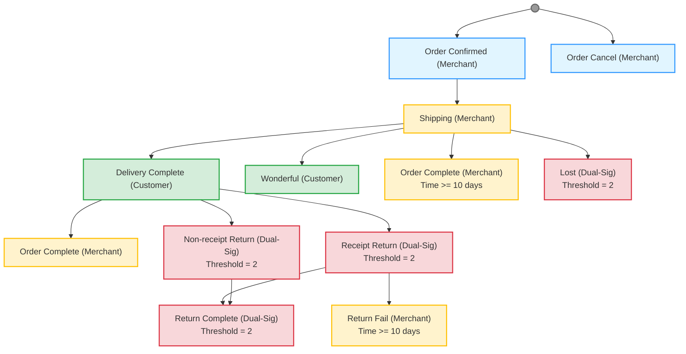

# MyShop Advanced E-Commerce Example

An advanced e-commerce example demonstrating escrow with multiple order fund allocation modes, multi-party allocation, arbitration with voting guards, and WIP-based product verification.

> **Complete Example**: This document contains all necessary JSON examples for setting up the MyShop Advanced e-commerce system.

***

## Core Requirements & Features

| Requirement                    | Description                                                               | Implementation                                                                        |
| ------------------------------ | ------------------------------------------------------------------------- | ------------------------------------------------------------------------------------- |
| **WIP-Verified Product**       | Single product with WIP file hash verification                            | `three_body.wip` integrated into Service sales                                        |
| **Milestone-Based Workflow**   | Order progress tracked through Machine workflow nodes                     | Multi-path workflow with delivery confirmation, wonderful rating, and return handling |
| **Simplified Fund Allocation** | Clear fund distribution model with reward incentives                      | 100% to merchant on completion/wonderful, 100% to customer on lost/return             |
| **Reward System**              | Incentive mechanism for excellent service and lost compensation           | Reward pool with guard-based verification                                             |
| **Messenger-Based Logistics**  | Privacy-preserving shipping info exchange via Messenger + Merkle Root     | Tracking numbers shared privately; only Merkle Root submitted on-chain                |
| **Multi-Path Returns**         | Support for non-receipt return, receipt return, and lost package handling | Different return paths based on delivery status                                       |

### Key Design Decisions

1. **Single Product Model**: Only one WIP-verified product to simplify the example while demonstrating full capabilities
2. **Privacy-Preserving Logistics**: Merchant handles logistics independently using any logistics provider. Tracking numbers are shared privately via Messenger (not on-chain), with only Merkle Root submitted on-chain as proof of communication
3. **Reward Incentive Model**: Additional reward pool for excellent service (Wonderful reward) and compensation for lost packages
4. **Multi-Path Workflow**: Order can complete through normal delivery, wonderful rating, or various return paths
5. **Dual-Signature Returns**: Return processes require both customer and merchant confirmation (threshold=2)

### Important Design Principle: "Who Completes the Key Action, Who Submits the Proof"

To ensure accountability and prevent disputes, the party who completes the critical action must submit the on-chain proof:

- **Merchant Shipping**: Merchant receives customer's shipping address via Messenger and sends back tracking number → **Merchant submits Merkle Root** proving communication completed
- **Customer Return**: Customer sends return tracking number to merchant via Messenger → **Customer submits Merkle Root** proving communication completed
- **Lost Confirmation**: Both parties confirm lost package through dual-signature mechanism

This principle ensures that the party responsible for the action bears the responsibility of recording it on-chain, creating a clear audit trail for potential arbitration.

***

## Overview

This advanced example demonstrates an enterprise-grade e-commerce system with:

- **Single WIP-Verified Product**: One product listing ("The Three-Body Problem + Author Signature") with WIP file verification
- **Multi-Path Workflow**: Order progress with delivery confirmation, wonderful rating, lost handling, and multiple return paths
- **Dual-Signature Returns**: Return processes require confirmation from both customer and merchant
- **Reward Incentive System**: Reward pool for excellent service and compensation for lost packages
- **Time-Based Auto-Completion**: Orders auto-complete after time thresholds

***

## Architecture

### System Components

```
┌─────────────────────────────────────────────────────────────────────────────┐
│                     MyShop Advanced E-Commerce System                       │
├─────────────────────────────────────────────────────────────────────────────┤
│                                                                             │
│  ┌─────────────────────────┐    ┌─────────────────────────┐                │
│  │    Merchant System      │    │    Customer System      │                │
│  ├─────────────────────────┤    ├─────────────────────────┤                │
│  │ • Permission            │    │ • Place Order           │                │
│  │ • Machine (Milestone)   │    │ • Track Progress        │                │
│  │ • Service (WIP Catalog) │◄──►│ • Confirm Delivery      │                │
│  │ • Allocation (Escrow)   │    │ • Rate Wonderful        │                │
│  │ • Guards (Verification) │    │ • Request Return        │                │
│  │ • Reward Pool           │    │ • Submit Arbitration    │                │
│  └─────────────────────────┘    └─────────────────────────┘                │
│                                                                             │
│  Fund Flow: Merchant + Reward Pool (Incentives)                            │
│                                                                             │
└─────────────────────────────────────────────────────────────────────────────┘
```

### Order Workflow (Multi-Path Milestone-Based)



#### Fund Allocation

- **Merchant 100%**: Order Complete | Wonderful | Return Fail
- **Customer 100%**: Lost | Return Complete

#### Reward Compensation

- **Wonderful Node**: 10000 reward
- **Lost Node**: 20000 compensation
- **Shipping Timeout (>2 days)**: 20000 compensation

***

## Part 1: Build Order and Rationale

Understanding the correct order for creating WoWok objects is crucial for a successful deployment. This section explains the dependency chain and why objects must be created in a specific sequence.

### Object Dependency Graph

```
┌─────────────────────────────────────────────────────────────────────────────┐
│                         Object Creation Dependencies                        │
├─────────────────────────────────────────────────────────────────────────────┤
│                                                                             │
│  Phase 1: Foundation                                                        │
│  ═══════════════════════════                                                │
│                                                                             │
│  ┌─────────────────┐    ┌─────────────────┐                                │
│  │   Permission    │    │   Accounts      │                                │
│  │ (myshop_perm_   │    │ (myshop_merchant│                                │
│  │     v2)         │    │  myshop_customer)│                               │
│  └────────┬────────┘    └─────────────────┘                                │
│           │                                                                 │
│           ▼                                                                 │
│  ┌─────────────────┐                                                       │
│  │ Add Permission  │◄─── Grant indexes 1000, 1001 to merchant             │
│  │    Indexes      │     Required for Machine operations                   │
│  └────────┬────────┘                                                        │
│           │                                                                 │
│           ▼                                                                 │
│  ┌─────────────────┐                                                       │
│  │     Service     │◄─── Requires: Permission                              │
│  │(three_body_sig  │     Publish: FALSE (get name first)                   │
│  │ _service_v2)    │                                                        │
│  └────────┬────────┘                                                        │
│           │                                                                 │
│           ▼                                                                 │
│  Phase 2: Guard Creation                                                    │
│  ═══════════════════════                                                    │
│                                                                             │
│  ┌─────────────────┐    ┌─────────────────┐    ┌─────────────────┐         │
│  │ machine_merkle_ │    │ machine_service_│    │ machine_time_   │         │
│  │   root_v2       │    │   order_v2      │    │   10d_v2        │         │
│  └─────────────────┘    └────────┬────────┘    └─────────────────┘         │
│                                  │                                          │
│                                  ▼                                          │
│  ┌─────────────────┐    ┌─────────────────┐    ┌─────────────────┐         │
│  │ service_merchant│    │ service_customer│    │ machine_time_2d │         │
│  │   _win_v2       │    │   _win_v2       │    │     _v2         │         │
│  └─────────────────┘    └─────────────────┘    └─────────────────┘         │
│                                                                             │
│  Phase 2b: Reward System (Empty Object First)                               │
│  ════════════════════════════════════════════                               │
│                                                                             │
│  ┌─────────────────┐                                                       │
│  │  Empty Reward   │◄─── Create empty reward object first                  │
│  │myshop_reward_v2 │     Guards will reference this object                 │
│  └────────┬────────┘                                                        │
│           │                                                                 │
│           ▼                                                                 │
│  ┌─────────────────┐    ┌─────────────────┐    ┌─────────────────┐         │
│  │ reward_wonderful│    │  reward_lost    │    │ reward_shipping │         │
│  │     _v2         │    │     _v2         │    │ _timeout_v2     │         │
│  └─────────────────┘    └─────────────────┘    └─────────────────┘         │
│                                                                             │
│  Phase 3: Machine Creation                                                  │
│  ═══════════════════════════════                                            │
│                                                                             │
│  ┌─────────────────┐                                                       │
│  │     Machine     │◄─── Requires: Permission + Guards                     │
│  │(myshop_advanced │     All nodes with guards for verification           │
│  │  _machine_v2)   │                                                        │
│  └────────┬────────┘                                                        │
│           │                                                                 │
│           ▼                                                                 │
│  Phase 4: Machine Binding                                                   │
│  ═══════════════════════════════                                            │
│                                                                             │
│  ┌─────────────────┐                                                       │
│  │ Bind Machine    │◄─── Requires: Service + Machine                       │
│  │   to Service    │     Must be done before publishing Service            │
│  └────────┬────────┘                                                        │
│           │                                                                 │
│           ▼                                                                 │
│  Phase 5: Arbitration Creation                                              │
│  ═══════════════════════════════                                            │
│                                                                             │
│  ┌─────────────────┐                                                       │
│  │   Arbitration   │◄─── Independent, but needs Service binding            │
│  │myshop_arbitration│                                                        │
│  │      _v2        │                                                        │
│  └────────┬────────┘                                                        │
│           │                                                                 │
│           ▼                                                                 │
│  Phase 6: Service Configuration                                             │
│  ════════════════════════════════                                           │
│                                                                             │
│  ┌─────────────────┐                                                       │
│  │ Update Service  │◄─── Add: order_allocators, sales, arbitrations        │
│  │  and Publish    │     Requires: All Guards, Arbitration                 │
│  └─────────────────┘                                                        │
│                                                                             │
│  Phase 7: Reward Pool Configuration                                         │
│  ══════════════════════════════════                                         │
│                                                                             │
│  ┌─────────────────┐                                                       │
│  │  Add Guards to  │◄─── Add reward guards with store_from_id              │
│  │     Reward      │     Enables double-claim protection                   │
│  │myshop_reward_v2 │                                                        │
│  └─────────────────┘                                                        │
│                                                                             │
└─────────────────────────────────────────────────────────────────────────────┘
```

### Why This Order Matters

| Phase | Object               | Dependencies         | Reason                                                                                                        |
| ----- | -------------------- | -------------------- | ------------------------------------------------------------------------------------------------------------- |
| 1     | **Permission**       | None                 | Permission is the foundation. Machine and Service both reference a permission object for access control.      |
| 1b    | **Permission Indexes** | Permission         | Grant permission indexes 1000 and 1001 to merchant. Required for Machine node operations.                     |
| 2     | **Service (Empty)**  | Permission           | Create Service without publishing first to obtain its name. This name is used in Guard verification.          |
| 3     | **Guards**           | Service Name         | Guards must verify that orders belong to the correct Service. They query Service name and Progress state.     |
| 4     | **Machine**          | Permission, Guards   | Machine requires guards for node verification. Guards need Service name which is now available.               |
| 5     | **Machine Binding**  | Service, Machine     | Bind Machine to Service before publishing. Once published, Machine cannot be bound.                           |
| 6     | **Arbitration**      | None                 | Arbitration is independent but needs to be bound to Service. Create before Service update.                    |
| 7     | **Service (Update)** | Guards, Arb, Machine | Update Service with order\_allocators, sales, arbitrations, machine binding. Then publish.                     |
| 8     | **Empty Reward**     | None                 | Create empty reward object first. This object is referenced by reward guards for double-claim protection.     |
| 9     | **Reward Guards**    | Reward (by name)     | Create reward guards that reference the reward object by name. Guards verify order node + no prior claim.     |
| 10    | **Add Guards to Reward** | Reward, Guards   | Add reward guards to the reward object with store\_from\_id set. This enables order-based double-claim protection. |
| 11    | **Deposit to Reward** | Reward              | Deposit WOW tokens to reward pool for claim distribution.                                                      |

### Key Design Decisions

1. **Permission First**: Every major object (Machine, Service) requires a permission object. Create this first.
2. **Permission Indexes**: Grant permission indexes 1000 and 1001 to merchant account. These are used in Machine node forwards.
3. **Service Before Guards**: Create Service without publishing to get its name. Guards use Service name to verify orders belong to the correct service.
4. **Guards Before Machine**: Machine nodes reference guards for verification. Create all guards first, then create Machine with guard references.
5. **Machine Binding Before Publish**: Bind Machine to Service before publishing. Once published, Machine cannot be bound.
6. **Arbitration Before Service Update**: Arbitration must be created before Service update so it can be bound to Service.
7. **Service Publishing Last**: Only publish Service after all guards, machine, and arbitration are ready.
8. **Empty Reward Before Reward Guards**: Create an empty reward object first. Reward guards reference this object by name to verify no double-claiming.
9. **Reward Guards Before Adding to Reward**: Create reward guards that check both order node and no prior claim, then add them to the reward object with store_from_id set.

### Simplified Build Sequence

```
Phase 1: Foundation
└── 1. Create Permission (myshop_perm_v2)
    └── Add permission indexes (1000 for Order Confirmed/Cancel, 1001 for other operations)

Phase 2: Service Creation
└── 2. Create Service (three_body_signature_service_v2)
    ├── Publish: FALSE
    └── Record the Service address for Guard creation

Phase 3: Guard Creation (Machine Guards)
└── 3. Create Machine Guards (4 guards)
    ├── machine_merkle_root_v2 (verify string length = 66)
    ├── machine_service_order_v2 (verify order service + node)
    ├── machine_time_10d_v2 (time >= 10 days)
    └── machine_time_2d_v2 (time >= 2 days)

Phase 3b: Service Guards
└── 3b. Create Service Guards (2 guards)
    ├── service_merchant_win_v2 (verify node in [Order Complete, Wonderful, Return Fail])
    └── service_customer_win_v2 (verify node in [Lost, Return Complete])

Phase 4: Machine Creation
└── 4. Create Machine (myshop_advanced_machine_v2)
    └── Add all nodes with guards (Order Confirmed, Order Cancel, Shipping, 
        Delivery Complete, Wonderful, Order Complete, Lost, 
        Non-receipt Return, Receipt Return, Return Fail, Return Complete)

Phase 5: Machine Binding
└── 5. Bind Machine to Service
    └── Must be done before publishing Service

Phase 6: Arbitration Creation
└── 6. Create Arbitration (myshop_arbitration_v2)
    └── Final dispute resolution mechanism

Phase 7: Service Configuration
└── 7. Update and Publish Service
    ├── Add order_allocators (service_merchant_win_v2, service_customer_win_v2)
    ├── Add sales (Three-Body Problem product)
    ├── Add arbitrations binding
    └── Publish service

Phase 8: Reward Pool Setup
└── 8. Create Empty Reward (myshop_reward_v2)
    └── Create empty reward object first (guards will reference it)

Phase 9: Reward Guards Creation
└── 9. Create Reward Guards (3 guards)
    ├── reward_wonderful_v2 (verify Wonderful node + no prior claim)
    ├── reward_lost_v2 (verify Lost node + no prior claim)
    └── reward_shipping_timeout_v2 (verify Shipping node + no prior claim)

Phase 10: Reward Guards Configuration
└── 10. Add Guards to Reward Object
    ├── Add reward_wonderful_v2 (amount: 10000, store_from_id: 0)
    ├── Add reward_lost_v2 (amount: 20000, store_from_id: 0)
    └── Add reward_shipping_timeout_v2 (amount: 20000, store_from_id: 0)

Phase 11: Deposit to Reward Pool
└── 11. Deposit WOW tokens to reward pool
    └── Add sufficient balance for all reward payments
```

***

## Part 2: Merchant System Setup

### Prerequisites

Reuse existing accounts from basic MyShop:

- Account: `myshop_merchant` (store owner)
- Account: `myshop_customer` (customer)

Ensure both accounts have sufficient testnet WOW tokens.

***

### Step 1: Create Permission Object

Create a new permission object for the advanced shop.

**Prompt**: Create permission object "myshop\_perm\_v2".

```json
{
  "operation_type": "permission",
  "data": {
    "object": {
      "name": "myshop_perm_v2",
      "replaceExistName": true
    },
    "description": "Permission object for MyShop Advanced e-commerce system"
  },
  "env": {
    "account": "myshop_merchant",
    "network": "testnet",
    "no_cache": true
  }
}
```

***

### Step 2: Add Custom Permissions

Add custom permission indexes for advanced operations.

**Permission Index 1000**: Order Confirmed + Order Cancel (Merchant operations for order confirmation/cancellation)

```json
{
  "operation_type": "permission",
  "data": {
    "object": "myshop_perm_v2",
    "remark": {
      "op": "set",
      "index": 1000,
      "remark": "Order Confirmed and Order Cancel - Merchant confirms or cancels order"
    },
    "table": {
      "op": "add perm by index",
      "index": 1000,
      "entity": {
        "entities": [{"name_or_address": "myshop_merchant"}]
      }
    }
  },
  "env": {
    "account": "myshop_merchant",
    "network": "testnet",
    "no_cache": true
  }
}
```

**Permission Index 1001**: Shipping + Order Complete + Lost + Return (Merchant logistics operations)

```json
{
  "operation_type": "permission",
  "data": {
    "object": "myshop_perm_v2",
    "remark": {
      "op": "set",
      "index": 1001,
      "remark": "Shipping, Order Complete, Lost, Return operations - Merchant logistics operations"
    },
    "table": {
      "op": "add perm by index",
      "index": 1001,
      "entity": {
        "entities": [{"name_or_address": "myshop_merchant"}]
      }
    }
  },
  "env": {
    "account": "myshop_merchant",
    "network": "testnet",
    "no_cache": true
  }
}
```

***

### Step 3: Create Service (Unpublished)

Create the Service without publishing to obtain its address for Guard creation.

**Prompt**: Create Service "three\_body\_signature\_service\_v2" with permission "myshop\_perm\_v2", do not publish.

```json
{
  "operation_type": "service",
  "data": {
    "object": {
      "name": "three_body_signature_service_v2",
      "replaceExistName": true,
      "permission": "myshop_perm_v2"
    },
    "description": "Three-Body Problem Signature Edition - Limited collector's item with WIP verification",
    "pause": false
  },
  "env": {
    "account": "myshop_merchant",
    "network": "testnet",
    "no_cache": true
  }
}
```

**Record the Service address** - it will be needed for Guard creation.

***

### Step 4: Create Guards (Machine Guards)

Create Guards using the Service address. Guards verify order state and service ownership.

> **Pre-Query Step**: Before designing Guards, query available Guard instructions via `wowok_buildin_info` to confirm correct query IDs, parameter types, and return types. This is mandatory per the skill framework.
>
> ```json
> {
>   "info": "guard instructions",
>   "filter": { "scope": "all" }
> }
> ```
>
> Key instructions used in this example:
> - Query ID 1563 (`order.service`): Returns the Service address of an Order — used to verify order belongs to this service
> - Query ID for `progress.node_current`: Returns current node name — used to verify order at specific workflow node

**Guard 1: machine_merkle_root_v2** - Verify Merkle Root string length = 66 (0x prefix + 64 hex chars)

```json
{
  "operation_type": "guard",
  "data": {
    "namedNew": {
      "name": "machine_merkle_root_v2",
      "replaceExistName": true
    },
    "description": "Verify Merkle Root string length is 66 characters (0x prefix + 64 hex)",
    "table": [
      {"identifier": 0, "b_submission": true, "value_type": "String"},
      {"identifier": 1, "b_submission": false, "value_type": "U64", "value": "66"}
    ],
    "root": {
      "type": "logic_as_u256_equal",
      "nodes": [
        {"type": "calc_string_length", "node": {"type": "identifier", "identifier": 0}},
        {"type": "identifier", "identifier": 1}
      ]
    }
  },
  "env": {
    "account": "myshop_merchant",
    "network": "testnet",
    "no_cache": true
  }
}
```

**Guard 2: machine_time_10d_v2** - Verify 10-day timeout (864000000 ms)

```json
{
  "operation_type": "guard",
  "data": {
    "namedNew": {
      "name": "machine_time_10d_v2",
      "replaceExistName": true
    },
    "description": "Verify time elapsed >= 10 days (864000000 ms)",
    "table": [
      {"identifier": 0, "b_submission": true, "value_type": "U64"},
      {"identifier": 1, "b_submission": false, "value_type": "U64", "value": "864000000"}
    ],
    "root": {
      "type": "logic_as_u256_greater_or_equal",
      "nodes": [
        {
          "type": "calc_number_subtract",
          "nodes": [
            {"type": "context", "context": "Clock"},
            {"type": "identifier", "identifier": 0}
          ]
        },
        {"type": "identifier", "identifier": 1}
      ]
    }
  },
  "env": {
    "account": "myshop_merchant",
    "network": "testnet",
    "no_cache": true
  }
}
```

**Guard 3: machine_time_2d_v2** - Verify 2-day timeout (172800000 ms)

```json
{
  "operation_type": "guard",
  "data": {
    "namedNew": {
      "name": "machine_time_2d_v2",
      "replaceExistName": true
    },
    "description": "Verify time elapsed >= 2 days (172800000 ms)",
    "table": [
      {"identifier": 0, "b_submission": true, "value_type": "U64"},
      {"identifier": 1, "b_submission": false, "value_type": "U64", "value": "172800000"}
    ],
    "root": {
      "type": "logic_as_u256_greater_or_equal",
      "nodes": [
        {
          "type": "calc_number_subtract",
          "nodes": [
            {"type": "context", "context": "Clock"},
            {"type": "identifier", "identifier": 0}
          ]
        },
        {"type": "identifier", "identifier": 1}
      ]
    }
  },
  "env": {
    "account": "myshop_merchant",
    "network": "testnet",
    "no_cache": true
  }
}
```

***

**Guard 4: service_merchant_win_v2** - Verify order at merchant win nodes AND order belongs to this service

```json
{
  "operation_type": "guard",
  "data": {
    "namedNew": {
      "name": "service_merchant_win_v2",
      "replaceExistName": true
    },
    "description": "Verify order at merchant win nodes (Order Complete, Wonderful, Return Fail) AND order belongs to three_body_signature_service_v2",
    "table": [
      {"identifier": 0, "b_submission": true, "value_type": "Address", "name": "order_id"},
      {"identifier": 1, "b_submission": false, "value_type": "String", "value": "Order Complete"},
      {"identifier": 2, "b_submission": false, "value_type": "String", "value": "Wonderful"},
      {"identifier": 3, "b_submission": false, "value_type": "String", "value": "Return Fail"},
      {"identifier": 4, "b_submission": false, "value_type": "Address", "name": "service_address", "value": "three_body_signature_service_v2"}
    ],
    "root": {
      "type": "logic_and",
      "nodes": [
        {
          "type": "logic_or",
          "nodes": [
            {
              "type": "logic_string_nocase_equal",
              "nodes": [
                {"type": "query", "query": 1253, "object": {"identifier": 0, "convert_witness": 100}, "parameters": []},
                {"type": "identifier", "identifier": 1}
              ]
            },
            {
              "type": "logic_string_nocase_equal",
              "nodes": [
                {"type": "query", "query": 1253, "object": {"identifier": 0, "convert_witness": 100}, "parameters": []},
                {"type": "identifier", "identifier": 2}
              ]
            },
            {
              "type": "logic_string_nocase_equal",
              "nodes": [
                {"type": "query", "query": 1253, "object": {"identifier": 0, "convert_witness": 100}, "parameters": []},
                {"type": "identifier", "identifier": 3}
              ]
            }
          ]
        },
        {
          "type": "logic_equal",
          "nodes": [
            {"type": "query", "query": 1563, "object": {"identifier": 0}, "parameters": []},
            {"type": "identifier", "identifier": 4}
          ]
        }
      ]
    }
  },
  "env": {
    "account": "myshop_merchant",
    "network": "testnet",
    "no_cache": true
  }
}
```

**Guard Logic:**
1. 验证订单当前节点是 Order Complete、Wonderful 或 Return Fail（商家胜利节点）
2. 验证订单的 Service 地址等于当前 Guard 所属的 Service 地址（使用 `order.service` 查询指令 ID 1563）
```

**Guard 5: machine_service_order_v2** - Verify order belongs to this Service

```json
{
  "operation_type": "guard",
  "data": {
    "namedNew": {
      "name": "machine_service_order_v2",
      "replaceExistName": true
    },
    "description": "Verify order belongs to three_body_signature_service_v2",
    "table": [
      {"identifier": 0, "b_submission": true, "value_type": "Address", "name": "order_id"},
      {"identifier": 1, "b_submission": false, "value_type": "Address", "name": "service_address", "value": "three_body_signature_service_v2"}
    ],
    "root": {
      "type": "logic_equal",
      "nodes": [
        {
          "type": "query",
          "query": 1563,
          "object": {"identifier": 0},
          "parameters": []
        },
        {
          "type": "identifier",
          "identifier": 1
        }
      ]
    }
  },
  "env": {
    "account": "myshop_merchant",
    "network": "testnet",
    "no_cache": true
  }
}
```

***

**Guard 6: service_customer_win_v2** - Verify order at customer win nodes AND order belongs to this service

```json
{
  "operation_type": "guard",
  "data": {
    "namedNew": {
      "name": "service_customer_win_v2",
      "replaceExistName": true
    },
    "description": "Verify order at customer win nodes (Lost, Return Complete) AND order belongs to three_body_signature_service_v2",
    "table": [
      {"identifier": 0, "b_submission": true, "value_type": "Address", "name": "order_id"},
      {"identifier": 1, "b_submission": false, "value_type": "String", "value": "Lost"},
      {"identifier": 2, "b_submission": false, "value_type": "String", "value": "Return Complete"},
      {"identifier": 3, "b_submission": false, "value_type": "Address", "name": "service_address", "value": "three_body_signature_service_v2"}
    ],
    "root": {
      "type": "logic_and",
      "nodes": [
        {
          "type": "logic_or",
          "nodes": [
            {
              "type": "logic_string_nocase_equal",
              "nodes": [
                {"type": "query", "query": 1253, "object": {"identifier": 0, "convert_witness": 100}, "parameters": []},
                {"type": "identifier", "identifier": 1}
              ]
            },
            {
              "type": "logic_string_nocase_equal",
              "nodes": [
                {"type": "query", "query": 1253, "object": {"identifier": 0, "convert_witness": 100}, "parameters": []},
                {"type": "identifier", "identifier": 2}
              ]
            }
          ]
        },
        {
          "type": "logic_equal",
          "nodes": [
            {"type": "query", "query": 1563, "object": {"identifier": 0}, "parameters": []},
            {"type": "identifier", "identifier": 3}
          ]
        }
      ]
    }
  },
  "env": {
    "account": "myshop_merchant",
    "network": "testnet",
    "no_cache": true
  }
}
```

**Guard Logic:**
1. 验证订单当前节点是 Lost 或 Return Complete（客户胜利节点）
2. 验证订单的 Service 地址等于当前 Guard 所属的 Service 地址（使用 `order.service` 查询指令 ID 1563）
```

***

### Step 5: Create Machine (Multi-Path Workflow)

Create Machine with all nodes and guards in a single operation.

**Important Notes on Machine Design**:

1. **Entry Node Constraint (Mandatory)**: At least one node MUST have a pair with `prev_node: ""` (empty string). This defines the entry point from the initial state. Without such a node, Progress cannot advance from its initial empty state. In this example, the "Order Confirmed" node has `prev_node: ""` serving as the entry point.

2. **`namedOperator` for Customer Operations**: In Machine forwards, setting `namedOperator: ""` (empty string) allows the **customer** to operate the Progress through their Order. This is required for all forwards that should be triggered by the customer via the order system. Forwards without `namedOperator` or with a specific named operator require the merchant or designated operator to execute.

3. **Permission Index vs namedOperator**: Each forward MUST specify either `permissionIndex` (shared internal role) OR `namedOperator` (per-Progress namespace). Order user operations MUST use `namedOperator("")`.

**Prompt**: Create Machine "myshop\_advanced\_machine\_v2" with permission "myshop\_perm\_v2" and all nodes.

```json
{
  "operation_type": "machine",
  "data": {
    "object": {
      "name": "myshop_advanced_machine_v2",
      "replaceExistName": true,
      "permission": "myshop_perm_v2"
    },
    "description": "Multi-path order processing with delivery confirmation, wonderful rating, lost handling and return processing - Complete workflow with guards",
    "node": {
      "op": "add",
      "nodes": [
        {
          "name": "Order Confirmed",
          "pairs": [
            {
              "prev_node": "",
              "threshold": 1,
              "forwards": [
                {
                  "name": "Confirm Order",
                  "permissionIndex": 1000,
                  "weight": 1
                }
              ]
            }
          ]
        },
        {
          "name": "Order Cancel",
          "pairs": [
            {
              "prev_node": "Order Confirmed",
              "threshold": 1,
              "forwards": [
                {
                  "name": "Cancel Order",
                  "permissionIndex": 1000,
                  "weight": 1
                }
              ]
            }
          ]
        },
        {
          "name": "Shipping",
          "pairs": [
            {
              "prev_node": "Order Confirmed",
              "threshold": 1,
              "forwards": [
                {
                  "name": "Confirm Signature and Submit Merkle Root",
                  "permissionIndex": 1001,
                  "weight": 1,
                  "guard": { "guard": "machine_merkle_root_v2" }
                }
              ]
            }
          ]
        },
        {
          "name": "Delivery Complete",
          "pairs": [
            {
              "prev_node": "Shipping",
              "threshold": 1,
              "forwards": [
                {
                  "name": "Confirm Receipt",
                  "weight": 1,
                  "namedOperator": ""
                }
              ]
            }
          ]
        },
        {
          "name": "Wonderful",
          "pairs": [
            {
              "prev_node": "Delivery Complete",
              "threshold": 1,
              "forwards": [
                {
                  "name": "Rate as Wonderful",
                  "weight": 1,
                  "namedOperator": ""
                }
              ]
            }
          ]
        },
        {
          "name": "Order Complete",
          "pairs": [
            {
              "prev_node": "Delivery Complete",
              "threshold": 1,
              "forwards": [
                {
                  "name": "Complete Order",
                  "permissionIndex": 1001,
                  "weight": 1
                }
              ]
            },
            {
              "prev_node": "Shipping",
              "threshold": 1,
              "forwards": [
                {
                  "name": "Auto Complete from Shipping",
                  "permissionIndex": 1001,
                  "weight": 1,
                  "guard": { "guard": "machine_time_10d_v2" }
                }
              ]
            }
          ]
        },
        {
          "name": "Lost",
          "pairs": [
            {
              "prev_node": "Shipping",
              "threshold": 2,
              "forwards": [
                {
                  "name": "Report Lost",
                  "weight": 1,
                  "namedOperator": ""
                },
                {
                  "name": "Confirm Lost with Merkle Root",
                  "permissionIndex": 1001,
                  "weight": 1,
                  "guard": { "guard": "machine_merkle_root_v2" }
                }
              ]
            }
          ]
        },
        {
          "name": "Non-receipt Return",
          "pairs": [
            {
              "prev_node": "Shipping",
              "threshold": 2,
              "forwards": [
                {
                  "name": "Request Return",
                  "weight": 1,
                  "namedOperator": ""
                },
                {
                  "name": "Confirm Return with Merkle Root",
                  "permissionIndex": 1001,
                  "weight": 1,
                  "guard": { "guard": "machine_merkle_root_v2" }
                }
              ]
            }
          ]
        },
        {
          "name": "Receipt Return",
          "pairs": [
            {
              "prev_node": "Delivery Complete",
              "threshold": 2,
              "forwards": [
                {
                  "name": "Request Return with Receipt",
                  "weight": 1,
                  "namedOperator": ""
                },
                {
                  "name": "Confirm Return Address with Merkle Root",
                  "permissionIndex": 1001,
                  "weight": 1,
                  "guard": { "guard": "machine_merkle_root_v2" }
                }
              ]
            }
          ]
        },
        {
          "name": "Return Fail",
          "pairs": [
            {
              "prev_node": "Receipt Return",
              "threshold": 1,
              "forwards": [
                {
                  "name": "Timeout Return Not Received",
                  "permissionIndex": 1001,
                  "weight": 1,
                  "guard": { "guard": "machine_time_10d_v2" }
                }
              ]
            }
          ]
        },
        {
          "name": "Return Complete",
          "pairs": [
            {
              "prev_node": "Receipt Return",
              "threshold": 2,
              "forwards": [
                {
                  "name": "Submit Return Merkle Root",
                  "weight": 1,
                  "namedOperator": "",
                  "guard": { "guard": "machine_merkle_root_v2" }
                },
                {
                  "name": "Confirm Return Received",
                  "weight": 1,
                  "namedOperator": ""
                }
              ]
            },
            {
              "prev_node": "Non-receipt Return",
              "threshold": 2,
              "forwards": [
                {
                  "name": "Submit Return Merkle Root",
                  "weight": 1,
                  "namedOperator": "",
                  "guard": { "guard": "machine_merkle_root_v2" }
                },
                {
                  "name": "Confirm Return Received",
                  "weight": 1,
                  "namedOperator": ""
                }
              ]
            }
          ]
        }
      ]
    }
  },
  "env": {
    "account": "myshop_merchant",
    "network": "testnet",
    "no_cache": true
  }
}
```

***

### Step 6: Publish Machine

> **Pre-Publish Verification (Mandatory)**: Before publishing, export and review the Machine node structure using `machineNode2file`. Once published, node settings become immutable. Verify all nodes, forwards, guards, and permission indices are correct.
>
> ```json
> {
>   "object": "myshop_advanced_machine_v2",
>   "format": "json"
> }
> ```
>
> Confirm with the user that the exported structure is correct before proceeding to publish.

Machine must be published before binding to Service.

```json
{
  "operation_type": "machine",
  "data": {
    "object": "myshop_advanced_machine_v2",
    "publish": true
  },
  "env": {
    "account": "myshop_merchant",
    "network": "testnet",
    "no_cache": true
  }
}
```

***

### Step 7: Bind Machine to Service

Bind the Machine to the Service. **Important**: The Service must be unpublished when binding the Machine.

**Prompt**: Bind machine "myshop\_advanced\_machine\_v2" to service "three\_body\_signature\_service\_v2".

```json
{
  "operation_type": "service",
  "data": {
    "object": "three_body_signature_service_v2",
    "machine": "myshop_advanced_machine_v2"
  },
  "env": {
    "account": "myshop_merchant",
    "network": "testnet",
    "no_cache": true
  }
}
```

**Note**: This step must be performed before publishing the Service. Once published, the Machine cannot be bound.

***

### Step 8: Create Service Guards (Optional)

Create guards for Service order_allocators (if needed).

**Guard List:**

| # | Guard Name | Purpose |
|---|------------|---------|
| 5 | `service_merchant_win_v2` | Verify node in [Order Complete, Wonderful, Return Fail] |
| 6 | `service_customer_win_v2` | Verify node in [Lost, Return Complete] |


***

### Step 9: Create Arbitration Object

Create an Arbitration object as the final on-chain mechanism for protecting user rights.

**IMPORTANT**: Arbitration `voting_guard` must use object format with `op` and `guards` array.

**Prompt**: Create arbitration object "myshop\_arbitration\_v2".

```json
{
  "operation_type": "arbitration",
  "data": {
    "object": {
      "name": "myshop_arbitration_v2",
      "replaceExistName": true
    },
    "description": "Arbitration for MyShop Advanced - Final dispute resolution mechanism",
    "voting_guard": {
      "op": "add",
      "guards": [
        {
          "guard": "machine_merkle_root_v2",
          "vote_weight": {
            "FixedValue": 1
          }
        }
      ]
    }
  },
  "env": {
    "account": "myshop_merchant",
    "network": "testnet",
    "no_cache": true
  }
}
```

**Note**: Arbitration object is automatically published upon creation. No separate publish step is required.
```

***

### Step 10: Configure Order Allocators and Publish

Configure order_allocators to define fund distribution rules, then publish the Service.

> **Pre-Publish Verification (Mandatory)**: Before publishing the Service, verify all bindings are correct: Machine, Arbitration, Rewards, and order_allocators. Once published, all bindings become immutable. Use `query_toolkit` to confirm the Service state:
>
> ```json
> {
>   "query_type": "service",
>   "object": "three_body_signature_service_v2",
>   "network": "testnet",
>   "no_cache": true
> }
> ```
>
> Confirm with the user that all bindings and configurations are correct before proceeding to publish.

**IMPORTANT**: Service must have order_allocators configured before publishing. Once published, order_allocators becomes immutable.

**Prompt**: Configure order_allocators and publish service "three\_body\_signature\_service\_v2".

```json
{
  "operation_type": "service",
  "data": {
    "object": "three_body_signature_service_v2",
    "sales": {
      "op": "add",
      "sales": [
        {
          "name": "The Three-Body Problem + Author Signature",
          "price": 1000000000,
          "stock": 100,
          "suspension": false,
          "wip": "https://wowok.net/test/three_body.wip",
          "wip_hash": ""
        }
      ]
    },
    "order_allocators": {
      "description": "Order fund allocation - 100% to Service when order complete/wonderful/return fail, 100% to Order when lost/return complete",
      "threshold": 1,
      "allocators": [
        {
          "guard": "service_merchant_win_v2",
          "sharing": [
            {
              "who": {"Entity": {"name_or_address": "three_body_signature_service_v2"}},
              "sharing": 10000,
              "mode": "Rate"
            }
          ]
        },
        {
          "guard": "service_customer_win_v2",
          "sharing": [
            {
              "who": {"Signer": "signer"},
              "sharing": 10000,
              "mode": "Rate"
            }
          ]
        }
      ]
    },
    "arbitrations": {
      "op": "add",
      "objects": ["myshop_arbitration_v2"]
    },
    "rewards": {
      "op": "add",
      "objects": ["myshop_reward_v2"]
    },
    "publish": true
  },
  "env": {
    "account": "myshop_merchant",
    "network": "testnet",
    "no_cache": true
  }
}
```

**Fund Allocation Rules:**

| Guard | Condition | Recipient | Amount |
|-------|-----------|-----------|--------|
| service_merchant_win_v2 | Node is Order Complete / Wonderful / Return Fail | Service (merchant) | 100% |
| service_customer_win_v2 | Node is Lost / Return Complete | Order (customer) | 100% |

**Recipient Types:**
- **Service**: 资金分配给 Service 对象（商家收款）
- **Order**: 资金分配给 Order 对象（客户收款，订单所有者可以提取）
```

***

### Step 11: Create Empty Reward Object (Optional)

Create an empty reward object first. This object will be referenced by reward guards to prevent double-claiming.

**Prompt**: Create empty reward object.

```json
{
  "operation_type": "reward",
  "data": {
    "object": {
      "name": "myshop_reward_v2",
      "replaceExistName": true,
      "permission": "myshop_perm_v2"
    },
    "description": "MyShop reward pool for wonderful service and compensation"
  },
  "env": {
    "account": "myshop_merchant",
    "network": "testnet",
    "no_cache": true
  }
}
```

***

### Step 12: Create Reward Guards (Optional)

Create guards for reward verification with double-claim protection:

| # | Guard Name | Purpose | Reward Amount |
|---|------------|---------|---------------|
**Guard 7: reward_wonderful_v2**

```json
{
  "operation_type": "guard",
  "data": {
    "namedNew": {
      "name": "reward_wonderful_v2",
      "replaceExistName": true
    },
    "description": "Verify order at Wonderful node for reward, signer must be order owner, order belongs to this service, and not claimed before",
    "table": [
      {"identifier": 0, "b_submission": true, "value_type": "Address", "name": "order_id"},
      {"identifier": 1, "b_submission": false, "value_type": "String", "value": "Wonderful"},
      {"identifier": 2, "b_submission": false, "value_type": "Address", "value": "myshop_reward_v2", "name": "reward_object"},
      {"identifier": 3, "b_submission": false, "value_type": "Address", "value": "three_body_signature_service_v2", "name": "service_address"}
    ],
    "root": {
      "type": "logic_and",
      "nodes": [
        {
          "type": "logic_string_nocase_equal",
          "nodes": [
            {"type": "query", "query": 1253, "object": {"identifier": 0, "convert_witness": 100}, "parameters": []},
            {"type": "identifier", "identifier": 1}
          ]
        },
        {
          "type": "logic_equal",
          "nodes": [
            {"type": "query", "query": 1562, "object": {"identifier": 0}, "parameters": []},
            {"type": "context", "context": "Signer"}
          ]
        },
        {
          "type": "logic_equal",
          "nodes": [
            {"type": "query", "query": 1563, "object": {"identifier": 0}, "parameters": []},
            {"type": "identifier", "identifier": 3}
          ]
        },
        {
          "type": "logic_not",
          "node": {
            "type": "query_reward_record_exists",
            "object": {"identifier": 2},
            "where": {
              "storeFromId": {"identifier": 0}
            }
          }
        }
      ]
    }
  },
  "env": {
    "account": "myshop_merchant",
    "network": "testnet",
    "no_cache": true
  }
}
```

**Guard 8: reward_lost_v2**

```json
{
  "operation_type": "guard",
  "data": {
    "namedNew": {
      "name": "reward_lost_v2",
      "replaceExistName": true
    },
    "description": "Verify order at Lost node for compensation, signer must be order owner, order belongs to this service, and not claimed before",
    "table": [
      {"identifier": 0, "b_submission": true, "value_type": "Address", "name": "order_id"},
      {"identifier": 1, "b_submission": false, "value_type": "String", "value": "Lost"},
      {"identifier": 2, "b_submission": false, "value_type": "Address", "value": "myshop_reward_v2", "name": "reward_object"},
      {"identifier": 3, "b_submission": false, "value_type": "Address", "value": "three_body_signature_service_v2", "name": "service_address"}
    ],
    "root": {
      "type": "logic_and",
      "nodes": [
        {
          "type": "logic_string_nocase_equal",
          "nodes": [
            {"type": "query", "query": 1253, "object": {"identifier": 0, "convert_witness": 100}, "parameters": []},
            {"type": "identifier", "identifier": 1}
          ]
        },
        {
          "type": "logic_equal",
          "nodes": [
            {"type": "query", "query": 1562, "object": {"identifier": 0}, "parameters": []},
            {"type": "context", "context": "Signer"}
          ]
        },
        {
          "type": "logic_equal",
          "nodes": [
            {"type": "query", "query": 1563, "object": {"identifier": 0}, "parameters": []},
            {"type": "identifier", "identifier": 3}
          ]
        },
        {
          "type": "logic_not",
          "node": {
            "type": "query_reward_record_exists",
            "object": {"identifier": 2},
            "where": {
              "storeFromId": {"identifier": 0}
            }
          }
        }
      ]
    }
  },
  "env": {
    "account": "myshop_merchant",
    "network": "testnet",
    "no_cache": true
  }
}
```

**Guard 9: reward_shipping_timeout_v2**

```json
{
  "operation_type": "guard",
  "data": {
    "namedNew": {
      "name": "reward_shipping_timeout_v2",
      "replaceExistName": true
    },
    "description": "Verify order at Shipping node for timeout compensation, signer must be order owner, order belongs to this service, and not claimed before",
    "table": [
      {"identifier": 0, "b_submission": true, "value_type": "Address", "name": "order_id"},
      {"identifier": 1, "b_submission": false, "value_type": "String", "value": "Shipping"},
      {"identifier": 2, "b_submission": false, "value_type": "Address", "value": "myshop_reward_v2", "name": "reward_object"},
      {"identifier": 3, "b_submission": false, "value_type": "Address", "value": "three_body_signature_service_v2", "name": "service_address"}
    ],
    "root": {
      "type": "logic_and",
      "nodes": [
        {
          "type": "logic_string_nocase_equal",
          "nodes": [
            {"type": "query", "query": 1253, "object": {"identifier": 0, "convert_witness": 100}, "parameters": []},
            {"type": "identifier", "identifier": 1}
          ]
        },
        {
          "type": "logic_equal",
          "nodes": [
            {"type": "query", "query": 1562, "object": {"identifier": 0}, "parameters": []},
            {"type": "context", "context": "Signer"}
          ]
        },
        {
          "type": "logic_equal",
          "nodes": [
            {"type": "query", "query": 1563, "object": {"identifier": 0}, "parameters": []},
            {"type": "identifier", "identifier": 3}
          ]
        },
        {
          "type": "logic_not",
          "node": {
            "type": "query_reward_record_exists",
            "object": {"identifier": 2},
            "where": {
              "storeFromId": {"identifier": 0}
            }
          }
        }
      ]
    }
  },
  "env": {
    "account": "myshop_merchant",
    "network": "testnet",
    "no_cache": true
  }
}
```

***

### Step 13: Add Reward Guards to Reward Object (Optional)

Add reward guards to the reward object with `store_from_id` set to the order identifier. This enables double-claim protection by storing the order ID in reward records.

**Prompt**: Add reward guards with store_from_id.

```json
{
  "operation_type": "reward",
  "data": {
    "object": "myshop_reward_v2",
    "guard_add": [
      {
        "guard": "reward_wonderful_v2",
        "recipient": {"Signer": "signer"},
        "amount": {"type": "Fixed", "value": 10000},
        "store_from_id": 0
      },
      {
        "guard": "reward_lost_v2",
        "recipient": {"Signer": "signer"},
        "amount": {"type": "Fixed", "value": 20000},
        "store_from_id": 0
      },
      {
        "guard": "reward_shipping_timeout_v2",
        "recipient": {"Signer": "signer"},
        "amount": {"type": "Fixed", "value": 20000},
        "store_from_id": 0
      }
    ]
  },
  "env": {
    "account": "myshop_merchant",
    "network": "testnet",
    "no_cache": true
  }
}

***

### Step 14: Deposit to Reward Pool (Optional)

Deposit WOW tokens to the reward pool for rewards and compensation.

**Prompt**: Deposit to reward object "myshop\_reward\_v2".

```json
{
  "operation_type": "reward",
  "data": {
    "object": "myshop_reward_v2",
    "coin_add": {
      "balance": 150000000
    }
  },
  "env": {
    "account": "myshop_merchant",
    "network": "testnet",
    "no_cache": true
  }
}
```

***

## Part 3: Customer Order Flow

### Step 1: Create Order with WIP Verification

Customer places an order for "The Three-Body Problem + Author Signature" with WIP hash verification.

**Prompt**: Customer "myshop\_customer" creates an order.

```json
{
  "operation_type": "service",
  "data": {
    "object": "three_body_signature_service_v2",
    "order_new": {
      "buy": {
        "items": [
          {
            "name": "The Three-Body Problem + Author Signature",
            "stock": 1,
            "wip_hash": "03c18561efa8faf4d75480eb1f732c4a46ffde95599e92eca06167785fc07a5b"
          }
        ],
        "total_pay": {
          "balance": 1000000000
        },
        "payment_remark": "To my dear friend - keep exploring the universe"
      },
      "namedNewOrder": {
        "name": "myshop_order_v2",
        "replaceExistName": true
      },
      "namedNewAllocation": {
        "name": "myshop_allocation_v2",
        "replaceExistName": true
      },
      "namedNewProgress": {
        "name": "myshop_progress_v2",
        "replaceExistName": true
      }
    }
  },
  "env": {
    "account": "myshop_customer",
    "network": "testnet",
    "no_cache": true
  }
}
```

***

### Step 2: Merchant Confirms Order

Merchant confirms the order. This step uses permission index 1000 (no Guard submission needed).

**Prompt**: Merchant confirms order.

```json
{
  "operation_type": "progress",
  "data": {
    "object": "myshop_progress_v2",
    "operate": {
      "operation": {
        "next_node_name": "Order Confirmed",
        "forward": "Confirm Order"
      },
      "message": "Order confirmed by merchant"
    }
  },
  "env": {
    "account": "myshop_merchant",
    "network": "testnet",
    "no_cache": true
  }
}
```

***

### Step 3: Merchant Starts Shipping

Merchant starts shipping after signature service is completed. The merchant submits a Merkle Root (66-character hex string with 0x prefix) proving communication with the customer via Messenger.

**Prompt**: Merchant starts shipping with Merkle Root submission.

```json
{
  "operation_type": "progress",
  "data": {
    "object": "myshop_progress_v2",
    "operate": {
      "operation": {
        "next_node_name": "Shipping",
        "forward": "Confirm Signature and Submit Merkle Root"
      },
      "message": "Shipping started - signature completed and Merkle Root submitted"
    }
  },
  "submission": {
    "type": "submission",
    "guard": [
      {
        "object": "machine_merkle_root_v2",
        "impack": true
      }
    ],
    "submission": [
      {
        "guard": "machine_merkle_root_v2",
        "submission": [
          {
            "identifier": 0,
            "b_submission": true,
            "value_type": "String",
            "value": "0xaaaaaaaaaaaaaaaaaaaaaaaaaaaaaaaaaaaaaaaaaaaaaaaaaaaaaaaaaaaaaaaa"
          }
        ]
      }
    ]
  },
  "env": {
    "account": "myshop_merchant",
    "network": "testnet",
    "no_cache": true
  }
}
```

**Note**: The `machine_merkle_root_v2` Guard expects a 66-character string (including "0x" prefix). The Guard validates that the string length equals 66 characters. The Merkle Root is computed from the Messenger conversation between merchant and customer, proving that tracking information was exchanged.

***

### Step 4: Customer Confirms Delivery

Customer confirms receipt of goods.

**Prompt**: Customer confirms delivery.

```json
{
  "operation_type": "order",
  "data": {
    "object": "myshop_order_v2",
    "progress": {
      "operation": {
        "next_node_name": "Delivery Complete",
        "forward": "Confirm Receipt"
      },
      "message": "Delivery confirmed - goods received"
    }
  },
  "env": {
    "account": "myshop_customer",
    "network": "testnet",
    "no_cache": true
  }
}
```

***

### Step 5: Customer Rates Wonderful

Alternatively, customer can rate as Wonderful (very satisfied).

**Prompt**: Customer rates order as Wonderful.

```json
{
  "operation_type": "order",
  "data": {
    "object": "myshop_order_v2",
    "progress": {
      "operation": {
        "next_node_name": "Wonderful",
        "forward": "Rate as Wonderful"
      },
      "message": "Rated as Wonderful - very satisfied with the service"
    }
  },
  "env": {
    "account": "myshop_customer",
    "network": "testnet",
    "no_cache": true
  }
}
```

***

### Step 6: Claim Wonderful Reward

Customer claims Wonderful reward from reward pool.

**Prompt**: Customer claims Wonderful reward.

```json
{
  "operation_type": "reward",
  "data": {
    "object": "myshop_reward_v2",
    "claim": "reward_wonderful_v2"
  },
  "submission": {
    "type": "submission",
    "guard": [
      {
        "object": "reward_wonderful_v2",
        "impack": true
      }
    ],
    "submission": [
      {
        "guard": "reward_wonderful_v2",
        "submission": [
          {
            "identifier": 0,
            "b_submission": true,
            "value_type": "Address",
            "value": "myshop_order_v2"
          }
        ]
      }
    ]
  },
  "env": {
    "account": "myshop_customer",
    "network": "testnet",
    "no_cache": true
  }
}
```

***

### Step 7: Order Auto-Complete or Manual Complete

Order can auto-complete after time thresholds or be manually completed.

**From Shipping (10 days)**:

```json
{
  "operation_type": "progress",
  "data": {
    "object": "myshop_progress_v2",
    "operate": {
      "operation": {
        "next_node_name": "Order Complete",
        "forward": "Auto Complete from Shipping"
      },
      "hold": false,
      "message": "Order auto-completed after 10 days"
    }
  },
  "submission": {
    "type": "submission",
    "guard": [
      {
        "object": "machine_time_10d_v2",
        "impack": true
      }
    ],
    "submission": [
      {
        "guard": "machine_time_10d_v2",
        "submission": [
          {
            "identifier": 0,
            "b_submission": true,
            "value_type": "Address",
            "value": "myshop_progress_v2"
          }
        ]
      }
    ]
  },
  "env": {
    "account": "myshop_merchant",
    "network": "testnet",
    "no_cache": true
  }
}
```

**From Delivery Complete (2 days)**:

```json
{
  "operation_type": "progress",
  "data": {
    "object": "myshop_progress_v2",
    "operate": {
      "operation": {
        "next_node_name": "Order Complete",
        "forward": "Auto Complete from Delivery"
      },
      "hold": false,
      "message": "Order auto-completed after 2 days from delivery"
    }
  },
  "submission": {
    "type": "submission",
    "guard": [
      {
        "object": "machine_time_2d_v2",
        "impack": true
      }
    ],
    "submission": [
      {
        "guard": "machine_time_2d_v2",
        "submission": [
          {
            "identifier": 0,
            "b_submission": true,
            "value_type": "Address",
            "value": "myshop_progress_v2"
          }
        ]
      }
    ]
  },
  "env": {
    "account": "myshop_merchant",
    "network": "testnet",
    "no_cache": true
  }
}
```

***

### Step 8: Lost Package Handling

If package is lost, customer reports and merchant confirms.

**Step 8.1: Customer Reports Lost**

```json
{
  "operation_type": "progress",
  "data": {
    "object": "myshop_progress_v2",
    "operate": {
      "operation": {
        "next_node_name": "Lost",
        "forward": "Report Lost"
      },
      "hold": false,
      "message": "Package reported as lost"
    }
  },
  "env": {
    "account": "myshop_customer",
    "network": "testnet",
    "no_cache": true
  }
}
```

**Step 8.2: Merchant Confirms Lost**

```json
{
  "operation_type": "progress",
  "data": {
    "object": "myshop_progress_v2",
    "operate": {
      "operation": {
        "next_node_name": "Lost",
        "forward": "Confirm Lost with Merkle Root"
      },
      "hold": false,
      "message": "Lost confirmed with Merkle Root"
    }
  },
  "submission": {
    "type": "submission",
    "guard": [
      {
        "object": "machine_merkle_root_v2",
        "impack": true
      }
    ],
    "submission": [
      {
        "guard": "machine_merkle_root_v2",
        "submission": [
          {
            "identifier": 0,
            "b_submission": true,
            "value_type": "String",
            "value": "0xbbbbbbbbbbbbbbbbbbbbbbbbbbbbbbbbbbbbbbbbbbbbbbbbbbbbbbbbbbbbbbbb"
          }
        ]
      }
    ]
  },
  "env": {
    "account": "myshop_merchant",
    "network": "testnet",
    "no_cache": true
  }
}
```

**Step 8.3: Claim Lost Compensation**

```json
{
  "operation_type": "reward",
  "data": {
    "object": "myshop_reward_v2",
    "claim": "reward_lost_v2"
  },
  "submission": {
    "type": "submission",
    "guard": [
      {
        "object": "reward_lost_v2",
        "impack": true
      }
    ],
    "submission": [
      {
        "guard": "reward_lost_v2",
        "submission": [
          {
            "identifier": 0,
            "b_submission": true,
            "value_type": "Address",
            "value": "myshop_order_v2"
          }
        ]
      }
    ]
  },
  "env": {
    "account": "myshop_customer",
    "network": "testnet",
    "no_cache": true
  }
}
```

***

### Step 9: Return Process (Receipt Return)

Customer requests return after delivery confirmation.

**Step 9.1: Customer Requests Return**

```json
{
  "operation_type": "progress",
  "data": {
    "object": "myshop_progress_v2",
    "operate": {
      "operation": {
        "next_node_name": "Receipt Return",
        "forward": "Request Return with Receipt"
      },
      "hold": false,
      "message": "Return requested after delivery"
    }
  },
  "env": {
    "account": "myshop_customer",
    "network": "testnet",
    "no_cache": true
  }
}
```

**Step 9.2: Merchant Confirms Return Address**

```json
{
  "operation_type": "progress",
  "data": {
    "object": "myshop_progress_v2",
    "operate": {
      "operation": {
        "next_node_name": "Receipt Return",
        "forward": "Confirm Return Address with Merkle Root"
      },
      "hold": false,
      "message": "Return address confirmed with Merkle Root"
    }
  },
  "submission": {
    "type": "submission",
    "guard": [
      {
        "object": "machine_merkle_root_v2",
        "impack": true
      }
    ],
    "submission": [
      {
        "guard": "machine_merkle_root_v2",
        "submission": [
          {
            "identifier": 0,
            "b_submission": true,
            "value_type": "String",
            "value": "0xcccccccccccccccccccccccccccccccccccccccccccccccccccccccccccccccc"
          }
        ]
      }
    ]
  },
  "env": {
    "account": "myshop_merchant",
    "network": "testnet",
    "no_cache": true
  }
}
```

**Step 9.3: Customer Submits Return Merkle Root**

```json
{
  "operation_type": "progress",
  "data": {
    "object": "myshop_progress_v2",
    "operate": {
      "operation": {
        "next_node_name": "Return Complete",
        "forward": "Submit Return Merkle Root"
      },
      "hold": false,
      "message": "Return shipping Merkle Root submitted"
    }
  },
  "submission": {
    "type": "submission",
    "guard": [
      {
        "object": "machine_merkle_root_v2",
        "impack": true
      }
    ],
    "submission": [
      {
        "guard": "machine_merkle_root_v2",
        "submission": [
          {
            "identifier": 0,
            "b_submission": true,
            "value_type": "String",
            "value": "0xdddddddddddddddddddddddddddddddddddddddddddddddddddddddddddddddd"
          }
        ]
      }
    ]
  },
  "env": {
    "account": "myshop_customer",
    "network": "testnet",
    "no_cache": true
  }
}
```

**Step 9.4: Merchant Confirms Return Received**

```json
{
  "operation_type": "progress",
  "data": {
    "object": "myshop_progress_v2",
    "operate": {
      "operation": {
        "next_node_name": "Return Complete",
        "forward": "Confirm Return Received"
      },
      "hold": false,
      "message": "Return received and confirmed"
    }
  },
  "env": {
    "account": "myshop_merchant",
    "network": "testnet",
    "no_cache": true
  }
}
```

***

### Step 10: Return Fail (Timeout)

If customer doesn't return within 10 days, merchant can mark as Return Fail.

```json
{
  "operation_type": "progress",
  "data": {
    "object": "myshop_progress_v2",
    "operate": {
      "operation": {
        "next_node_name": "Return Fail",
        "forward": "Timeout Return Not Received"
      },
      "hold": false,
      "message": "Return failed - timeout"
    }
  },
  "submission": {
    "type": "submission",
    "guard": [
      {
        "object": "machine_time_10d_v2",
        "impack": true
      }
    ],
    "submission": [
      {
        "guard": "machine_time_10d_v2",
        "submission": [
          {
            "identifier": 0,
            "b_submission": true,
            "value_type": "Address",
            "value": "myshop_progress_v2"
          }
        ]
      }
    ]
  },
  "env": {
    "account": "myshop_merchant",
    "network": "testnet",
    "no_cache": true
  }
}
```

***

## Part 4: Fund Allocation

### Merchant Wins (Order Complete, Wonderful, Return Fail)

When order reaches Order Complete, Wonderful, or Return Fail, merchant can withdraw funds.

**Prompt**: Merchant withdraws funds when winning condition is met.

```json
{
  "operation_type": "order",
  "data": {
    "object": "myshop_order_v2",
    "withdraw": {
      "guard": "service_merchant_win_v2"
    }
  },
  "submission": {
    "type": "submission",
    "guard": [
      {
        "object": "service_merchant_win_v2",
        "impack": true
      }
    ],
    "submission": [
      {
        "guard": "service_merchant_win_v2",
        "submission": [
          {
            "identifier": 0,
            "b_submission": true,
            "value_type": "Address",
            "value": "myshop_order_v2"
          }
        ]
      }
    ]
  },
  "env": {
    "account": "myshop_merchant",
    "network": "testnet",
    "no_cache": true
  }
}
```

### Customer Wins (Lost, Return Complete)

When order reaches Lost or Return Complete, customer can withdraw funds.

**Prompt**: Customer withdraws funds when winning condition is met.

```json
{
  "operation_type": "order",
  "data": {
    "object": "myshop_order_v2",
    "withdraw": {
      "guard": "service_customer_win_v2"
    }
  },
  "submission": {
    "type": "submission",
    "guard": [
      {
        "object": "service_customer_win_v2",
        "impack": true
      }
    ],
    "submission": [
      {
        "guard": "service_customer_win_v2",
        "submission": [
          {
            "identifier": 0,
            "b_submission": true,
            "value_type": "Address",
            "value": "myshop_order_v2"
          }
        ]
      }
    ]
  },
  "env": {
    "account": "myshop_customer",
    "network": "testnet",
    "no_cache": true
  }
}
```

***

## Summary

This advanced e-commerce example demonstrates:

1. **Multi-Path Workflow**: Orders can complete through normal delivery, wonderful rating, or various return paths
2. **Dual-Signature Returns**: Return processes require confirmation from both parties (threshold=2)
3. **Time-Based Auto-Completion**: Orders auto-complete after time thresholds (10 days from shipping, 2 days from delivery)
4. **Guard-Based Verification**: All state transitions and fund allocations are protected by guards
5. **Reward Incentive System**: Wonderful ratings receive rewards, lost packages and shipping delays receive compensation
6. **Arbitration Support**: Service binds to Arbitration object for final on-chain dispute resolution
7. **Privacy-Preserving Logistics**: Only Merkle Roots are submitted on-chain, actual tracking info is shared via Messenger
8. **Flexible Fund Allocation**: Clear rules for merchant win (Order Complete, Wonderful, Return Fail) vs customer win (Lost, Return Complete)

The system ensures accountability through the "Who Completes the Key Action, Who Submits the Proof" principle, creating a clear audit trail for all critical actions.
