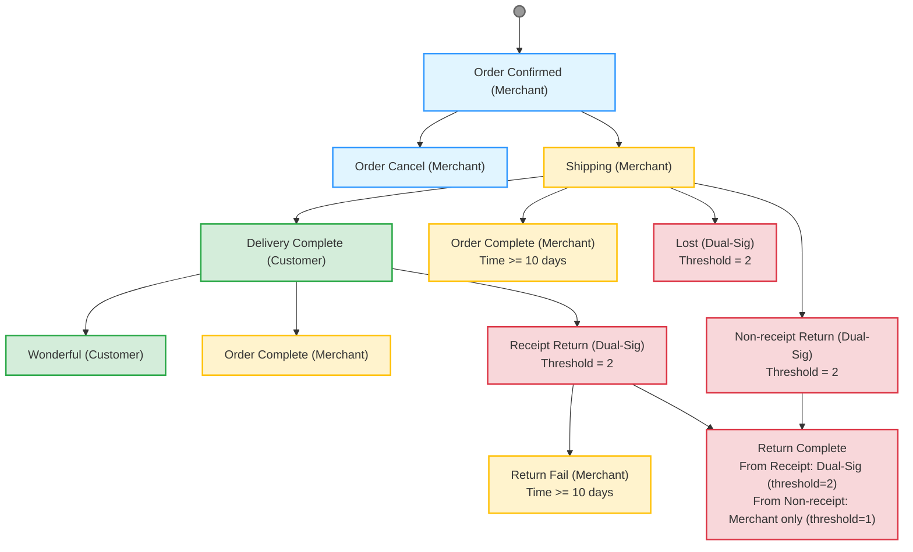

# MyShop Advanced E-Commerce Example

An advanced e-commerce example demonstrating escrow with multiple order fund allocation modes, multi-party allocation, arbitration with voting guards, and WIP-based product verification.

> **Complete Example**: This document contains all necessary JSON examples for setting up the MyShop Advanced e-commerce system.

***

## ⚠️ Running Principle

> **Run the example in full every time (repeatable).** This example uses `replaceExistName: true` on all object creations — each run generates new objects with new addresses. If you skip build steps, operations may silently act on orphaned objects from previous runs, producing incorrect results. Old objects' configurations do not reflect the current document version.

- **Execution order**: Part 1 (read) → Part 2 Steps 1–14 (build all) → Part 3 (customer flow) → Part 4 (fund allocation). Do not skip steps — each depends on objects created by prior steps.
- **Prerequisites**: `myshop_merchant` ≥ 0.05 WOW (gas), `myshop_customer` ≥ 0.15 WOW (gas + order payment). All on-chain operations require `env.confirmed: true`.

### 🔐 Two-Step Confirmation Flow (Production Safety)

This example sets `env.confirmed: true` on irreversible operations (e.g., `publish: true` on Machine) for brevity. In real deployments, follow the two-step flow enforced by the ConfirmGate safety layer:

1. **Phase 1 — Preview**: Call the tool **without** `env.confirmed`. The server returns `{ status: "pending_confirmation", confirmation_text: "..." }` containing the full operation summary, risk assessment, and irreversible-action warnings.
2. **Phase 2 — Confirm**: Review `confirmation_text` with the user. Only after explicit user approval, call the tool again **with** `env.confirmed: true` to actually execute the on-chain transaction.

> Skipping Phase 1 means the user never sees the risk summary before gas is spent. Always preview first, then confirm.

***

> **💡 Call Format**: All WoWok operations go through a single unified `wowok` tool. The AI calls `wowok({ tool: "<sub-tool>", data: {<params>} })`. If parameters don't match the schema, the response includes the correct schema for self-correction. See [Response Format](../../docs/response-format.md) for details.

## Core Requirements & Features

| Requirement                    | Description                                                               | Implementation                                                                        |
| ------------------------------ | ------------------------------------------------------------------------- | ------------------------------------------------------------------------------------- |
| **WIP-Verified Product**       | Single product with WIP file hash verification                            | `three_body.wip` integrated into Service sales                                        |
| **Milestone-Based Workflow**   | Order progress tracked through Machine workflow nodes                     | Multi-path workflow with delivery confirmation, wonderful rating, and return handling |
| **Simplified Fund Allocation** | Clear fund distribution model with reward incentives                      | 100% to merchant on completion/wonderful, 100% to customer on lost/return             |
| **Reward System**              | Incentive mechanism for excellent service and lost compensation           | Reward pool with guard-based verification                                             |
| **Messenger-Based Logistics**  | Privacy-preserving shipping info exchange via Messenger + Merkle Root     | Tracking numbers shared privately; only Merkle Root submitted on-chain                |
| **Multi-Path Returns**         | Support for non-receipt return, receipt return, and lost package handling | Different return paths based on delivery status                                       |

### Key Design Decisions

1. **Single Product Model**: Only one WIP-verified product to simplify the example while demonstrating full capabilities
2. **Privacy-Preserving Logistics**: Merchant handles logistics independently using any logistics provider. Tracking numbers are shared privately via Messenger (not on-chain), with only Merkle Root submitted on-chain as proof of communication
3. **Reward Incentive Model**: Additional reward pool for excellent service (Wonderful reward) and compensation for lost packages
4. **Multi-Path Workflow**: Order can complete through normal delivery, wonderful rating, or various return paths
5. **Dual-Signature Returns**: Receipt return processes require both customer and merchant confirmation (threshold=2). Non-receipt returns (customer never received goods) require only merchant confirmation of goods recovery (threshold=1), since the customer has nothing to return and their non-receipt was already confirmed when entering the Non-receipt Return node.

### Important Design Principle: "Who Completes the Key Action, Who Submits the Proof"

To ensure accountability and prevent disputes, the party who completes the critical action must submit the on-chain proof:

- **Merchant Shipping**: Merchant receives customer's shipping address via Messenger and sends back tracking number → **Merchant submits Merkle Root** proving communication completed
- **Customer Return**: Customer sends return tracking number to merchant via Messenger → **Customer submits Merkle Root** proving communication completed
- **Lost Confirmation**: Both parties confirm lost package through dual-signature mechanism

This principle ensures that the party responsible for the action bears the responsibility of recording it on-chain, creating a clear audit trail for potential arbitration.

***

## Overview

This advanced example demonstrates an enterprise-grade e-commerce system with:

- **Single WIP-Verified Product**: One product listing ("The Three-Body Problem + Author Signature") with WIP file verification
- **Multi-Path Workflow**: Order progress with delivery confirmation, wonderful rating, lost handling, and multiple return paths
- **Dual-Signature Returns**: Receipt returns require both customer and merchant confirmation; non-receipt returns require only merchant confirmation of goods recovery
- **Reward Incentive System**: Reward pool for excellent service and compensation for lost packages
- **Time-Based Auto-Completion**: Orders auto-complete after time thresholds

***

## Architecture

### System Components

```
┌─────────────────────────────────────────────────────────────────────────────┐
│                     MyShop Advanced E-Commerce System                       │
├─────────────────────────────────────────────────────────────────────────────┤
│                                                                             │
│  ┌─────────────────────────┐    ┌─────────────────────────┐                │
│  │    Merchant System      │    │    Customer System      │                │
│  ├─────────────────────────┤    ├─────────────────────────┤                │
│  │ • Permission            │    │ • Place Order           │                │
│  │ • Machine (Milestone)   │    │ • Track Progress        │                │
│  │ • Service (WIP Catalog) │◄──►│ • Confirm Delivery      │                │
│  │ • Allocation (Escrow)   │    │ • Rate Wonderful        │                │
│  │ • Guards (Verification) │    │ • Request Return        │                │
│  │ • Reward Pool           │    │ • Submit Arbitration    │                │
│  └─────────────────────────┘    └─────────────────────────┘                │
│                                                                             │
│  Fund Flow: Merchant + Reward Pool (Incentives)                            │
│                                                                             │
└─────────────────────────────────────────────────────────────────────────────┘
```

### Order Workflow (Multi-Path Milestone-Based)


```mermaid
graph TD
    classDef initial fill:#e1f5ff,stroke:#3399ff,stroke-width:2px;
    classDef merchant fill:#fff3cd,stroke:#ffc107,stroke-width:2px;
    classDef customer fill:#d4edda,stroke:#28a745,stroke-width:2px;
    classDef dualsig fill:#f8d7da,stroke:#dc3545,stroke-width:2px;
    classDef start fill:#999,stroke:#666,stroke-width:2px;

    START(( )):::start

    OC["Order Confirmed (Merchant)"]:::initial
    OR["Order Cancel (Merchant)"]:::initial

    SH["Shipping (Merchant)"]:::merchant

    DC["Delivery Complete (Customer)"]:::customer
    WO["Wonderful (Customer)"]:::customer
    OC2["Order Complete (Merchant)<br/>Time >= 10 days"]:::merchant
    LO["Lost (Dual-Sig)<br/>Threshold = 2"]:::dualsig

    OC3["Order Complete (Merchant)"]:::merchant
    NR["Non-receipt Return (Dual-Sig)<br/>Threshold = 2"]:::dualsig

    RR["Receipt Return (Dual-Sig)<br/>Threshold = 2"]:::dualsig
    RF["Return Fail (Merchant)<br/>Time >= 10 days"]:::merchant
    RC["Return Complete<br/>From Receipt: Dual-Sig (threshold=2)<br/>From Non-receipt: Merchant only (threshold=1)"]:::dualsig

    START --> OC
    OC --> OR
    OC --> SH
    SH --> DC
    DC --> WO
    SH --> OC2
    SH --> LO
    
    DC --> OC3
    SH --> NR
    
    DC --> RR
    RR --> RF
    RR --> RC
    NR --> RC
```

#### Fund Allocation

- **Merchant 100%**: Order Complete | Wonderful | Return Fail
- **Customer 100%**: Lost | Return Complete

#### Reward Compensation

- **Wonderful Node**: 10000 reward
- **Lost Node**: 20000 compensation
- **Shipping Timeout (>2 days)**: 20000 compensation

> **⚠️ Units Note (BalanceType)**: The reward/compensation amounts above (and the `amount.value` numbers in Step 13) are **raw BalanceType values in the SMALLEST unit** of WOW. WOW has 9 decimals (1 WOW = 10⁹ smallest units), so 10000 = 0.00001 WOW and 20000 = 0.00002 WOW — far below gas cost. Treat them as **symbolic/test values** that keep the flow executable on any balance; for production amounts use either larger smallest-unit values (e.g. `20000000000` = 20 WOW) or the display format (e.g. `"20WOW"`), both accepted by `BalanceTypeSchema`. Note the different semantics of `"sharing": 10000, "mode": "Rate"` in the order_allocators (Step 10): that is **basis points (100.00%)**, not a WOW amount.

***

## Part 1: Build Order and Rationale

Understanding the correct order for creating WoWok objects is crucial for a successful deployment. This section explains the dependency chain and why objects must be created in a specific sequence.

### Object Dependency Graph

```
┌─────────────────────────────────────────────────────────────────────────────┐
│                         Object Creation Dependencies                        │
├─────────────────────────────────────────────────────────────────────────────┤
│                                                                             │
│  Phase 1: Foundation                                                        │
│  ═══════════════════════════════════════════════                            │
│                                                                             │
│  ┌─────────────────┐    ┌─────────────────┐                                │
│  │   Permission    │    │   Accounts      │                                │
│  │ (myshop_perm_   │    │ (myshop_merchant│                                │
│  │     v2)         │    │  myshop_customer)│                               │
│  └────────┬────────┘    └─────────────────┘                                │
│           │                                                                 │
│           ▼                                                                 │
│  ┌─────────────────┐                                                       │
│  │ Add Permission  │◄─── Grant indexes 1000, 1001 to merchant             │
│  │    Indexes      │     Required for Machine operations                   │
│  └────────┬────────┘                                                        │
│           │                                                                 │
│           ▼                                                                 │
│  ┌─────────────────┐                                                       │
│  │     Service     │◄─── Requires: Permission                              │
│  │(three_body_sig  │     Publish: FALSE (get name first)                   │
│  │ _service_v2)    │                                                        │
│  └────────┬────────┘                                                        │
│           │                                                                 │
│           ▼                                                                 │
│  ┌─────────────────┐                                                       │
│  │    Treasury     │◄─── Requires: Permission (same as Service)            │
│  │(myshop_treasury │     Aggregates merchant revenue                       │
│  │      _v2)       │     Referenced by order_allocators (Phase 6)          │
│  └────────┬────────┘                                                        │
│           │                                                                 │
│           ▼                                                                 │
│  Phase 2: Guard Creation                                                    │
│  ═══════════════════════                                                    │
│                                                                             │
│  ┌─────────────────┐    ┌─────────────────┐    ┌─────────────────┐         │
│  │ machine_merkle_ │    │ machine_service_│    │ machine_time_   │         │
│  │   root_v2       │    │   order_v2      │    │   10d_v2        │         │
│  └─────────────────┘    └────────┬────────┘    └─────────────────┘         │
│                                  │                                          │
│                                  ▼                                          │
│  ┌─────────────────┐    ┌─────────────────┐    ┌─────────────────┐         │
│  │ service_merchant│    │ service_customer│    │ machine_time_2d │         │
│  │   _win_v2       │    │   _win_v2       │    │     _v2         │         │
│  └─────────────────┘    └─────────────────┘    └─────────────────┘         │
│                                                                             │
│  Phase 2b: Reward System (Empty Object First)                               │
│  ════════════════════════════════════════════                               │
│                                                                             │
│  ┌─────────────────┐                                                       │
│  │  Empty Reward   │◄─── Create empty reward object first                  │
│  │myshop_reward_v2 │     Guards will reference this object                 │
│  └────────┬────────┘                                                        │
│           │                                                                 │
│           ▼                                                                 │
│  ┌─────────────────┐    ┌─────────────────┐    ┌─────────────────┐         │
│  │ reward_wonderful│    │  reward_lost    │    │ reward_shipping │         │
│  │     _v2         │    │     _v2         │    │ _timeout_v2     │         │
│  └─────────────────┘    └─────────────────┘    └─────────────────┘         │
│                                                                             │
│  Phase 3: Machine Creation                                                  │
│  ═══════════════════════════════════════                                    │
│                                                                             │
│  ┌─────────────────┐                                                       │
│  │     Machine     │◄─── Requires: Permission + Guards                     │
│  │(myshop_advanced │     All nodes with guards for verification           │
│  │  _machine_v2)   │                                                        │
│  └────────┬────────┘                                                        │
│           │                                                                 │
│           ▼                                                                 │
│  Phase 4: Machine Binding                                                   │
│  ═══════════════════════════════════════                                    │
│                                                                             │
│  ┌─────────────────┐                                                       │
│  │ Bind Machine    │◄─── Requires: Service + Machine                       │
│  │   to Service    │     Must be done before publishing Service            │
│  └────────┬────────┘                                                        │
│           │                                                                 │
│           ▼                                                                 │
│  Phase 5: Arbitration Creation                                              │
│  ═══════════════════════════════════════                                    │
│                                                                             │
│  ┌─────────────────┐                                                       │
│  │   Arbitration   │◄─── Independent, but needs Service binding            │
│  │myshop_arbitration│                                                        │
│  │      _v2        │                                                        │
│  └────────┬────────┘                                                        │
│           │                                                                 │
│           ▼                                                                 │
│  Phase 6: Service Configuration                                             │
│  ═════════════════════════════════════════                                  │
│                                                                             │
│  ┌─────────────────┐                                                       │
│  │ Update Service  │◄─── Add: order_allocators, sales, arbitrations        │
│  │  and Publish    │     Requires: All Guards, Arbitration                 │
│  └─────────────────┘                                                        │
│                                                                             │
│  Phase 7: Reward Pool Configuration                                         │
│  ═══════════════════════════════════════════                                │
│                                                                             │
│  ┌─────────────────┐                                                       │
│  │  Add Guards to  │◄─── Add reward guards with store_from_id              │
│  │     Reward      │     Enables double-claim protection                   │
│  │myshop_reward_v2 │                                                        │
│  └─────────────────┘                                                        │
│                                                                             │
└─────────────────────────────────────────────────────────────────────────────┘
```

### Why This Order Matters

| Phase | Object               | Dependencies         | Reason                                                                                                        |
| ----- | -------------------- | -------------------- | ------------------------------------------------------------------------------------------------------------- |
| 1     | **Permission**       | None                 | Permission is the foundation. Machine and Service both reference a permission object for access control.      |
| 1b    | **Permission Indexes** | Permission         | Grant permission indexes 1000 and 1001 to merchant. Required for Machine node operations.                     |
| 2     | **Service (Empty)**  | Permission           | Create Service without publishing first to obtain its name. This name is used in Guard verification.          |
| 2b    | **Treasury**         | Permission           | Treasury aggregates merchant revenue. Uses same Permission as Service. Referenced by order\_allocators in Phase 7. |
| 3     | **Guards**           | Service Name         | Guards must verify that orders belong to the correct Service. They query Service name and Progress state.     |
| 4     | **Machine**          | Permission, Guards   | Machine requires guards for node verification. Guards need Service name which is now available.               |
| 5     | **Machine Binding**  | Service, Machine     | Bind Machine to Service before publishing. Once published, Machine cannot be bound.                           |
| 6     | **Arbitration**      | Own Permission       | Arbitration is independent but needs to be bound to Service. ⚠️ It MUST use a DIFFERENT Permission than the Service — the Service contract asserts `arbitration.permission != service.permission` when binding. Create before Service update. |
| 7     | **Service (Update)** | Guards, Arb, Machine | Update Service with order\_allocators, sales, arbitrations, machine binding. Then publish.                     |
| 8     | **Empty Reward**     | None                 | Create empty reward object first. This object is referenced by reward guards for double-claim protection.     |
| 9     | **Reward Guards**    | Reward (by name)     | Create reward guards that reference the reward object by name. Guards verify order node + no prior claim.     |
| 10    | **Add Guards to Reward** | Reward, Guards   | Add reward guards to the reward object with store\_from\_id set. This enables order-based double-claim protection. |
| 11    | **Deposit to Reward** | Reward              | Deposit WOW tokens to reward pool for claim distribution.                                                      |

### Key Design Decisions

1. **Permission First**: Every major object (Machine, Service) requires a permission object. Create this first.
2. **Permission Indexes**: Grant permission indexes 1000 and 1001 to merchant account. These are used in Machine node forwards.
3. **Service Before Guards**: Create Service without publishing to get its name. Guards use Service name to verify orders belong to the correct service.
3b. **Treasury for Fund Aggregation**: Create Treasury with the same Permission as the Service. Merchant revenue flows to the Treasury (not the Service address), making allocators pay a fixed destination regardless of caller and aggregating public funds for operational distribution.
4. **Guards Before Machine**: Machine nodes reference guards for verification. Create all guards first, then create Machine with guard references.
5. **Machine Binding Before Publish**: Bind Machine to Service before publishing. Once published, Machine cannot be bound.
6. **Arbitration Before Service Update**: Arbitration must be created before Service update so it can be bound to Service.
7. **Service Publishing Last**: Only publish Service after all guards, machine, and arbitration are ready.
8. **Empty Reward Before Reward Guards**: Create an empty reward object first. Reward guards reference this object by name to verify no double-claiming.
9. **Reward Guards Before Adding to Reward**: Create reward guards that check both order node and no prior claim, then add them to the reward object with store_from_id set.

### Simplified Build Sequence

```
Phase 1: Foundation
└── 1. Create Permission (myshop_perm_v2)
    └── Add permission indexes (1000 for Order Confirmed/Cancel, 1001 for other operations)

Phase 2: Service Creation
└── 2. Create Service (three_body_signature_service_v2)
    ├── Publish: FALSE
    └── Record the Service address for Guard creation

Phase 2b: Treasury Creation
└── 2b. Create Treasury (myshop_treasury_v2)
    ├── Permission: myshop_perm_v2 (same as Service)
    ├── Type parameter: 0x2::wow::WOW
    └── Aggregates merchant revenue; referenced by order_allocators (Phase 7)

Phase 3: Guard Creation (Machine Guards)
└── 3. Create Machine Guards (4 guards)
    ├── machine_merkle_root_v2 (verify string length = 66)
    ├── machine_service_order_v2 (verify order service + node — illustrative variant, not wired into the Machine; see Step 4 note)
    ├── machine_time_10d_v2 (on-chain time >= 10 days on current node)
    └── machine_time_2d_v2 (on-chain time >= 2 days — illustrative variant, not wired into the Machine; see Step 4 note)

Phase 3b: Service Guards
└── 3b. Create Service Guards (2 guards)
    ├── service_merchant_win_v2 (verify node in [Order Complete, Wonderful, Return Fail])
    └── service_customer_win_v2 (verify node in [Lost, Return Complete])

Phase 4: Machine Creation
└── 4. Create Machine (myshop_advanced_machine_v2)
    └── Add all nodes with guards (Order Confirmed, Order Cancel, Shipping, 
        Delivery Complete, Wonderful, Order Complete, Lost, 
        Non-receipt Return, Receipt Return, Return Fail, Return Complete)

Phase 5: Machine Binding
└── 5. Bind Machine to Service
    └── Must be done before publishing Service

Phase 6: Arbitration Creation
└── 6. Create Arbitration (myshop_arbitration_v2)
    └── Final dispute resolution mechanism

Phase 7: Service Configuration
└── 7. Update and Publish Service
    ├── Add order_allocators (service_merchant_win_v2, service_customer_win_v2)
    ├── Add sales (Three-Body Problem product)
    ├── Add arbitrations binding
    └── Publish service

Phase 8: Reward Pool Setup
└── 8. Create Empty Reward (myshop_reward_v2)
    └── Create empty reward object first (guards will reference it)

Phase 9: Reward Guards Creation
└── 9. Create Reward Guards (3 guards)
    ├── reward_wonderful_v2 (verify Wonderful node + no prior claim)
    ├── reward_lost_v2 (verify Lost node + no prior claim)
    └── reward_shipping_timeout_v2 (verify Shipping node + no prior claim)

Phase 10: Reward Guards Configuration
└── 10. Add Guards to Reward Object
    ├── Add reward_wonderful_v2 (amount: 10000, store_from_id: 0)
    ├── Add reward_lost_v2 (amount: 20000, store_from_id: 0)
    └── Add reward_shipping_timeout_v2 (amount: 20000, store_from_id: 0)

Phase 11: Deposit to Reward Pool
└── 11. Deposit WOW tokens to reward pool
    └── Add sufficient balance for all reward payments
```

***

## Part 2: Merchant System Setup

### Prerequisites

Reuse existing accounts from basic MyShop:

- Account: `myshop_merchant` (store owner)
- Account: `myshop_customer` (customer)

> **Mandatory**: Ensure both accounts (`myshop_merchant` and `myshop_customer`) exist as local marks BEFORE proceeding. The Permission object (Step 2) grants indexes to `myshop_merchant` by name — if the account does not exist when the permission is created, the grant will silently fail or target the wrong account, causing "Permission denied" errors in later steps.

Ensure both accounts have sufficient mainnet WOW tokens.

***

### Step 1: Create Permission Object

Create a new permission object for the advanced shop.

**Prompt**: Create permission object "myshop\_perm\_v2".

```json
{
  "tool": "onchain_operations",
  "data": {
    "operation_type": "permission",
    "data": {
      "object": {
        "name": "myshop_perm_v2",
        "replaceExistName": true
      },
      "description": "Permission object for MyShop Advanced e-commerce system"
    },
    "env": {
      "account": "myshop_merchant",
      "network": "mainnet",
      "no_cache": true
    }
  }
}
```

***

### Step 2: Add Custom Permissions

Add custom permission indexes for advanced operations.

**Permission Index 1000**: Order Confirmed + Order Cancel (Merchant operations for order confirmation/cancellation)

```json
{
  "tool": "onchain_operations",
  "data": {
    "operation_type": "permission",
    "data": {
      "object": "myshop_perm_v2",
      "remark": {
        "op": "set",
        "index": 1000,
        "remark": "Order Confirmed and Order Cancel - Merchant confirms or cancels order"
      },
      "table": {
        "op": "add perm by index",
        "index": 1000,
        "entity": {
          "entities": [{"name_or_address": "myshop_merchant"}]
        }
      }
    },
    "env": {
      "account": "myshop_merchant",
      "network": "mainnet",
      "no_cache": true
    }
  }
}
```

**Permission Index 1001**: Shipping + Order Complete + Lost + Return (Merchant logistics operations)

```json
{
  "tool": "onchain_operations",
  "data": {
    "operation_type": "permission",
    "data": {
      "object": "myshop_perm_v2",
      "remark": {
        "op": "set",
        "index": 1001,
        "remark": "Shipping, Order Complete, Lost, Return operations - Merchant logistics operations"
      },
      "table": {
        "op": "add perm by index",
        "index": 1001,
        "entity": {
          "entities": [{"name_or_address": "myshop_merchant"}]
        }
      }
    },
    "env": {
      "account": "myshop_merchant",
      "network": "mainnet",
      "no_cache": true
    }
  }
}
```

***

### Step 3: Create Service (Unpublished)

Create the Service without publishing to obtain its address for Guard creation.

**Prompt**: Create Service "three\_body\_signature\_service\_v2" with permission "myshop\_perm\_v2", do not publish.

```json
{
  "tool": "onchain_operations",
  "data": {
    "operation_type": "service",
    "data": {
      "object": {
        "name": "three_body_signature_service_v2",
        "replaceExistName": true,
        "permission": "myshop_perm_v2"
      },
      "description": "Three-Body Problem Signature Edition - Limited collector's item with WIP verification",
      "pause": false
    },
    "env": {
      "account": "myshop_merchant",
      "network": "mainnet",
      "no_cache": true
    }
  }
}
```

**Record the Service address** - it will be needed for Guard creation.

***

### Step 3b: Create Treasury (Merchant Revenue Aggregation)

Create a Treasury object to aggregate merchant revenue. The Treasury uses the **same Permission** as the Service (`myshop_perm_v2`) for consistency — a single permission organization governs both fund collection and service operations.

**Prompt**: Create Treasury "myshop\_treasury\_v2" with permission "myshop\_perm\_v2", type parameter "0x2::wow::WOW".

```json
{
  "tool": "onchain_operations",
  "data": {
    "operation_type": "treasury",
    "data": {
      "object": {
        "name": "myshop_treasury_v2",
        "type_parameter": "0x2::wow::WOW",
        "permission": "myshop_perm_v2",
        "replaceExistName": true
      },
      "description": "Treasury for aggregating MyShop merchant revenue. Uses the same Permission as the Service (myshop_perm_v2) for consistency — a single permission organization governs both fund collection and service operations."
    },
    "env": {
      "account": "myshop_merchant",
      "network": "mainnet",
      "no_cache": true
    }
  }
}
```

> **Treasury-First Rule**: Following the fund-flow design pattern established in the Insurance example, merchant revenue flows to `myshop_treasury_v2` (not directly to the Service address). This:
> 1. **Aggregates public funds** for operational distribution and accounting
> 2. **Makes allocators pay a fixed destination** — funds always flow to the fixed Treasury regardless of caller, so no Signer binding is needed in the Guard
> 3. **Uses permission consistency** — Treasury and Service share `myshop_perm_v2`, ensuring unified governance

***

### Step 4: Create Guards (Machine Guards)

Create Guards using the Service address. Guards verify order state and service ownership.

> **Pre-Query Step**: Before designing Guards, query available Guard instructions via `wowok_buildin_info` to confirm correct query IDs, parameter types, and return types. This is mandatory per the skill framework.
>
> ```json
> {
>   "tool": "wowok_buildin_info",
>   "data": {
>     "info": "guard instructions",
>     "filter": { "scope": "all" }
>   }
> }
> ```
>
> Key instructions used in this example:
> - Query ID 1563 (`order.service`): Returns the Service address of an Order — used to verify order belongs to this service
> - Query ID 1253 (`progress.current`): Returns current node name — used to verify order at specific workflow node

**Guard 1: machine_merkle_root_v2** - Verify Merkle Root string length = 66 (0x prefix + 64 hex chars)

```json
{
  "tool": "onchain_operations",
  "data": {
    "operation_type": "guard",
    "data": {
      "namedNew": {
        "name": "machine_merkle_root_v2",
        "replaceExistName": true
      },
      "description": "Verify Merkle Root string length is 66 characters (0x prefix + 64 hex)",
      "table": [
        {"identifier": 0, "b_submission": true, "value_type": "String"},
        {"identifier": 1, "b_submission": false, "value_type": "U64", "value": "66"}
      ],
      "root": {
        "type": "logic_as_u256_equal",
        "nodes": [
          {"type": "calc_string_length", "node": {"type": "identifier", "identifier": 0}},
          {"type": "identifier", "identifier": 1}
        ]
      }
    },
    "env": {
      "account": "myshop_merchant",
      "network": "mainnet",
      "no_cache": true
    }
  }
}
```

**Guard 1b: machine_messenger_proof_v2** - Strict-mode privacy delivery (alternative to Guard 1)

> **Two standard modes for "privacy info delivered via Messenger but not suitable for on-chain publication":**
>
> | Mode | Guard | Submission | Verification | Trust model |
> |------|-------|-----------|-------------|-------------|
> | **Broad** | `machine_merkle_root_v2` (Guard 1) | String (Merkle Root) | Length == 66 | Trusts submitter honesty; counterparty disputes via own Messenger log. Arbitration basis. |
> | **Strict** | `machine_messenger_proof_v2` (Guard 1b) | Proof addr + Order addr | Signer==proof.signer ∧ proof.time>order.time ∧ order.service==service | Submitter accountability (谁得利谁举证); no content verification. |
>
> Machine forwards may reference **either** Guard 1 or Guard 1b — choose before publishing (Forward.guard is immutable). The same strict Guard can be reused across all forwards that need Merkle-Root verification (shipping, lost, returns, etc.).

```json
{
  "tool": "onchain_operations",
  "data": {
    "operation_type": "guard",
    "data": {
      "namedNew": {
        "name": "machine_messenger_proof_v2",
        "replaceExistName": true
      },
      "description": "Strict-mode privacy delivery: verify Signer==proof.signer AND proof.time>order.time AND order.service==service (verifier submits Proof+Order object addresses)",
      "table": [
        {"identifier": 0, "b_submission": true, "value_type": "Address", "name": "Proof object from submitChainProof"},
        {"identifier": 1, "b_submission": true, "value_type": "Address", "name": "Order object submitted by verifier"},
        {"identifier": 2, "b_submission": false, "value_type": "Address", "name": "service_address", "value": "three_body_signature_service_v2"}
      ],
      "root": {
        "type": "logic_and",
        "nodes": [
          {
            "type": "logic_equal",
            "nodes": [
              {"type": "context", "context": "Signer"},
              {"type": "query", "query": "proof.signer", "object": {"identifier": 0}, "parameters": []}
            ]
          },
          {
            "type": "logic_as_u256_greater",
            "nodes": [
              {"type": "query", "query": "proof.time", "object": {"identifier": 0}, "parameters": []},
              {"type": "query", "query": "order.time", "object": {"identifier": 1}, "parameters": []}
            ]
          },
          {
            "type": "logic_equal",
            "nodes": [
              {"type": "query", "query": "order.service", "object": {"identifier": 1}, "parameters": []},
              {"type": "identifier", "identifier": 2}
            ]
          }
        ]
      }
    },
    "env": {
      "account": "myshop_merchant",
      "network": "mainnet",
      "no_cache": true
    }
  }
}
```

**Three conditions (logic_and):**
1. **Submitter accountability** — `logic_equal[context(Signer), query("proof.signer", obj=proof)]`: the transaction signer must be the Proof's signer (the party who generated the Proof via `submitChainProof`).
2. **Freshness** — `logic_as_u256_greater[query("proof.time", obj=proof), query("order.time", obj=order)]`: the Proof was created after the order, preventing stale-proof replay. (`proof.time` has invariant `clock_derived`, always > 0.)
3. **Project binding** — `logic_equal[query("order.service", obj=order), identifier[2]]`: the submitted Order belongs to `three_body_signature_service_v2`, so orders of other services cannot qualify.

**Generating the Proof (provider side, before submitting to the forward):**
```text
// SDK call: messenger.submitChainProof(env, peerAddress, description?)
// - about_address is set to peerAddress (the customer's address)
// - pass the order_id in description to associate the Proof with the order
// Returns: { proofAddress, txHash }
```

**Runtime submission (verifier side, advancing the Machine forward):**
- Broad mode (Guard 1): submit one String identifier — the Merkle Root.
- Strict mode (Guard 1b): submit two Address identifiers — the Proof object address (identifier 0) and the Order object address (identifier 1).

> No content verification is performed in either mode — only submission responsibility. The counterparty can dispute a fraudulent claim by checking their own Messenger conversation for the alleged dialogue. This follows the 谁得利谁举证 (whoever benefits bears the burden of proof) principle.

**Guard 2: machine_time_10d_v2** - Verify 10-day timeout (864000000 ms)

> **Secure time-lock pattern**: identifier 0 is the **Progress object submitted at runtime (Address)** — the Guard reads its current-node entry timestamp on-chain via `query("progress.current_time")` (GUARDQUERY id 1272). NEVER declare the start time as a caller-submitted U64: a submitter could pass 0 and bypass the lock entirely. The threshold stays a creation-time constant (identifier 1).

```json
{
  "tool": "onchain_operations",
  "data": {
    "operation_type": "guard",
    "data": {
      "namedNew": {
        "name": "machine_time_10d_v2",
        "replaceExistName": true
      },
      "description": "Verify time elapsed on the current node >= 10 days (864000000 ms): Clock - progress.current_time >= 864000000. The Progress object is submitted at runtime (Address identifier 0); the start time is read on-chain via query 1272, so the caller cannot forge it.",
      "table": [
        {"identifier": 0, "b_submission": true, "value_type": "Address", "name": "progress_id"},
        {"identifier": 1, "b_submission": false, "value_type": "U64", "value": "864000000"}
      ],
      "root": {
        "type": "logic_as_u256_greater_or_equal",
        "nodes": [
          {
            "type": "calc_number_subtract",
            "nodes": [
              {"type": "context", "context": "Clock"},
              {"type": "query", "query": "progress.current_time", "object": {"identifier": 0}, "parameters": []}
            ]
          },
          {"type": "identifier", "identifier": 1}
        ]
      }
    },
    "env": {
      "account": "myshop_merchant",
      "network": "mainnet",
      "no_cache": true
    }
  }
}
```

**Guard 3: machine_time_2d_v2** - Verify 2-day timeout (172800000 ms)

```json
{
  "tool": "onchain_operations",
  "data": {
    "operation_type": "guard",
    "data": {
      "namedNew": {
        "name": "machine_time_2d_v2",
        "replaceExistName": true
      },
      "description": "Verify time elapsed on the current node >= 2 days (172800000 ms): Clock - progress.current_time >= 172800000. The Progress object is submitted at runtime (Address identifier 0); the start time is read on-chain via query 1272, so the caller cannot forge it.",
      "table": [
        {"identifier": 0, "b_submission": true, "value_type": "Address", "name": "progress_id"},
        {"identifier": 1, "b_submission": false, "value_type": "U64", "value": "172800000"}
      ],
      "root": {
        "type": "logic_as_u256_greater_or_equal",
        "nodes": [
          {
            "type": "calc_number_subtract",
            "nodes": [
              {"type": "context", "context": "Clock"},
              {"type": "query", "query": "progress.current_time", "object": {"identifier": 0}, "parameters": []}
            ]
          },
          {"type": "identifier", "identifier": 1}
        ]
      }
    },
    "env": {
      "account": "myshop_merchant",
      "network": "mainnet",
      "no_cache": true
    }
  }
}
```

> **⚠️ Not wired into this Machine**: `machine_time_2d_v2` (and `machine_service_order_v2` below) are **illustrative/optional variants — no forward in `myshop_advanced_machine_v2` references them**. The "Shipping Timeout (>2 days) → 20000 compensation" path promised in [Reward Compensation](#reward-compensation) is NOT a Machine transition: the order must **remain at the Shipping node** for the claim to pass, so the 2-day condition is enforced inside the `reward_shipping_timeout_v2` Guard itself (Step 12, same Clock − `progress.current_time` pattern), not by a forward Guard. Keep these Guards for reference or adapt them in your own workflow; this example's flow does not depend on them.

***

**Guard 4: service_merchant_win_v2** - Verify order at merchant win nodes AND order belongs to this service

```json
{
  "tool": "onchain_operations",
  "data": {
    "operation_type": "guard",
    "data": {
      "namedNew": {
        "name": "service_merchant_win_v2",
        "tags": ["order", "merchant-win"],
        "replaceExistName": true
      },
      "description": "Verify order at merchant win nodes (Order Complete, Wonderful, Return Fail) AND order belongs to three_body_signature_service_v2. No Signer binding is needed because the allocator uses sharing.who=Entity(myshop_treasury_v2) — funds always flow to the Treasury regardless of caller. Two-fold verification: (1) order at a merchant win node, (2) order belongs to this service.",
      "table": [
        {"identifier": 0, "b_submission": true, "value_type": "Address", "name": "order_id"},
        {"identifier": 1, "b_submission": false, "value_type": "String", "value": "Order Complete"},
        {"identifier": 2, "b_submission": false, "value_type": "String", "value": "Wonderful"},
        {"identifier": 3, "b_submission": false, "value_type": "String", "value": "Return Fail"},
        {"identifier": 4, "b_submission": false, "value_type": "Address", "name": "service_address", "value": "three_body_signature_service_v2"}
      ],
      "root": {
        "type": "logic_and",
        "nodes": [
          {
            "type": "logic_or",
            "nodes": [
              {
                "type": "logic_string_nocase_equal",
                "nodes": [
                  {"type": "query", "query": "progress.current", "object": {"identifier": 0, "convert_witness": "OrderProgress"}, "parameters": []},
                  {"type": "identifier", "identifier": 1}
                ]
              },
              {
                "type": "logic_string_nocase_equal",
                "nodes": [
                  {"type": "query", "query": "progress.current", "object": {"identifier": 0, "convert_witness": "OrderProgress"}, "parameters": []},
                  {"type": "identifier", "identifier": 2}
                ]
              },
              {
                "type": "logic_string_nocase_equal",
                "nodes": [
                  {"type": "query", "query": "progress.current", "object": {"identifier": 0, "convert_witness": "OrderProgress"}, "parameters": []},
                  {"type": "identifier", "identifier": 3}
                ]
              }
            ]
          },
          {
            "type": "logic_equal",
            "nodes": [
              {"type": "query", "query": "order.service", "object": {"identifier": 0}, "parameters": []},
              {"type": "identifier", "identifier": 4}
            ]
          }
        ]
      }
    },
    "env": {
      "account": "myshop_merchant",
      "network": "mainnet",
      "no_cache": true
    }
  }
}
```

**Guard Explanation (Two-fold Verification):**
- **Table Item 0**: Order address (submitted at runtime)
- **Table Items 1-3**: Constant strings "Order Complete", "Wonderful", "Return Fail" (merchant win node names)
- **Table Item 4**: Constant address `three_body_signature_service_v2` (this service's on-chain address)
- **Condition 1 — Merchant Win Node**: `logic_or` of three `logic_string_nocase_equal` checks against `query("progress.current", witness="OrderProgress")` — verifies the order is at one of the merchant win nodes
- **Condition 2 — Service Ownership**: `logic_equal[query("order.service"), identifier[4]]` — verifies the submitted Order's `service` field equals `three_body_signature_service_v2`, so orders of another service cannot qualify
- **root**: `logic_and` of both conditions — all must pass for allocation to proceed

> **Fixed recipient design**: the allocator uses `"who": {"Entity": {"name_or_address": "myshop_treasury_v2"}}` — funds flow to the fixed Treasury address regardless of caller, so no Signer binding is needed and there is no lock-in to a fixed merchant address.
```

**Guard 4 — Alternative Shorthand Form (VecString + vec_contains_string_nocase)**

The `logic_or` of three `logic_string_nocase_equal` checks above can be collapsed into a single `vec_contains_string_nocase` over a `VecString` constant. Both forms are **semantically equivalent** (verified by `guard-examples-lint.spec.ts` → "Semantic Equivalence" tests: identical risk diagnostics, identical `root_type`, identical `errors`/`ready` state). The shorthand is preferred when the candidate set has ≥ 2 entries — it scales linearly with the vector length instead of duplicating the query node N times.

```json
{
  "tool": "onchain_operations",
  "data": {
    "operation_type": "guard",
    "data": {
      "namedNew": {
        "name": "service_merchant_win_v2",
        "tags": ["order", "merchant-win"],
        "replaceExistName": true
      },
      "description": "Verify order at merchant win nodes (Order Complete, Wonderful, Return Fail) AND order belongs to three_body_signature_service_v2. SHORTHAND: collapses three String constants + logic_or[logic_string_nocase_equal x 3] into a single VecString + vec_contains_string_nocase. Semantically equivalent to the original form (see guard-examples-lint 'Semantic Equivalence' tests).",
      "table": [
        {"identifier": 0, "b_submission": true, "value_type": "Address", "name": "order_id"},
        {"identifier": 1, "b_submission": false, "value_type": "VecString", "value": ["Order Complete", "Wonderful", "Return Fail"], "name": "merchant_win_nodes"},
        {"identifier": 2, "b_submission": false, "value_type": "Address", "name": "service_address", "value": "three_body_signature_service_v2"}
      ],
      "root": {
        "type": "logic_and",
        "nodes": [
          {
            "type": "vec_contains_string_nocase",
            "nodes": [
              {"type": "identifier", "identifier": 1},
              {"type": "query", "query": "progress.current", "object": {"identifier": 0, "convert_witness": "OrderProgress"}, "parameters": []}
            ]
          },
          {
            "type": "logic_equal",
            "nodes": [
              {"type": "query", "query": "order.service", "object": {"identifier": 0}, "parameters": []},
              {"type": "identifier", "identifier": 2}
            ]
          }
        ]
      }
    },
    "env": {
      "account": "myshop_merchant",
      "network": "mainnet",
      "no_cache": true
    }
  }
}
```

**Shorthand Equivalence Explanation:**

| Aspect | Original Form | Shorthand Form |
|---|---|---|
| `table` count | 5 entries (1 Address + 3 String + 1 Address) | 3 entries (1 Address + 1 VecString + 1 Address) |
| Condition 1 node | `logic_or` of 3 × `logic_string_nocase_equal` | `vec_contains_string_nocase` (single node) |
| Condition 2 node | `logic_equal` (unchanged) | `logic_equal` (unchanged) |
| `root` type | `logic_and` | `logic_and` (identical) |
| Risk diagnostics | identical | identical (security-equivalent) |
| Lint diagnostics | identical | identical |
| Missing-name warnings | 3 (the 3 unnamed String constants) | 0 (the VecString is named `merchant_win_nodes`) |
| Total warnings | 5 | 2 (3 fewer) |

**Why the shorthand is preferred:**
- **Fewer table entries**: 3 vs 5 (40% reduction). Adding a new merchant-win node is a one-line edit to the `value` array instead of a new identifier + new `logic_string_nocase_equal` branch.
- **No missing-name nits**: The single `VecString` entry is naturally named (`merchant_win_nodes`), eliminating the 3 missing-name warnings.
- **Linear scaling**: For N candidate nodes, the original grows as O(N) identifiers + O(N) `logic_string_nocase_equal` branches under one `logic_or` (capped at 8 children). The shorthand stays at 1 identifier + 1 `vec_contains_string_nocase` node regardless of N.
- **Same security posture**: risk-layer diagnostics are identical, so the fixed-Treasury design without a Signer binding is preserved.

**Equivalence verification**: See `d:\wowok\agent\mcp\src\knowledge\__tests__\guard-examples-lint.spec.ts` → describe block `"Semantic Equivalence — Shorthand vs Original (VecString + vec_contains_string_nocase)"`. The test suite verifies: identical `root_type`, identical `errors`/`ready`, identical risk diagnostics, identical lint diagnostics apart from the missing-name warnings, reduced `table_count`, no SDK syntax errors, and complete `risk_assessment`.

**Guard 5: machine_service_order_v2** - Verify order belongs to this Service

```json
{
  "tool": "onchain_operations",
  "data": {
    "operation_type": "guard",
    "data": {
      "namedNew": {
        "name": "machine_service_order_v2",
        "replaceExistName": true
      },
      "description": "Verify order belongs to three_body_signature_service_v2",
      "table": [
        {"identifier": 0, "b_submission": true, "value_type": "Address", "name": "order_id"},
        {"identifier": 1, "b_submission": false, "value_type": "Address", "name": "service_address", "value": "three_body_signature_service_v2"}
      ],
      "root": {
        "type": "logic_equal",
        "nodes": [
          {
            "type": "query",
            "query": "order.service",
            "object": {"identifier": 0},
            "parameters": []
          },
          {
            "type": "identifier",
            "identifier": 1
          }
        ]
      }
    },
    "env": {
      "account": "myshop_merchant",
      "network": "mainnet",
      "no_cache": true
    }
  }
}
```

***

**Guard 6: service_customer_win_v2** - Verify order at customer win nodes AND order belongs to this service

```json
{
  "tool": "onchain_operations",
  "data": {
    "operation_type": "guard",
    "data": {
      "namedNew": {
        "name": "service_customer_win_v2",
        "tags": ["order", "customer-win"],
        "replaceExistName": true
      },
      "description": "Verify order at customer win nodes (Lost, Return Complete) AND order belongs to three_body_signature_service_v2, and restrict initiation to the order's owner. The allocator delivers the refund to the submitted order as escrow, which only that order's owner can receive.",
      "table": [
        {"identifier": 0, "b_submission": true, "value_type": "Address", "name": "order_id"},
        {"identifier": 1, "b_submission": false, "value_type": "String", "value": "Lost"},
        {"identifier": 2, "b_submission": false, "value_type": "String", "value": "Return Complete"},
        {"identifier": 3, "b_submission": false, "value_type": "Address", "name": "service_address", "value": "three_body_signature_service_v2"}
      ],
      "root": {
        "type": "logic_and",
        "nodes": [
          {
            "type": "logic_or",
            "nodes": [
              {
                "type": "logic_string_nocase_equal",
                "nodes": [
                  {"type": "query", "query": "progress.current", "object": {"identifier": 0, "convert_witness": "OrderProgress"}, "parameters": []},
                  {"type": "identifier", "identifier": 1}
                ]
              },
              {
                "type": "logic_string_nocase_equal",
                "nodes": [
                  {"type": "query", "query": "progress.current", "object": {"identifier": 0, "convert_witness": "OrderProgress"}, "parameters": []},
                  {"type": "identifier", "identifier": 2}
                ]
              }
            ]
          },
          {
            "type": "logic_equal",
            "nodes": [
              {"type": "query", "query": "order.owner", "object": {"identifier": 0}, "parameters": []},
              {"type": "context", "context": "Signer"}
            ]
          },
          {
            "type": "logic_equal",
            "nodes": [
              {"type": "query", "query": "order.service", "object": {"identifier": 0}, "parameters": []},
              {"type": "identifier", "identifier": 3}
            ]
          }
        ]
      }
    },
    "env": {
      "account": "myshop_merchant",
      "network": "mainnet",
      "no_cache": true
    }
  }
}
```

**Guard Explanation:**
- **Table Item 0**: Order address (submitted at runtime)
- **Table Items 1-2**: Constant strings "Lost", "Return Complete" (customer win node names)
- **Table Item 3**: Constant address `three_body_signature_service_v2` (this service's on-chain address)
- **Condition 1 — Customer Win Node**: `logic_or` of two `logic_string_nocase_equal` checks against `query("progress.current", witness="OrderProgress")` — verifies the order is at one of the customer win nodes
- **Condition 2 — Signer is Order Owner (optional initiation restriction)**: `logic_equal[query("order.owner"), context(Signer)]` — verifies the transaction caller is the order's owner. This condition is not required for fund safety because the recipient is the submitted order itself; it is a business policy ensuring only the customer initiates their own refund. It uses a dynamic query, so it does not lock the design to one fixed address.
- **Condition 3 — Service Ownership**: `logic_equal[query("order.service"), identifier[3]]` — verifies the submitted Order's `service` field equals `three_body_signature_service_v2`, so orders of another service cannot qualify
- **root**: `logic_and` of all three conditions — all must pass for allocation to proceed

> **Submitted-order recipient**: the allocator uses `"who": {"GuardIdentifier": 0}` — the refund is delivered to the submitted order as escrow, not to the caller's wallet. The Signer restriction in Condition 2 is an optional policy here; even without it, the funds can be received only by the order's owner.
>
> **Order receipt is owner receipt**: the escrowed funds are owned by the submitted Order object. They can subsequently be received only through the order's owner-receive entry, which requires the order as a mutable input — only its current owner can provide that — and then transfers the coins to that owner. Unrelated addresses cannot intercept, and the delivery stays traceable on-chain and tied to the specific order.
```

**Guard 6 — Alternative Shorthand Form (VecString + vec_contains_string_nocase)**

The `logic_or` of two `logic_string_nocase_equal` checks above can be collapsed into a single `vec_contains_string_nocase` over a `VecString` constant. Both forms are **semantically equivalent** (verified by `guard-examples-lint.spec.ts` → "Semantic Equivalence — Guard 6 Shorthand" tests: identical risk diagnostics, identical `root_type`, identical `errors`/`ready` state).

```json
{
  "tool": "onchain_operations",
  "data": {
    "operation_type": "guard",
    "data": {
      "namedNew": {
        "name": "service_customer_win_v2",
        "tags": ["order", "customer-win"],
        "replaceExistName": true
      },
      "description": "Verify order at customer win nodes (Lost, Return Complete) AND order belongs to three_body_signature_service_v2. SHORTHAND: collapses two String constants + logic_or[logic_string_nocase_equal x 2] into a single VecString + vec_contains_string_nocase. Semantically equivalent to the original form (see guard-examples-lint 'Semantic Equivalence — Guard 6 Shorthand' tests).",
      "table": [
        {"identifier": 0, "b_submission": true, "value_type": "Address", "name": "order_id"},
        {"identifier": 1, "b_submission": false, "value_type": "VecString", "value": ["Lost", "Return Complete"], "name": "customer_win_nodes"},
        {"identifier": 2, "b_submission": false, "value_type": "Address", "name": "service_address", "value": "three_body_signature_service_v2"}
      ],
      "root": {
        "type": "logic_and",
        "nodes": [
          {
            "type": "vec_contains_string_nocase",
            "nodes": [
              {"type": "identifier", "identifier": 1},
              {"type": "query", "query": "progress.current", "object": {"identifier": 0, "convert_witness": "OrderProgress"}, "parameters": []}
            ]
          },
          {
            "type": "logic_equal",
            "nodes": [
              {"type": "query", "query": "order.owner", "object": {"identifier": 0}, "parameters": []},
              {"type": "context", "context": "Signer"}
            ]
          },
          {
            "type": "logic_equal",
            "nodes": [
              {"type": "query", "query": "order.service", "object": {"identifier": 0}, "parameters": []},
              {"type": "identifier", "identifier": 2}
            ]
          }
        ]
      }
    },
    "env": {
      "account": "myshop_merchant",
      "network": "mainnet",
      "no_cache": true
    }
  }
}
```

**Shorthand Equivalence Explanation:**

| Aspect | Original Form | Shorthand Form |
|---|---|---|
| `table` count | 4 entries (1 Address + 2 String + 1 Address) | 3 entries (1 Address + 1 VecString + 1 Address) |
| Condition 1 node | `logic_or` of 2 × `logic_string_nocase_equal` | `vec_contains_string_nocase` (single node) |
| Condition 2 node (Signer restriction) | `logic_equal` (unchanged) | `logic_equal` (unchanged) |
| Condition 3 node (Service ownership) | `logic_equal` (unchanged) | `logic_equal` (unchanged) |
| `root` type | `logic_and` | `logic_and` (identical) |
| Risk diagnostics | identical | identical (security-equivalent) |
| Lint diagnostics | identical | identical |
| Missing-name warnings | 2 (the 2 unnamed String constants) | 0 (the VecString is named `customer_win_nodes`) |
| Total warnings | 4 | 2 (2 fewer) |

**Case-sensitivity note (critical)**: The source uses `logic_string_nocase_equal` (case-insensitive), so the target is `vec_contains_string_nocase` (case-insensitive). If the source had used `logic_equal` on String (case-sensitive — "Lost" ≠ "lost"), the target would have to be `vec_contains_string` (case-sensitive) to preserve semantics. **Mixing case-sensitive and case-insensitive operators in the same `logic_or` is NOT convertible** — the original `logic_or` must be kept because there is no single `vec_contains_*` variant that captures both behaviors. This is a fundamental limitation of the contains shorthand: it is syntactic sugar, not a universal replacement.

**Equivalence verification**: See `d:\wowok\agent\mcp\src\knowledge\__tests__\guard-examples-lint.spec.ts` → describe block `"Semantic Equivalence — Guard 6 Shorthand (service_customer_win_v2: VecString + vec_contains_string_nocase)"`. The test suite verifies: identical `root_type`, identical `errors`/`ready`, identical risk and lint diagnostics apart from missing-name warnings, reduced `table_count`, no SDK syntax errors, and complete `risk_assessment`.

***

### Step 5: Create Machine (Multi-Path Workflow)

Create Machine with all nodes and guards in a single operation.

**Important Notes on Machine Design**:

1. **Entry Node Constraint (Mandatory)**: At least one node MUST have a pair with `prev_node: ""` (empty string). This defines the entry point from the initial state. Without such a node, Progress cannot advance from its initial empty state. In this example, the "Order Confirmed" node has `prev_node: ""` serving as the entry point.

2. **`namedOperator` for Customer Operations**: In Machine forwards, setting `namedOperator: ""` (empty string) allows the **customer** to operate the Progress through their Order. This is required for all forwards that should be triggered by the customer via the order system. Forwards without `namedOperator` or with a specific named operator require the merchant or designated operator to execute.

3. **Permission Index vs namedOperator**: Each forward MUST specify either `permissionIndex` (shared internal role) OR `namedOperator` (per-Progress namespace). Order user operations MUST use `namedOperator("")`.

**Prompt**: Create Machine "myshop\_advanced\_machine\_v2" with permission "myshop\_perm\_v2" and all nodes.

```json
{
  "tool": "onchain_operations",
  "data": {
    "operation_type": "machine",
    "data": {
      "object": {
        "name": "myshop_advanced_machine_v2",
        "replaceExistName": true,
        "permission": "myshop_perm_v2"
      },
      "description": "Multi-path order processing with delivery confirmation, wonderful rating, lost handling and return processing - Complete workflow with guards",
      "node": {
        "op": "add",
        "nodes": [
          {
            "name": "Order Confirmed",
            "pairs": [
              {
                "prev_node": "",
                "threshold": 1,
                "forwards": [
                  {
                    "name": "Confirm Order",
                    "permissionIndex": 1000,
                    "weight": 1
                  }
                ]
              }
            ]
          },
          {
            "name": "Order Cancel",
            "pairs": [
              {
                "prev_node": "Order Confirmed",
                "threshold": 1,
                "forwards": [
                  {
                    "name": "Cancel Order",
                    "permissionIndex": 1000,
                    "weight": 1
                  }
                ]
              }
            ]
          },
          {
            "name": "Shipping",
            "pairs": [
              {
                "prev_node": "Order Confirmed",
                "threshold": 1,
                "forwards": [
                  {
                    "name": "Confirm Signature and Submit Merkle Root",
                    "permissionIndex": 1001,
                    "weight": 1,
                    "guard": { "guard": "machine_merkle_root_v2" }
                  }
                ]
              }
            ]
          },
          {
            "name": "Delivery Complete",
            "pairs": [
              {
                "prev_node": "Shipping",
                "threshold": 1,
                "forwards": [
                  {
                    "name": "Confirm Receipt",
                    "weight": 1,
                    "namedOperator": ""
                  }
                ]
              }
            ]
          },
          {
            "name": "Wonderful",
            "pairs": [
              {
                "prev_node": "Delivery Complete",
                "threshold": 1,
                "forwards": [
                  {
                    "name": "Rate as Wonderful",
                    "weight": 1,
                    "namedOperator": ""
                  }
                ]
              }
            ]
          },
          {
            "name": "Order Complete",
            "pairs": [
              {
                "prev_node": "Delivery Complete",
                "threshold": 1,
                "forwards": [
                  {
                    "name": "Complete Order",
                    "permissionIndex": 1001,
                    "weight": 1
                  }
                ]
              },
              {
                "prev_node": "Shipping",
                "threshold": 1,
                "forwards": [
                  {
                    "name": "Auto Complete from Shipping",
                    "permissionIndex": 1001,
                    "weight": 1,
                    "guard": { "guard": "machine_time_10d_v2" }
                  }
                ]
              }
            ]
          },
          {
            "name": "Lost",
            "pairs": [
              {
                "prev_node": "Shipping",
                "threshold": 2,
                "forwards": [
                  {
                    "name": "Report Lost",
                    "weight": 1,
                    "namedOperator": ""
                  },
                  {
                    "name": "Confirm Lost with Merkle Root",
                    "permissionIndex": 1001,
                    "weight": 1,
                    "guard": { "guard": "machine_merkle_root_v2" }
                  }
                ]
              }
            ]
          },
          {
            "name": "Non-receipt Return",
            "pairs": [
              {
                "prev_node": "Shipping",
                "threshold": 2,
                "forwards": [
                  {
                    "name": "Request Return",
                    "weight": 1,
                    "namedOperator": ""
                  },
                  {
                    "name": "Confirm Return with Merkle Root",
                    "permissionIndex": 1001,
                    "weight": 1,
                    "guard": { "guard": "machine_merkle_root_v2" }
                  }
                ]
              }
            ]
          },
          {
            "name": "Receipt Return",
            "pairs": [
              {
                "prev_node": "Delivery Complete",
                "threshold": 2,
                "forwards": [
                  {
                    "name": "Request Return with Receipt",
                    "weight": 1,
                    "namedOperator": ""
                  },
                  {
                    "name": "Confirm Return Address with Merkle Root",
                    "permissionIndex": 1001,
                    "weight": 1,
                    "guard": { "guard": "machine_merkle_root_v2" }
                  }
                ]
              }
            ]
          },
          {
            "name": "Return Fail",
            "pairs": [
              {
                "prev_node": "Receipt Return",
                "threshold": 1,
                "forwards": [
                  {
                    "name": "Timeout Return Not Received",
                    "permissionIndex": 1001,
                    "weight": 1,
                    "guard": { "guard": "machine_time_10d_v2" }
                  }
                ]
              }
            ]
          },
          {
            "name": "Return Complete",
            "pairs": [
              {
                "prev_node": "Receipt Return",
                "threshold": 2,
                "forwards": [
                  {
                    "name": "Submit Return Merkle Root",
                    "weight": 1,
                    "namedOperator": "",
                    "guard": { "guard": "machine_merkle_root_v2" }
                  },
                  {
                    "name": "Confirm Return Received",
                    "permissionIndex": 1001,
                    "weight": 1
                  }
                ]
              },
              {
                "prev_node": "Non-receipt Return",
                "threshold": 1,
                "forwards": [
                  {
                    "name": "Confirm Goods Recovered",
                    "permissionIndex": 1001,
                    "weight": 1
                  }
                ]
              }
            ]
          }
        ]
      }
    },
    "env": {
      "account": "myshop_merchant",
      "network": "mainnet",
      "no_cache": true
    }
  }
}
```

***

### Step 6: Publish Machine

> **Pre-Publish Verification (Mandatory)**: Before publishing, export and review the Machine node structure using `machineNode2file`. Once published, node settings become immutable. Verify all nodes, forwards, guards, and permission indices are correct.
>
> ```json
> {
>   "tool": "machineNode2file",
>   "data": {
>     "machine": "myshop_advanced_machine_v2",
>     "file_path": ".trae/tmp/myshop_machine_export.json",
>     "format": "json"
>   }
> }
> ```
>
> Confirm with the user that the exported structure is correct before proceeding to publish.

Machine must be published before binding to Service.

```json
{
  "tool": "onchain_operations",
  "data": {
    "operation_type": "machine",
    "data": {
      "object": "myshop_advanced_machine_v2",
      "publish": true
    },
    "env": {
      "account": "myshop_merchant",
      "network": "mainnet",
      "no_cache": true,
      "confirmed": true
    }
  }
}
```

***

### Step 7: Bind Machine to Service

Bind the Machine to the Service. **Important**: The Service must be unpublished when binding the Machine.

**Prompt**: Bind machine "myshop\_advanced\_machine\_v2" to service "three\_body\_signature\_service\_v2".

```json
{
  "tool": "onchain_operations",
  "data": {
    "operation_type": "service",
    "data": {
      "object": "three_body_signature_service_v2",
      "machine": "myshop_advanced_machine_v2"
    },
    "env": {
      "account": "myshop_merchant",
      "network": "mainnet",
      "no_cache": true
    }
  }
}
```

**Note**: This step must be performed before publishing the Service. Once published, the Machine cannot be bound.

***

### Step 8: Create Service Guards (Optional)

Create guards for Service order_allocators (if needed).

**Guard List:**

| # | Guard Name | Purpose |
|---|------------|---------|
| 5 | `service_merchant_win_v2` | Verify node in [Order Complete, Wonderful, Return Fail] |
| 6 | `service_customer_win_v2` | Verify node in [Lost, Return Complete] |


***

### Step 9: Create Arbitration Object

Create an Arbitration object as the final on-chain mechanism for protecting user rights.

**IMPORTANT**: Arbitration `voting_guard` must use object format with `op` and `guards` array.

#### Step 9.1: Create an Independent Permission for Arbitration

> **WHY a separate Permission?** The Service contract (`service.move` → `arbitration_add_imp`) asserts `arbitration.permission != self.permission` when an Arbitration is bound to a Service. If the Arbitration shared the Service's Permission (`myshop_perm_v2`), the binding in Step 10 would abort with `E_ARBITRATION_PERMISSION_CONFLICT`. Create a dedicated Permission `myshop_arb_perm_v2` first.

**Prompt**: Create permission object "myshop\_arb\_perm\_v2".

```json
{
  "tool": "onchain_operations",
  "data": {
    "operation_type": "permission",
    "data": {
      "object": {
        "name": "myshop_arb_perm_v2",
        "replaceExistName": true
      },
      "description": "Independent Permission for the MyShop Arbitration object. MUST differ from the Service Permission (myshop_perm_v2) — the Service contract asserts arbitration.permission != service.permission on binding."
    },
    "env": {
      "account": "myshop_merchant",
      "network": "mainnet",
      "no_cache": true
    }
  }
}
```

#### Step 9.2: Create the Arbitration Object

**Prompt**: Create arbitration object "myshop\_arbitration\_v2" with permission "myshop\_arb\_perm\_v2".

```json
{
  "tool": "onchain_operations",
  "data": {
    "operation_type": "arbitration",
    "data": {
      "object": {
        "name": "myshop_arbitration_v2",
        "replaceExistName": true,
        "permission": "myshop_arb_perm_v2"
      },
      "description": "Arbitration for MyShop Advanced - Final dispute resolution mechanism",
      "voting_guard": {
        "op": "add",
        "guards": [
          {
            "guard": "machine_merkle_root_v2",
            "vote_weight": {
              "FixedValue": 1
            }
          }
        ]
      }
    },
    "env": {
      "account": "myshop_merchant",
      "network": "mainnet",
      "no_cache": true
    }
  }
}
```

**Note**: Arbitration object is automatically published upon creation. No separate publish step is required.
```

***

### Step 10: Configure Order Allocators and Publish

Configure order_allocators to define fund distribution rules, then publish the Service.

> **Pre-Publish Verification (Mandatory)**: Before publishing the Service, verify all bindings are correct: Machine, Arbitration, and order_allocators. Once published, the Machine and order_allocators become permanently immutable (L1-locked). Use `query_toolkit` to confirm the Service state:
>
> ```json
> {
>   "tool": "query_toolkit",
>   "data": {
>     "query_type": "onchain_objects",
>     "objects": ["three_body_signature_service_v2"],
>     "network": "mainnet",
>     "no_cache": true
>   }
> }
> ```
>
> Confirm with the user that all bindings and configurations are correct before proceeding to publish.

**IMPORTANT**: Service must have order_allocators configured before publishing. Once published, order_allocators becomes immutable.

**Prompt**: Configure order_allocators and publish service "three\_body\_signature\_service\_v2".

```json
{
  "tool": "onchain_operations",
  "data": {
    "operation_type": "service",
    "data": {
      "object": "three_body_signature_service_v2",
      "sales": {
        "op": "add",
        "sales": [
          {
            "name": "The Three-Body Problem + Author Signature",
            "price": 100000000,
            "stock": 100,
            "suspension": false,
            "wip": "https://wowok.net/test/three_body.wip",
            "wip_hash": "03c18561efa8faf4d75480eb1f732c4a46ffde95599e92eca06167785fc07a5b"
          }
        ]
      },
      "order_allocators": {
        "description": "Order fund allocation - 100% to Treasury when order complete/wonderful/return fail, 100% to Order owner when lost/return complete",
        "threshold": 1,
        "allocators": [
          {
            "guard": "service_merchant_win_v2",
            "sharing": [
              {
                "who": {"Entity": {"name_or_address": "myshop_treasury_v2"}},
                "sharing": 10000,
                "mode": "Rate"
              }
            ]
          },
          {
            "guard": "service_customer_win_v2",
            "sharing": [
              {
                "who": {"GuardIdentifier": 0},
                "sharing": 10000,
                "mode": "Rate"
              }
            ]
          }
        ]
      },
      "arbitrations": {
        "op": "add",
        "objects": ["myshop_arbitration_v2"]
      },
      "publish": true
    },
    "env": {
      "account": "myshop_merchant",
      "network": "mainnet",
      "no_cache": true,
      "confirmed": true
    }
  }
}
```

**Fund Allocation Rules:**

| Guard | Condition | Recipient | Amount |
|-------|-----------|-----------|--------|
| service_merchant_win_v2 | Node is Order Complete / Wonderful / Return Fail | Treasury (merchant revenue aggregation) | 100% |
| service_customer_win_v2 | Node is Lost / Return Complete | Submitted Order (customer escrow) | 100% |

**Recipient Types:**
- `{ "Entity": { "name_or_address": "myshop_treasury_v2" } }` - Funds flow to the fixed Treasury address regardless of caller; it uses the same Permission as the Service for governance consistency, and the Guard needs no Signer restriction.
- `{ "Signer": "signer" }` - Transaction sender; safe only when the Guard binds the Signer to an authorized address (`logic_equal[context(Signer), <authorized_address_or_query>]`), otherwise anyone who passes the Guard takes the funds. Customer-win refunds do not use Signer delivery — they are delivered to the submitted order via `GuardIdentifier 0`, so the funds are received only by that order's owner.

> **Guard + Sharing Coupling**:
> - **Merchant win allocator** (`sharing.who = Entity → myshop_treasury_v2`): funds flow to the fixed Treasury address regardless of caller, so `service_merchant_win_v2` does not restrict the Signer — node state and the `order.service` binding fully determine which orders qualify.
> - **Customer win allocator** (`sharing.who = GuardIdentifier 0`): funds are delivered to the submitted order as escrow, not to the caller's wallet. This variant additionally restricts initiation with `context(Signer) == query("order.owner")` — an optional business policy; the escrowed funds are received only by the order's owner either way.
>
> **Treasury-First Rule**: merchant revenue flows to `myshop_treasury_v2` (not the Service address), aggregating public funds for operational distribution; the Treasury uses the same Permission as the Service (`myshop_perm_v2`) for governance consistency.
```

### Guard Design Notes

Signer restrictions across this example follow one rule — they are needed only when the recipient is the Signer itself; when the recipient is a fixed Entity or the submitted order, constraining the caller adds no fund safety.

| Guard | Pattern | Why |
|-------|---------|-----|
| Guard 1-3 (machine_merkle_root_v2, machine_service_order_v2, machine_time_*) | No Signer restriction | Machine forward's `permissionIndex` already verifies operator identity |
| Guard 4 (service_merchant_win_v2) | No Signer restriction | Allocator pays the fixed Treasury regardless of caller; node state plus `order.service` binding determine qualification |
| Guard 5 (machine_service_order_v2) | No Signer restriction | Service binding only (`order.service`); the machine forward verifies the operator |
| Guard 6 (service_customer_win_v2) | Optional `signer == order.owner` restriction | Allocator pays the submitted order as escrow, received only by that order's owner; the Signer restriction additionally ensures only the customer initiates it |
| Reward guards (reward_wonderful_v2, reward_lost_v2, reward_shipping_timeout_v2) | `signer == order.owner` | Their recipient IS the Signer; together with node state, `order.service`, and the no-prior-claim record, only the owner of a qualifying unclaimed order can claim, once |

**Key design decisions**:

1. **Merchant funds → Treasury (not Service)**: merchant revenue flows to `myshop_treasury_v2` (created with the same Permission as the Service), aggregating public funds for operations and distribution; no Signer restriction is needed.

2. **Customer refunds → submitted order escrow**: refunds are delivered to the submitted order rather than straight to a wallet. The escrowed funds are owned by the order and received only by its owner through the order's owner-receive entry. The optional `signer == order.owner` condition restricts who initiates; it reads a dynamic query, so it survives customer account changes instead of locking the design to one fixed address.

**Alternative designs considered**:
- **Guard 4 could add an identity-set condition** (merchant OR admin via permission.owner OR has admin) — rejected because the fixed Treasury recipient already makes the Signer restriction redundant.
- **Guard 6 could use an identity-set** (order.owner OR order.agent) — viable if agents should trigger refunds on behalf of customers; the current `order.owner` form is simpler and sufficient for this example. See `tpl_allocator_identity_set_order_holder` for the identity-set construction.
- **Guard 4 could use a dynamic permission condition** (permission.owner OR has admin, with dynamic permission) — viable if the Service may rotate its Permission. See `tpl_allocator_identity_set_service_provider_dynamic`; rejected here for simplicity.

***

### Step 11: Create Empty Reward Object (Optional)

Create an empty reward object first. This object will be referenced by reward guards to prevent double-claiming.

**Prompt**: Create empty reward object.

```json
{
  "tool": "onchain_operations",
  "data": {
    "operation_type": "reward",
    "data": {
      "object": {
        "name": "myshop_reward_v2",
        "replaceExistName": true,
        "permission": "myshop_perm_v2"
      },
      "description": "MyShop reward pool for wonderful service and compensation"
    },
    "env": {
      "account": "myshop_merchant",
      "network": "mainnet",
      "no_cache": true
    }
  }
}
```

***

### Step 11b: Bind Reward to Service (Post-Publish)

The Reward object only exists now, so the `rewards` binding is done here — deliberately AFTER publish. `rewards add` is an **L3 operation** (remains mutable after publish; only remove/clear requires pause + lock), unlike `machine` and `order_allocators` which are L1-locked at publish. This ordering also avoids referencing a not-yet-created object during the Step 10 publish call.

**Prompt**: Add reward "myshop\_reward\_v2" to service "three\_body\_signature\_service\_v2".

```json
{
  "tool": "onchain_operations",
  "data": {
    "operation_type": "service",
    "data": {
      "object": "three_body_signature_service_v2",
      "rewards": {
        "op": "add",
        "objects": ["myshop_reward_v2"]
      }
    },
    "env": {
      "account": "myshop_merchant",
      "network": "mainnet",
      "no_cache": true
    }
  }
}
```

***

### Step 12: Create Reward Guards (Optional)

Create guards for reward verification with double-claim protection:

> **Note on `query_reward_record_exists`**: The guard uses `query_reward_record_exists` with `where.storeFromId` to prevent double-claiming. The SDK automatically appends an internal table entry (type VecU8, using the **next free identifier**) for this query's parameters — you only define the business identifiers in the table (0–3 for Guards 7/8; 0–5 for Guard 9, which adds a time condition); the tool handles the rest.

| # | Guard Name | Purpose | Reward Amount |
|---|------------|---------|---------------|
**Guard 7: reward_wonderful_v2**

```json
{
  "tool": "onchain_operations",
  "data": {
    "operation_type": "guard",
    "data": {
      "namedNew": {
        "name": "reward_wonderful_v2",
        "replaceExistName": true
      },
      "description": "Verify order at Wonderful node for reward, signer must be order owner, order belongs to this service, and not claimed before",
      "table": [
        {"identifier": 0, "b_submission": true, "value_type": "Address", "name": "order_id"},
        {"identifier": 1, "b_submission": false, "value_type": "String", "value": "Wonderful"},
        {"identifier": 2, "b_submission": false, "value_type": "Address", "value": "myshop_reward_v2", "name": "reward_object"},
        {"identifier": 3, "b_submission": false, "value_type": "Address", "value": "three_body_signature_service_v2", "name": "service_address"}
      ],
      "root": {
        "type": "logic_and",
        "nodes": [
          {
            "type": "logic_string_nocase_equal",
            "nodes": [
              {"type": "query", "query": "progress.current", "object": {"identifier": 0, "convert_witness": "OrderProgress"}, "parameters": []},
              {"type": "identifier", "identifier": 1}
            ]
          },
          {
            "type": "logic_equal",
            "nodes": [
              {"type": "query", "query": "order.owner", "object": {"identifier": 0}, "parameters": []},
              {"type": "context", "context": "Signer"}
            ]
          },
          {
            "type": "logic_equal",
            "nodes": [
              {"type": "query", "query": "order.service", "object": {"identifier": 0}, "parameters": []},
              {"type": "identifier", "identifier": 3}
            ]
          },
          {
            "type": "logic_not",
            "node": {
              "type": "query_reward_record_exists",
              "object": {"identifier": 2},
              "where": {
                "storeFromId": {"identifier": 0}
              }
            }
          }
        ]
      }
    },
    "env": {
      "account": "myshop_merchant",
      "network": "mainnet",
      "no_cache": true
    }
  }
}
```

**Guard 8: reward_lost_v2**

```json
{
  "tool": "onchain_operations",
  "data": {
    "operation_type": "guard",
    "data": {
      "namedNew": {
        "name": "reward_lost_v2",
        "replaceExistName": true
      },
      "description": "Verify order at Lost node for compensation, signer must be order owner, order belongs to this service, and not claimed before",
      "table": [
        {"identifier": 0, "b_submission": true, "value_type": "Address", "name": "order_id"},
        {"identifier": 1, "b_submission": false, "value_type": "String", "value": "Lost"},
        {"identifier": 2, "b_submission": false, "value_type": "Address", "value": "myshop_reward_v2", "name": "reward_object"},
        {"identifier": 3, "b_submission": false, "value_type": "Address", "value": "three_body_signature_service_v2", "name": "service_address"}
      ],
      "root": {
        "type": "logic_and",
        "nodes": [
          {
            "type": "logic_string_nocase_equal",
            "nodes": [
              {"type": "query", "query": "progress.current", "object": {"identifier": 0, "convert_witness": "OrderProgress"}, "parameters": []},
              {"type": "identifier", "identifier": 1}
            ]
          },
          {
            "type": "logic_equal",
            "nodes": [
              {"type": "query", "query": "order.owner", "object": {"identifier": 0}, "parameters": []},
              {"type": "context", "context": "Signer"}
            ]
          },
          {
            "type": "logic_equal",
            "nodes": [
              {"type": "query", "query": "order.service", "object": {"identifier": 0}, "parameters": []},
              {"type": "identifier", "identifier": 3}
            ]
          },
          {
            "type": "logic_not",
            "node": {
              "type": "query_reward_record_exists",
              "object": {"identifier": 2},
              "where": {
                "storeFromId": {"identifier": 0}
              }
            }
          }
        ]
      }
    },
    "env": {
      "account": "myshop_merchant",
      "network": "mainnet",
      "no_cache": true
    }
  }
}
```

**Guard 9: reward_shipping_timeout_v2**

> **Time condition included**: unlike Guards 7/8, this Guard ALSO verifies the order has been stuck at the Shipping node for ≥ 2 days (172800000 ms) — otherwise the customer could claim "timeout compensation" immediately after shipping. It uses the same secure pattern as Guard 2/3: the Progress object is submitted at runtime (Address identifier 4) and the start time is read on-chain via `query("progress.current_time")` (GUARDQUERY id 1272).
>
> **Claim submission contract**: claiming via this Guard requires TWO submissions — identifier 0 = Order address (as in Guards 7/8) AND identifier 4 = the order's Progress object address (e.g. `myshop_progress_v2`).

```json
{
  "tool": "onchain_operations",
  "data": {
    "operation_type": "guard",
    "data": {
      "namedNew": {
        "name": "reward_shipping_timeout_v2",
        "replaceExistName": true
      },
      "description": "Verify order at Shipping node for timeout compensation: signer must be order owner, order belongs to this service, not claimed before, AND the order has been at the Shipping node for >= 2 days (Clock - progress.current_time >= 172800000 ms, progress submitted as Address identifier 4)",
      "table": [
        {"identifier": 0, "b_submission": true, "value_type": "Address", "name": "order_id"},
        {"identifier": 1, "b_submission": false, "value_type": "String", "value": "Shipping"},
        {"identifier": 2, "b_submission": false, "value_type": "Address", "value": "myshop_reward_v2", "name": "reward_object"},
        {"identifier": 3, "b_submission": false, "value_type": "Address", "value": "three_body_signature_service_v2", "name": "service_address"},
        {"identifier": 4, "b_submission": true, "value_type": "Address", "name": "progress_id"},
        {"identifier": 5, "b_submission": false, "value_type": "U64", "value": "172800000", "name": "timeout_ms"}
      ],
      "root": {
        "type": "logic_and",
        "nodes": [
          {
            "type": "logic_string_nocase_equal",
            "nodes": [
              {"type": "query", "query": "progress.current", "object": {"identifier": 0, "convert_witness": "OrderProgress"}, "parameters": []},
              {"type": "identifier", "identifier": 1}
            ]
          },
          {
            "type": "logic_equal",
            "nodes": [
              {"type": "query", "query": "order.owner", "object": {"identifier": 0}, "parameters": []},
              {"type": "context", "context": "Signer"}
            ]
          },
          {
            "type": "logic_equal",
            "nodes": [
              {"type": "query", "query": "order.service", "object": {"identifier": 0}, "parameters": []},
              {"type": "identifier", "identifier": 3}
            ]
          },
          {
            "type": "logic_as_u256_greater_or_equal",
            "nodes": [
              {
                "type": "calc_number_subtract",
                "nodes": [
                  {"type": "context", "context": "Clock"},
                  {"type": "query", "query": "progress.current_time", "object": {"identifier": 4}, "parameters": []}
                ]
              },
              {"type": "identifier", "identifier": 5}
            ]
          },
          {
            "type": "logic_not",
            "node": {
              "type": "query_reward_record_exists",
              "object": {"identifier": 2},
              "where": {
                "storeFromId": {"identifier": 0}
              }
            }
          }
        ]
      }
    },
    "env": {
      "account": "myshop_merchant",
      "network": "mainnet",
      "no_cache": true
    }
  }
}
```

***

### Step 13: Add Reward Guards to Reward Object (Optional)

Add reward guards to the reward object with `store_from_id` set to the order identifier. This enables double-claim protection by storing the order ID in reward records.

**Prompt**: Add reward guards with store_from_id.

```json
{
  "tool": "onchain_operations",
  "data": {
    "operation_type": "reward",
    "data": {
      "object": "myshop_reward_v2",
      "guard_add": [
        {
          "guard": "reward_wonderful_v2",
          "recipient": {"Signer": "signer"},
          "amount": {"type": "Fixed", "value": 10000},
          "store_from_id": 0
        },
        {
          "guard": "reward_lost_v2",
          "recipient": {"Signer": "signer"},
          "amount": {"type": "Fixed", "value": 20000},
          "store_from_id": 0
        },
        {
          "guard": "reward_shipping_timeout_v2",
          "recipient": {"Signer": "signer"},
          "amount": {"type": "Fixed", "value": 20000},
          "store_from_id": 0
        }
      ]
    },
    "env": {
      "account": "myshop_merchant",
      "network": "mainnet",
      "no_cache": true
    }
  }
}
```

***

### Step 14: Deposit to Reward Pool (Optional)

Deposit WOW tokens to the reward pool for rewards and compensation.

**Prompt**: Deposit to reward object "myshop\_reward\_v2".

```json
{
  "tool": "onchain_operations",
  "data": {
    "operation_type": "reward",
    "data": {
      "object": "myshop_reward_v2",
      "coin_add": {
        "balance": 150000000
      }
    },
    "env": {
      "account": "myshop_merchant",
      "network": "mainnet",
      "no_cache": true
    }
  }
}
```

***

## Part 3: Customer Order Flow

### Step 1: Create Order with WIP Verification

Customer places an order for "The Three-Body Problem + Author Signature" with WIP hash verification.

**Prompt**: Customer "myshop\_customer" creates an order.

```json
{
  "tool": "onchain_operations",
  "data": {
    "operation_type": "service",
    "data": {
      "object": "three_body_signature_service_v2",
      "order_new": {
        "buy": {
          "items": [
            {
              "name": "The Three-Body Problem + Author Signature",
              "stock": 1,
              "wip_hash": "03c18561efa8faf4d75480eb1f732c4a46ffde95599e92eca06167785fc07a5b"
            }
          ],
          "total_pay": {
            "balance": 100000000
          },
          "payment_remark": "To my dear friend - keep exploring the universe"
        },
        "namedNewOrder": {
          "name": "myshop_order_v2",
          "replaceExistName": true
        },
        "namedNewAllocation": {
          "name": "myshop_allocation_v2",
          "replaceExistName": true
        },
        "namedNewProgress": {
          "name": "myshop_progress_v2",
          "replaceExistName": true
        }
      }
    },
    "env": {
      "account": "myshop_customer",
      "network": "mainnet",
      "no_cache": true
    }
  }
}
```

***

### Step 2: Merchant Confirms Order

Merchant confirms the order. This step uses permission index 1000 (no Guard submission needed).

**Prompt**: Merchant confirms order.

```json
{
  "tool": "onchain_operations",
  "data": {
    "operation_type": "progress",
    "data": {
      "object": "myshop_progress_v2",
      "operate": {
        "operation": {
          "next_node_name": "Order Confirmed",
          "forward": "Confirm Order"
        },
        "op": "next",
        "message": "Order confirmed by merchant"
      }
    },
    "env": {
      "account": "myshop_merchant",
      "network": "mainnet",
      "no_cache": true
    }
  }
}
```

***

### Step 3: Merchant Starts Shipping

Merchant starts shipping after signature service is completed. The merchant submits a Merkle Root (66-character hex string with 0x prefix) proving communication with the customer via Messenger.

**Prompt**: Merchant starts shipping with Merkle Root submission.

```json
{
  "tool": "onchain_operations",
  "data": {
    "operation_type": "progress",
    "data": {
      "object": "myshop_progress_v2",
      "operate": {
        "operation": {
          "next_node_name": "Shipping",
          "forward": "Confirm Signature and Submit Merkle Root"
        },
        "op": "next",
        "message": "Shipping started - signature completed and Merkle Root submitted"
      }
    },
    "env": {
      "account": "myshop_merchant",
      "network": "mainnet",
      "no_cache": true
    },
    "submission": {
      "type": "submission",
      "guard": [
        {
          "object": "machine_merkle_root_v2",
          "impack": true
        }
      ],
      "submission": [
        {
          "guard": "machine_merkle_root_v2",
          "submission": [
            {
              "identifier": 0,
              "b_submission": true,
              "value_type": "String",
              "value": "0xaaaaaaaaaaaaaaaaaaaaaaaaaaaaaaaaaaaaaaaaaaaaaaaaaaaaaaaaaaaaaaaa"
            }
          ]
        }
      ]
    }
  }
}
```

**Note**: The `machine_merkle_root_v2` Guard expects a 66-character string (including "0x" prefix). The Guard validates that the string length equals 66 characters. The Merkle Root is computed from the Messenger conversation between merchant and customer, proving that tracking information was exchanged.

***

### Step 4: Customer Confirms Delivery

Customer confirms receipt of goods.

**Prompt**: Customer confirms delivery.

```json
{
  "tool": "onchain_operations",
  "data": {
    "operation_type": "order",
    "data": {
      "object": "myshop_order_v2",
      "progress": {
        "operation": {
          "next_node_name": "Delivery Complete",
          "forward": "Confirm Receipt"
        },
        "op": "next",
        "message": "Delivery confirmed - goods received"
      }
    },
    "env": {
      "account": "myshop_customer",
      "network": "mainnet",
      "no_cache": true
    }
  }
}
```

***

### Step 5: Customer Rates Wonderful

Alternatively, customer can rate as Wonderful (very satisfied).

**Prompt**: Customer rates order as Wonderful.

```json
{
  "tool": "onchain_operations",
  "data": {
    "operation_type": "order",
    "data": {
      "object": "myshop_order_v2",
      "progress": {
        "operation": {
          "next_node_name": "Wonderful",
          "forward": "Rate as Wonderful"
        },
        "op": "next",
        "message": "Rated as Wonderful - very satisfied with the service"
      }
    },
    "env": {
      "account": "myshop_customer",
      "network": "mainnet",
      "no_cache": true
    }
  }
}
```

***

### Step 6: Claim Wonderful Reward

Customer claims Wonderful reward from reward pool.

**Prompt**: Customer claims Wonderful reward.

```json
{
  "tool": "onchain_operations",
  "data": {
    "operation_type": "reward",
    "data": {
      "object": "myshop_reward_v2",
      "claim": "reward_wonderful_v2"
    },
    "env": {
      "account": "myshop_customer",
      "network": "mainnet",
      "no_cache": true
    },
    "submission": {
      "type": "submission",
      "guard": [
        {
          "object": "reward_wonderful_v2",
          "impack": true
        }
      ],
      "submission": [
        {
          "guard": "reward_wonderful_v2",
          "submission": [
            {
              "identifier": 0,
              "b_submission": true,
              "value_type": "Address",
              "value": "myshop_order_v2"
            }
          ]
        }
      ]
    }
  }
}
```

***

### Step 7: Order Auto-Complete or Manual Complete

Order can auto-complete after a time threshold or be manually completed by the merchant.

**Auto-Complete from Shipping (10 days, guard: machine_time_10d_v2)**:

```json
{
  "tool": "onchain_operations",
  "data": {
    "operation_type": "progress",
    "data": {
      "object": "myshop_progress_v2",
      "operate": {
        "operation": {
          "next_node_name": "Order Complete",
          "forward": "Auto Complete from Shipping"
        },
        "op": "next",
        "message": "Order auto-completed after 10 days"
      }
    },
    "env": {
      "account": "myshop_merchant",
      "network": "mainnet",
      "no_cache": true
    },
    "submission": {
      "type": "submission",
      "guard": [
        {
          "object": "machine_time_10d_v2",
          "impack": true
        }
      ],
      "submission": [
        {
          "guard": "machine_time_10d_v2",
          "submission": [
            {
              "identifier": 0,
              "b_submission": true,
              "value_type": "Address",
              "value": "myshop_progress_v2"
            }
          ]
        }
      ]
    }
  }
}
```

**Manual Complete from Delivery Complete (no Guard)**:

The "Complete Order" forward (Delivery Complete → Order Complete, permissionIndex 1001) has no Guard, so no `submission` is needed.

```json
{
  "tool": "onchain_operations",
  "data": {
    "operation_type": "progress",
    "data": {
      "object": "myshop_progress_v2",
      "operate": {
        "operation": {
          "next_node_name": "Order Complete",
          "forward": "Complete Order"
        },
        "op": "next",
        "message": "Order manually completed by merchant after delivery"
      }
    },
    "env": {
      "account": "myshop_merchant",
      "network": "mainnet",
      "no_cache": true
    }
  }
}
```

> **Note**: There is no "auto-complete from Delivery Complete" forward in this Machine — an earlier 2-day variant referenced a non-existent forward plus the illustrative `machine_time_2d_v2` Guard (see the Step 4 note). From Delivery Complete, the order finishes via "Complete Order" (above), "Rate as Wonderful" (Step 5), or a return path (Step 9).

***

### Step 8: Lost Package Handling

If package is lost, customer reports and merchant confirms.

**Step 8.1: Customer Reports Lost**

```json
{
  "tool": "onchain_operations",
  "data": {
    "operation_type": "order",
    "data": {
      "object": "myshop_order_v2",
      "progress": {
        "operation": {
          "next_node_name": "Lost",
          "forward": "Report Lost"
        },
        "op": "next",
        "message": "Package reported as lost"
      }
    },
    "env": {
      "account": "myshop_customer",
      "network": "mainnet",
      "no_cache": true
    }
  }
}
```

**Step 8.2: Merchant Confirms Lost**

```json
{
  "tool": "onchain_operations",
  "data": {
    "operation_type": "progress",
    "data": {
      "object": "myshop_progress_v2",
      "operate": {
        "operation": {
          "next_node_name": "Lost",
          "forward": "Confirm Lost with Merkle Root"
        },
        "op": "next",
        "message": "Lost confirmed with Merkle Root"
      }
    },
    "env": {
      "account": "myshop_merchant",
      "network": "mainnet",
      "no_cache": true
    },
    "submission": {
      "type": "submission",
      "guard": [
        {
          "object": "machine_merkle_root_v2",
          "impack": true
        }
      ],
      "submission": [
        {
          "guard": "machine_merkle_root_v2",
          "submission": [
            {
              "identifier": 0,
              "b_submission": true,
              "value_type": "String",
              "value": "0xbbbbbbbbbbbbbbbbbbbbbbbbbbbbbbbbbbbbbbbbbbbbbbbbbbbbbbbbbbbbbbbb"
            }
          ]
        }
      ]
    }
  }
}
```

**Step 8.3: Claim Lost Compensation**

```json
{
  "tool": "onchain_operations",
  "data": {
    "operation_type": "reward",
    "data": {
      "object": "myshop_reward_v2",
      "claim": "reward_lost_v2"
    },
    "env": {
      "account": "myshop_customer",
      "network": "mainnet",
      "no_cache": true
    },
    "submission": {
      "type": "submission",
      "guard": [
        {
          "object": "reward_lost_v2",
          "impack": true
        }
      ],
      "submission": [
        {
          "guard": "reward_lost_v2",
          "submission": [
            {
              "identifier": 0,
              "b_submission": true,
              "value_type": "Address",
              "value": "myshop_order_v2"
            }
          ]
        }
      ]
    }
  }
}
```

***

### Step 9: Return Process (Receipt Return)

Customer requests return after delivery confirmation.

**Step 9.1: Customer Requests Return**

```json
{
  "tool": "onchain_operations",
  "data": {
    "operation_type": "order",
    "data": {
      "object": "myshop_order_v2",
      "progress": {
        "operation": {
          "next_node_name": "Receipt Return",
          "forward": "Request Return with Receipt"
        },
        "op": "next",
        "message": "Return requested after delivery"
      }
    },
    "env": {
      "account": "myshop_customer",
      "network": "mainnet",
      "no_cache": true
    }
  }
}
```

**Step 9.2: Merchant Confirms Return Address**

```json
{
  "tool": "onchain_operations",
  "data": {
    "operation_type": "progress",
    "data": {
      "object": "myshop_progress_v2",
      "operate": {
        "operation": {
          "next_node_name": "Receipt Return",
          "forward": "Confirm Return Address with Merkle Root"
        },
        "op": "next",
        "message": "Return address confirmed with Merkle Root"
      }
    },
    "env": {
      "account": "myshop_merchant",
      "network": "mainnet",
      "no_cache": true
    },
    "submission": {
      "type": "submission",
      "guard": [
        {
          "object": "machine_merkle_root_v2",
          "impack": true
        }
      ],
      "submission": [
        {
          "guard": "machine_merkle_root_v2",
          "submission": [
            {
              "identifier": 0,
              "b_submission": true,
              "value_type": "String",
              "value": "0xcccccccccccccccccccccccccccccccccccccccccccccccccccccccccccccccc"
            }
          ]
        }
      ]
    }
  }
}
```

**Step 9.3: Customer Submits Return Merkle Root**

```json
{
  "tool": "onchain_operations",
  "data": {
    "operation_type": "order",
    "data": {
      "object": "myshop_order_v2",
      "progress": {
        "operation": {
          "next_node_name": "Return Complete",
          "forward": "Submit Return Merkle Root"
        },
        "op": "next",
        "message": "Return shipping Merkle Root submitted"
      }
    },
    "env": {
      "account": "myshop_customer",
      "network": "mainnet",
      "no_cache": true
    },
    "submission": {
      "type": "submission",
      "guard": [
        {
          "object": "machine_merkle_root_v2",
          "impack": true
        }
      ],
      "submission": [
        {
          "guard": "machine_merkle_root_v2",
          "submission": [
            {
              "identifier": 0,
              "b_submission": true,
              "value_type": "String",
              "value": "0xdddddddddddddddddddddddddddddddddddddddddddddddddddddddddddddddd"
            }
          ]
        }
      ]
    }
  }
}
```

**Step 9.4: Merchant Confirms Return Received**

```json
{
  "tool": "onchain_operations",
  "data": {
    "operation_type": "progress",
    "data": {
      "object": "myshop_progress_v2",
      "operate": {
        "operation": {
          "next_node_name": "Return Complete",
          "forward": "Confirm Return Received"
        },
        "op": "next",
        "message": "Return received and confirmed"
      }
    },
    "env": {
      "account": "myshop_merchant",
      "network": "mainnet",
      "no_cache": true
    }
  }
}
```

> **Receipt Return path**: Steps 9.3 + 9.4 complete the Receipt Return → Return Complete transition (threshold=2, dual-signature). The customer submits return tracking (Merkle Root), and the merchant confirms receipt of the returned goods.

**Step 9.5: Merchant Confirms Goods Recovered (Non-receipt Return path)**

For the Non-receipt Return path, the customer never received the goods and has nothing to return. The customer's non-receipt was already confirmed when entering the Non-receipt Return node (dual-signature at entry). The transition to Return Complete requires only the merchant to confirm goods recovery (threshold=1).

```json
{
  "tool": "onchain_operations",
  "data": {
    "operation_type": "progress",
    "data": {
      "object": "myshop_progress_v2",
      "operate": {
        "operation": {
          "next_node_name": "Return Complete",
          "forward": "Confirm Goods Recovered"
        },
        "op": "next",
        "message": "Goods recovered by merchant - non-receipt return complete"
      }
    },
    "env": {
      "account": "myshop_merchant",
      "network": "mainnet",
      "no_cache": true
    }
  }
}
```

> **Non-receipt Return path**: Only Step 9.5 is needed (threshold=1, merchant-only). No customer action required — the customer never received the goods and has nothing to return or submit. The merchant confirms the goods have been recovered (e.g., returned by logistics to the merchant).

***

### Step 10: Return Fail (Timeout)

If customer doesn't return within 10 days, merchant can mark as Return Fail.

```json
{
  "tool": "onchain_operations",
  "data": {
    "operation_type": "progress",
    "data": {
      "object": "myshop_progress_v2",
      "operate": {
        "operation": {
          "next_node_name": "Return Fail",
          "forward": "Timeout Return Not Received"
        },
        "op": "next",
        "message": "Return failed - timeout"
      }
    },
    "env": {
      "account": "myshop_merchant",
      "network": "mainnet",
      "no_cache": true
    },
    "submission": {
      "type": "submission",
      "guard": [
        {
          "object": "machine_time_10d_v2",
          "impack": true
        }
      ],
      "submission": [
        {
          "guard": "machine_time_10d_v2",
          "submission": [
            {
              "identifier": 0,
              "b_submission": true,
              "value_type": "Address",
              "value": "myshop_progress_v2"
            }
          ]
        }
      ]
    }
  }
}
```

***

## Part 4: Fund Allocation

> **IMPORTANT — Per-order Allocation**: Every order created via `service order_new` gets its **own** `Allocation` object (the Service-level `myshop_allocation_v2` is only the allocator **template** — it holds no funds). The order's escrow lives at the address in the Order's `allocation` field. `alloc_by_guard` MUST target that **per-order Allocation**, not the service-level one — otherwise the transaction aborts with `Insufficient balance` (abort code 7 in `allocation::alloc`).
>
> Resolve it from the Order object: query `myshop_order_v2` → read its `allocation` field (e.g. `0x1db0a7c9...`) → use that address as `object` below.
>
> **CoinWrapper claim (auto since SDK 2026-09)**: `alloc_by_guard` pays each recipient a `CoinWrapper` object (contract-side escrow, `payment::transfer_multi_imp`). The SDK **auto-claims the wrappers this tx created for the signer** (`payment::unwrap_to_myself`) right after the alloc commit — for a Signer recipient the tokens land directly in the caller's wallet in one logical operation. Manual claim (`operation_type: "payment"` `{object: "<coinwrapper_id>", receive: true}`) is only needed for legacy/historical wrappers or wrappers received from another party's transaction. Object recipients (Order escrow / Treasury) claim through their own receive entries (`order receive` / `treasury receive`) as before.

### Merchant Wins (Order Complete, Wonderful, Return Fail)

When order reaches Order Complete, Wonderful, or Return Fail, merchant can withdraw funds.

**Prompt**: Merchant withdraws funds when winning condition is met.

```json
{
  "tool": "onchain_operations",
  "data": {
    "operation_type": "allocation",
    "data": {
      "object": "<order_allocation_address — from myshop_order_v2.allocation>",
      "alloc_by_guard": "service_merchant_win_v2"
    },
    "env": {
      "account": "myshop_merchant",
      "network": "mainnet",
      "no_cache": true
    },
    "submission": {
      "type": "submission",
      "guard": [
        {
          "object": "service_merchant_win_v2",
          "impack": true
        }
      ],
      "submission": [
        {
          "guard": "service_merchant_win_v2",
          "submission": [
            {
              "identifier": 0,
              "b_submission": true,
              "value_type": "Address",
              "value": "myshop_order_v2"
            }
          ]
        }
      ]
    }
  }
}
```

### Customer Wins (Lost, Return Complete)

When the order reaches Lost or Return Complete, the refund is delivered to the customer's order as escrow; the customer then receives it through the order's owner-receive entry.

**Prompt**: Customer triggers the refund when the winning condition is met, then claims the escrowed coins from the order.

```json
{
  "tool": "onchain_operations",
  "data": {
    "operation_type": "allocation",
    "data": {
      "object": "<order_allocation_address — from myshop_order_v2.allocation>",
      "alloc_by_guard": "service_customer_win_v2"
    },
    "env": {
      "account": "myshop_customer",
      "network": "mainnet",
      "no_cache": true
    },
    "submission": {
      "type": "submission",
      "guard": [
        {
          "object": "service_customer_win_v2",
          "impack": true
        }
      ],
      "submission": [
        {
          "guard": "service_customer_win_v2",
          "submission": [
            {
              "identifier": 0,
              "b_submission": true,
              "value_type": "Address",
              "value": "myshop_order_v2"
            }
          ]
        }
      ]
    }
  }
}
```

***

## Summary

This advanced e-commerce example demonstrates:

1. **Multi-Path Workflow**: Orders can complete through normal delivery, wonderful rating, or various return paths
2. **Dual-Signature Returns**: Receipt returns require confirmation from both parties (threshold=2); non-receipt returns require only merchant confirmation of goods recovery (threshold=1)
3. **Time-Based Auto-Completion**: Orders auto-complete from Shipping after a 10-day threshold (guard-verified); from Delivery Complete the merchant completes manually via the "Complete Order" forward
4. **Guard-Based Verification**: All state transitions and fund allocations are protected by guards
5. **Reward Incentive System**: Wonderful ratings receive rewards, lost packages and shipping delays receive compensation
6. **Arbitration Support**: Service binds to Arbitration object for final on-chain dispute resolution
7. **Privacy-Preserving Logistics**: Only Merkle Roots are submitted on-chain, actual tracking info is shared via Messenger
8. **Flexible Fund Allocation**: Clear rules for merchant win (Order Complete, Wonderful, Return Fail) vs customer win (Lost, Return Complete)

The system ensures accountability through the "Who Completes the Key Action, Who Submits the Proof" principle, creating a clear audit trail for all critical actions.
